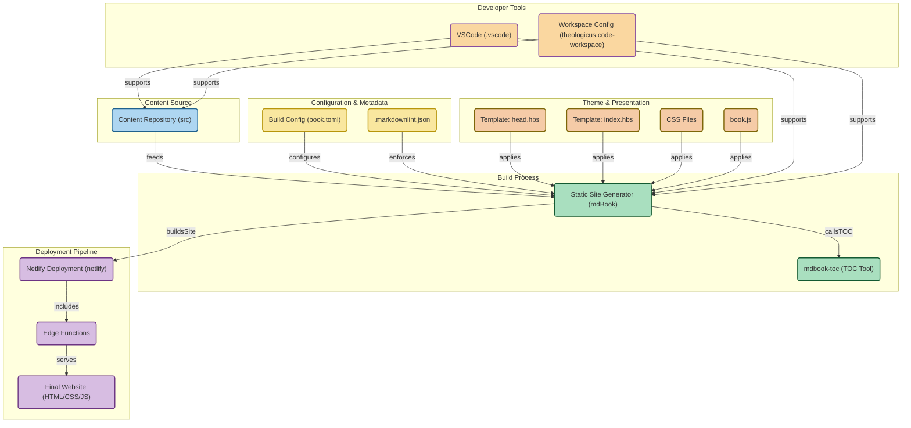

# Theologicus
Still no pen, no words, no image  
can express to you the loveliness  
of my only, only Lord Jesus.  
\- Samuel Rutherford

## upcoming

- [1 Samuel](https://theologic.us/samuel-1/index.html)
- [Matthew](https://theologic.us/matthew/index.md)
- [Christ Came to Save Sinners](https://theologic.us/doctrine-christ-saves/index.html)

## releases

- v3.5 (2025 Mar 5) [Praying Through Psalms](https://theologic.us/psalms/)
- v3.4 (2025 Jan 19) [1689 Second London Baptist Confession](https://theologic.us/confession-1689/index.md)
- v3.3.2 (2024 Apr 10) Port 1689 to [submodule](https://github.com/joelouthan/theologicus-1689) 
- v3.3.1 (2024 Jan 7) [Swift port](https://github.com/joelouthan/com.theologicus) 
- v3.3 (2023 Jul 16) [Apostles' Creed](https://theologic.us/creed-apostles/index.md)
- v3.2 (2023 Jul 04) [Book Reviews](https://theologic.us/reviews/index.md)
- v3.1 (2023 Jun 14) [Ruth](https://theologic.us/ruth/index.md)
- v3.0 (2023 Jun 09) [Hugo to mdBook](https://theologic.us) 
- v2.4 (2023 Apr 13) [The Epistle to the Romans](https://theologic.us/romans/index.md)
- v2.3 (2023 Feb 08) [The Gospel of Mark](https://theologic.us/mark/index.md)
- v2.2 (2022 Sep 08) [The Pastoral Epistles](https://theologic.us/pastorals/index.md)
- v2.1 (2021 Apr 29) [The Gospel of Luke](https://theologic.us/luke/index.md)
- v2.0 (2020 Apr 20) [Wordpress to Hugo](https://github.com/joelouthan/theologic.us) 

## running

## using

## built on

## diagram

*Thanks to @ahmedkhaleel2004 for [GitDiagram](https://github.com/ahmedkhaleel2004/gitdiagram). Get yours at [GitDiagram.com](https://gitdiagram.com/).*

## contact me

