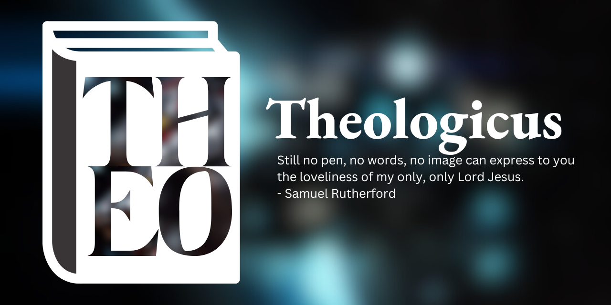

## writing

[Ruth](https://theologic.us/ruth/ruth00.html)
[1689 Second London Baptist Confession](https://theologic.us/confession-1689/1689-0.html)
[Apostles' Creed](https://theologic.us/creed-apostles/apostles.html)

## finished

[The Gospel of Mark](https://theologic.us/mark/mark00.html)  
[The Gospel of Luke](https://theologic.us/luke/luke00.html)
[The Pastoral Epistles](https://theologic.us/pastorals/pastorals00.html)  
[The Epistle to the Church in Rome](https://theologic.us/romans/romans00.html)

## using

## contact me

