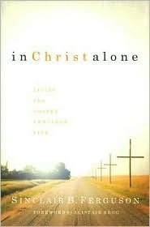
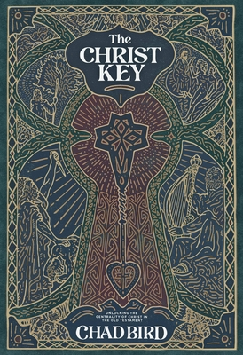
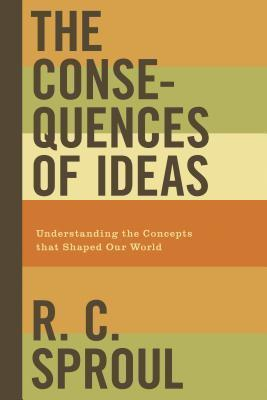
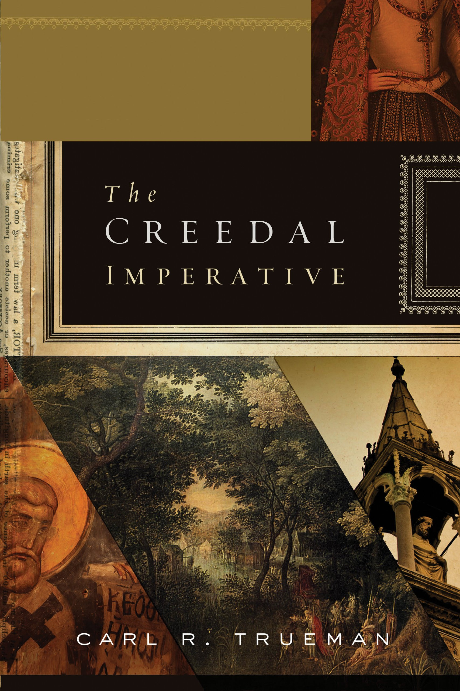

[In Christ Alone: Living the Gospel-Centered Life](reviews/in-christ-alone-living-the-gospel-centered-life.md).  
Sinclair B. ferguson.  
Ligonier Ministries. 2007.  
[Goodreads](https://www.goodreads.com/book/show/2750147-in-christ-alone)

The Christ Key  
Chad Bird.  
1517 Publishing. July 30, 2021.  
[Goodreads](https://www.goodreads.com/book/show/58373755-the-christ-key)

The Consequences of Ideas: Understanding the Concepts that Shaped Our World  
R.C. Sproul.  
Crossway. 2018.  
[Goodreads](https://www.goodreads.com/book/show/6616365-the-consequences-of-ideas)

The Creedal Imperative.  
Carl R. Trueman  
Crossway, 2012.  
[Goodreads](https://www.goodreads.com/book/show/14452976-the-creedal-imperative)

[Finally Alive](reviews/finally-alive.md).  
John Piper.  
Christian Focus. 2009.  
[Goodreads](https://www.goodreads.com/book/show/6064060-finally-alive)

