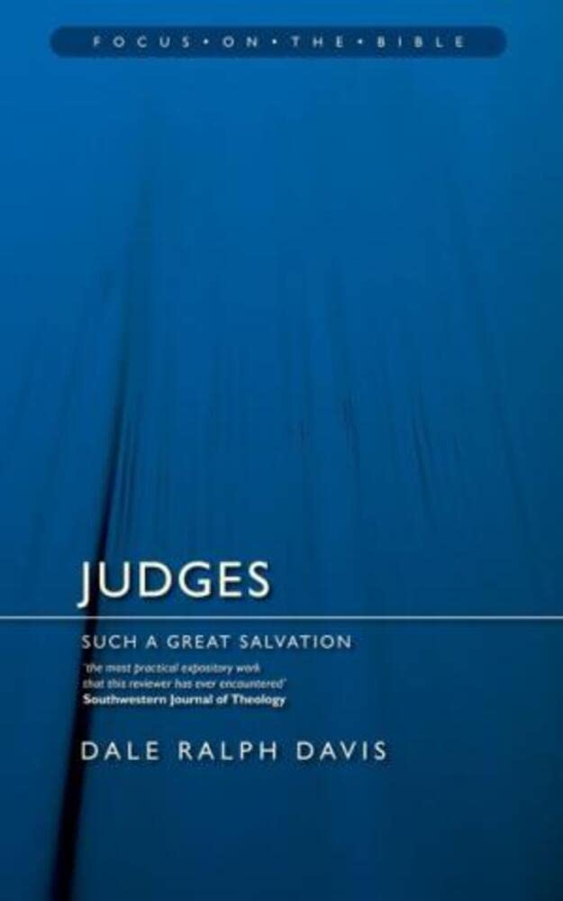
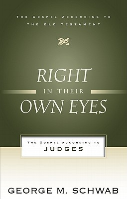
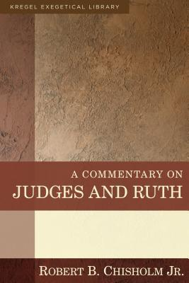

Judges: Such a Great Salvation.  
Dale Ralph Davis.  
Christian Focus. 2015.  
[Goodreads](https://www.goodreads.com/book/show/1634392.Judges)

Judges and Ruth: An Introduction and Commentary (Tyndale Old Testament Commentary)  
by Arthur E. Cundall & Leon L. Morris.  
IVP Academic. June 1, 1968.  
[Goodreads](https://www.goodreads.com/book/show/5128427-judges-and-ruth)

Right in Their Own Eyes: The Gospel According to Judges (Gospel According to the Old Testament).  
George M. Schwab.  
P&R Publishing. 2011.  
[Goodreads](https://www.goodreads.com/book/show/13397290-right-in-their-own-eyes?from_search=true&from_srp=true&qid=kHXIlsLIz0&rank=1)

A Commentary on Judges and Ruth.  
Robert B. Chisholm Jr..  
Kregel Academic. 2013.  
[Goodreads](https://www.goodreads.com/book/show/16692336-a-commentary-on-judges-and-ruth)

Judges and Ruth: God in Chaos.  
Barry G. Webb.  
Crossway. 2015.  
[Goodreads](https://www.goodreads.com/book/show/23531554-judges-and-ruth?from_search=true&from_srp=true&qid=t5D46PhcYO&rank=1)

