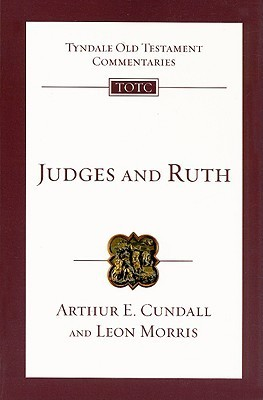
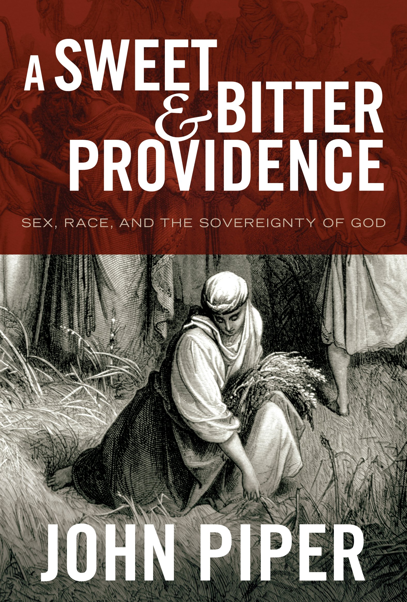
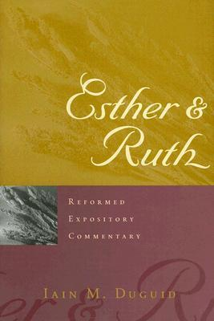
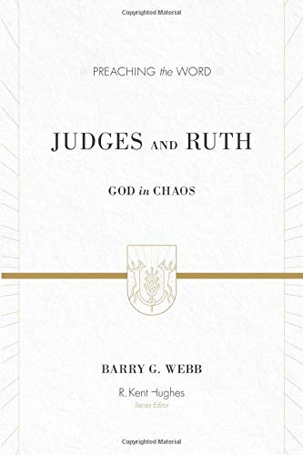

Judges and Ruth: An Introduction and Commentary (Tyndale Old Testament Commentary)  
by Arthur E. Cundall & Leon L. Morris.  
IVP Academic. June 1, 1968.  
[Goodreads](https://www.goodreads.com/book/show/5128427-judges-and-ruth)

A Sweet and Bitter Providence: Sex, Race, and the Sovereignty of God  
by John Piper.  
Crossway. January 1, 2010.  
[Goodreads](https://www.goodreads.com/book/show/6641627-a-sweet-and-bitter-providence)

Esther & Ruth (Reformed Expository Commentary)  
by Iain M. Duguid.  
P & R Publishing. October 1, 2005.  
[Goodreads](https://www.goodreads.com/book/show/1494459.Esther_Ruth)

Judges and Ruth: God in Chaos.  
Barry G. Webb.  
Crossway. 2015.  
[Goodreads](https://www.goodreads.com/book/show/23531554-judges-and-ruth?from_search=true&from_srp=true&qid=t5D46PhcYO&rank=1)

