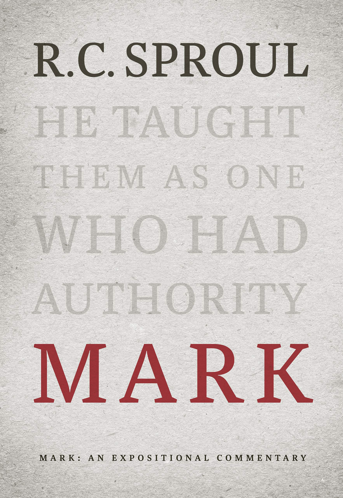
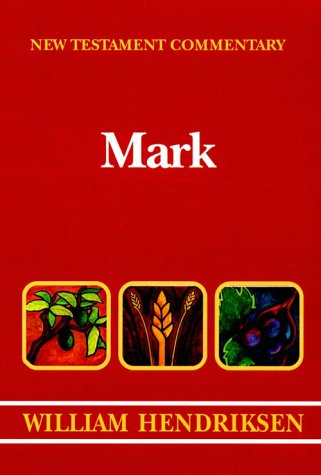
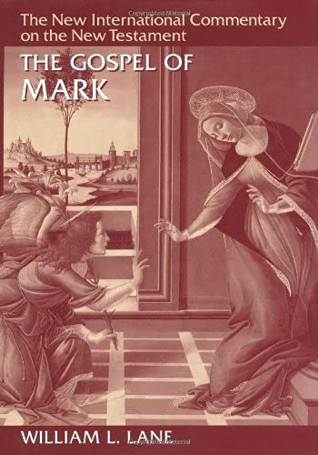
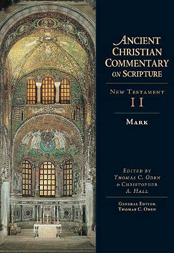
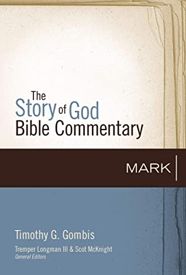
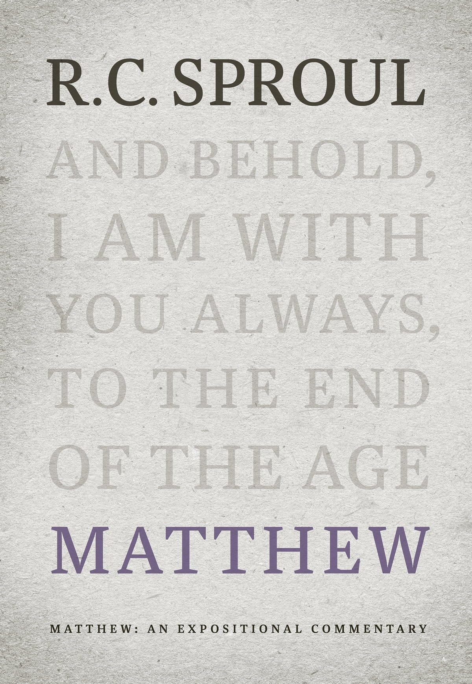
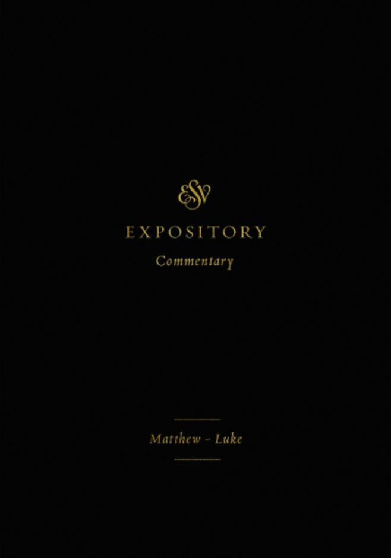
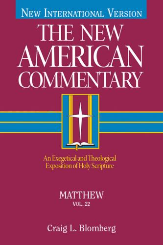
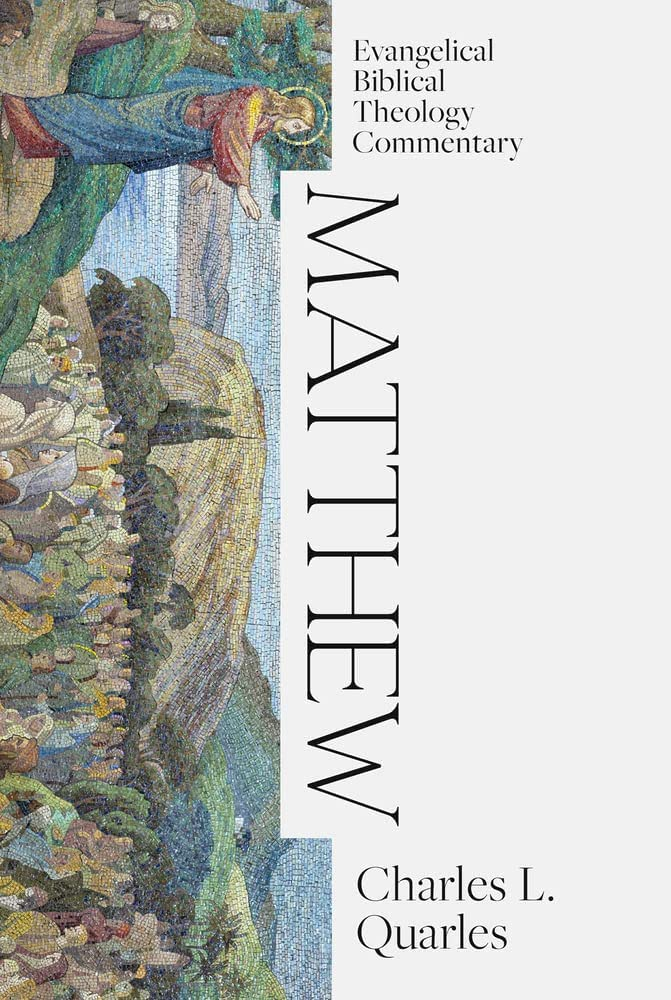

Mark: An Expositional Commentary  
R.C. Sproul.  
Reformation Trust Publisher. 2011.  
[Goodreads](https://www.goodreads.com/book/show/13329901-mark?ac=1&from_search=true&qid=AjPCOwNAXj&rank=1)

New Testament Commentary: Exposition of the Gospel According to Mark  
William Hendriksen.  
Baker. 1981.  
[Goodreads](https://www.goodreads.com/book/show/2365098.Mark)

The Gospel according to Mark: The English Text With Introduction, Exposition, and Notes (The New International Commentary on the New Testament)  
William L. Lane.  
Eerdman's. 1974.  
[Goodreads](https://www.goodreads.com/book/show/978619.The_Gospel_of_Mark?from_search=true&from_srp=true&qid=UOUMUiJ7z4&rank=2)

Mark (Ancient Christian Commentary on Scripture, NT Volume 2)  
Edited Thomas C. Odin & Christopher A. Hall  
IVP Academic. 2005.  
[Goodreads](https://www.goodreads.com/book/show/33015669-mark)

Mark (The Story of God Bible Commentary Series)  
Timothy G. Gombis.   
Zondervan Academic. March 9th 2021.  
[Goodreads](https://www.goodreads.com/book/show/54287613-mark)

Matthew: An Expositional Commentary.  
R.C. Sproul.  
Ligonier Ministries. October 29, 2019.  
[Goodreads](https://www.goodreads.com/book/show/14453116-matthew?ac=1&from_search=true&qid=1gLpP1i9jq&rank=1)

ESV Expository Commentary: Matthew–Luke (Volume 8)  
Dan Doriani (Author)  
Iain M. Duguid, James M. Hamilton Jr., & Jay Sklar (Editors)  
Crossway. September 7, 2021.  
[Goodreads](https://www.goodreads.com/book/show/50611048-esv-expository-commentary-volume-8?ac=1&from_search=true&qid=KXgplk0Joa&rank=1)

Matthew: An Exegetical and Theological Exposition of Holy Scripture (Volume 22) (The New American Commentary).  
Craig L. Blomberg.  
Holman Reference. May 1992.

Matthew (EBTC).  
Charles L. Quarles.  
Lexham Academic. 2023.  
[Goodreads](https://www.goodreads.com/book/show/62157376-matthew?from_search=true&from_srp=true&qid=dbeLIqrV0q&rank=4)

