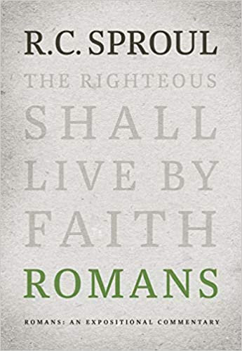
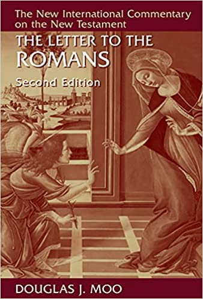
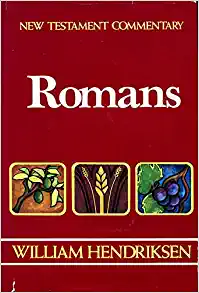
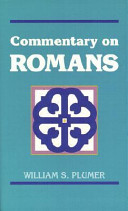
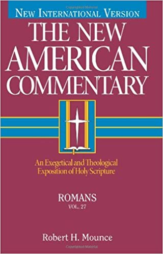
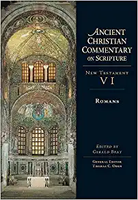
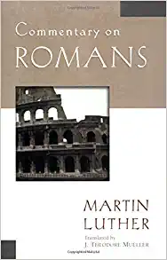
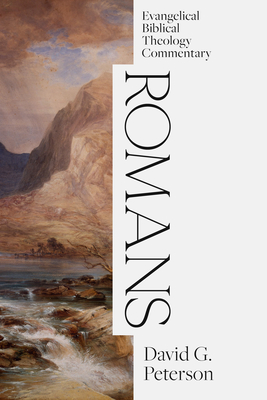

Romans: An Expositional Commentary  
R.C. Sproul.  
Reformation Trust Publishing. 2019.  
[Goodreads](https://www.goodreads.com/book/show/6468546-romans?ac=1&from_search=true&qid=xl3x8afdFN&rank=2)

The Letter to the Romans (New International Commentary on the New Testament (NICNT))  
Douglas Moo.    
Eerdmans. 1996.  
[Goodreads](https://www.goodreads.com/book/show/48640436-the-letter-to-the-romans-new-international-commentary-on-the-new-testam?ac=1&from_search=true&qid=K0oRkdrYXP&rank=1)

New Testament Commentary: Romans: Chapters 1-16  
William Hendriksen.  
Baker. 1992.  
[Goodreads](https://www.goodreads.com/book/show/6033721-romans?ac=1&from_search=true&qid=VSDDrJALl9&rank=1)

Romans  
William S. Plumer.  
Kregel. 1993.  
[Goodreads](https://www.goodreads.com/book/show/3189435-commentary-on-romans?ac=1&from_search=true&qid=pinspEBLVG&rank=1)

Romans: An Exegetical and Theological Exposition of Holy Scripture (The New American Commentary)  
Robert Mounce.  
Holmon Reference. 1995.  
[Goodreads](https://www.goodreads.com/book/show/1652633.Romans?ac=1&from_search=true&qid=t43icJXUYR&rank=2)

Romans (Ancient Christian Commentary on Scripture, NT Volume 6)  
Edited by Gerald L. Bray.  
IVP Academic. 2005.  
[Goodreads](https://www.goodreads.com/book/show/32922759-romans?ac=1&from_search=true&qid=O8EDAlniS5&rank=1)

Commentary on Romans  
Martin Luther.  
Kregel. 2003.  
[Goodreads](https://www.goodreads.com/book/show/1635020.Commentary_on_Romans?ac=1&from_search=true&qid=aIXX1icyNY&rank=5)

Romans (EBTC).  
David G. Peterson.  
Lexham Press. 2021.  
[Goodreads](https://www.goodreads.com/book/show/55150184-romans?from_search=true&from_srp=true&qid=IIOIEPgmSG&rank=1)

