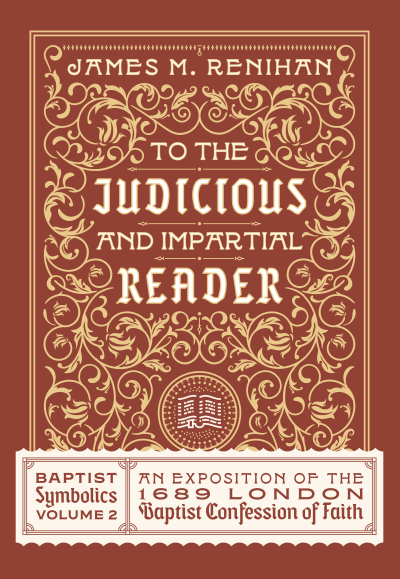
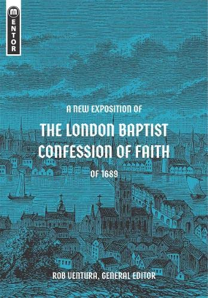
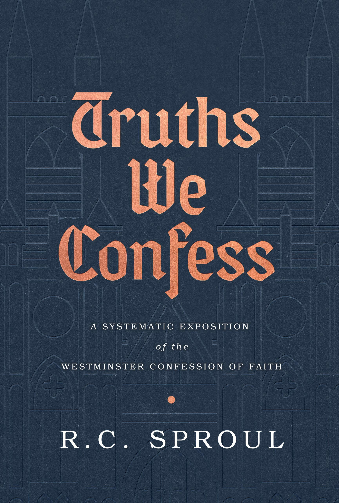

To the Judicious and Impartial Reader: Baptist Symbolics Volume 2.  
James Renihan.  
Founders Press. 2022.  
[Goodreads](https://www.goodreads.com/book/show/63271424-to-the-judicious-and-impartial-reader?from_search=true&from_srp=true&qid=d2GQVaOQdo&rank=2)

A New Exposition of the London Baptist Confession of Faith of 1689    
Rob Ventura.  
Mentor. January 17, 2023.  
[Goodreads](https://www.goodreads.com/book/show/67745144-a-new-exposition-of-the-london-baptist-confession-of-faith-of-1689)

Truths We Confess: A Systematic Exposition of the Westminster Confession of Faith.  
Sproul, R. C.    
Orlando: Reformation Trust, 2019.  
[Goodreads](https://www.goodreads.com/book/show/50024945-truths-we-confess?ac=1&from_search=true&qid=ssTkBgIFwE&rank=1)

The Baptist Confession of Faith 1689: Or the Second London Confession with Scripture Proofs  
Peter Masters.  
Wakeman Trust. January 1, 1981.  
[Goodreads](https://www.goodreads.com/book/show/1723671.Baptist_Confession_of_Faith_1689?ac=1&from_search=true&qid=HfdndsOLE6&rank=1)

Modern Exposition of the 1689 Baptist Confession of Faith.  
5th Edition.
Samuel E. Waldron.  
Evangelical Press. 2016.  
[Goodreads](https://www.goodreads.com/book/show/33114506-a-modern-exposition-of-the-1689-baptist-confession-of-faith)

The Westminster Confession: The Confession of Faith, The Larger and Shorter Catechism.  
Westminster Assembly.  
The Directory for the Public Worship of God, with Associated Historical Documents. 2018.   
[Goodreads](https://www.goodreads.com/book/show/39905592-the-westminster-confession?ac=1&from_search=true&qid=oMfahlcldC&rank=1)

