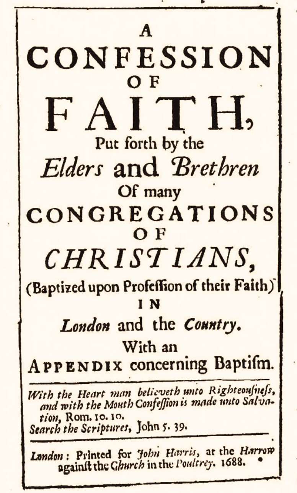

# 1689 Baptist Confession of Faith

## A Foreword

Although my roots are deeply planted in church life, I approach the historical confessions of faith as a newcomer. So why dive into an exposition on the 1689? That has been quite a journey.

My upbringing was charismatic, attending a mega-Assemblies of God church in Fort Worth, TX, with my grandma, and listening to Word of Faith preachers on TV. However, I did not get saved until I was 32, when God opened my eyes to my sin and gave me the gift of repentance.

Within months of being saved, I encountered Calvinism through a Google search that led to [Wikipedia](https://en.wikipedia.org/wiki/Reformed_Christianity). I read the article, reflecting on the points and didn't think much about it. However, that is not what the Spirit had for me. Through that generic article, God revealed his doctrines of grace to me. Total depravity was clear—“All have sinned and come short of the glory of God.” Yet, once I saw effectual grace, limited atonement, unmerited favor, and preservation of the saints began to leap off the page, as obvious and plain as the nose on my face, there was no way I could "unsee" these wonderful doctines.

I was attending an Acts 29 church in Oklahoma when I began this writing project in 2021. With no affiliation nor intention of becoming Presbyterian, I wanted to write this for the sheer joy of learning deeply. (This was in line with my tendency to initiate writing projects, only to discover that R.C. Sproul had already wrote it. Ergo, *[Truths We Confess](https://heritagebooks.org/products/truths-we-confess-a-systematic-exposition-of-the-westminster-confession-of-faith-sproul.html)*.)

In the summer of 2021, my wife and I decided to move to Kentucky for family reasons. Once upon a time, not that long ago, there were four A29 churches to the area we were considering. By 2021, there were none. I took this an indication by God that he was leading from one denomination/association to another. From that, given our deep theological and doctrinal convictions, we were led by God's Spirit, to a small Calvary Chapel church in Lexington, KY. This was no ordinary Calvary Chapel church. They said they were a part of Calvary Chapel. But a quick summation of their website had me concluded, "They are Reformed--they just don't know it yet." I was half-right. When we joined the church, they were on their way to voting in and adopting the 1689 Second London Baptist Confession.

At the start of this project, I was attending a Calvinistic-Evangelical church. By the time I completed it, I had been ordained as a pastor and elder in a 1689-confessing church in central Kentucky.

There is no way I could have decided a tougher, yet sweeter journey of faith. That has to be the grace of Christ for me. Praise be to his name.

This expositional commentary is still one little part of my worship to the Christ who loved me and gave himself up for me (Galatians 2:20).

And I wrote this so that your joy and my joy may be completed in Christ (1 John 1:4).
