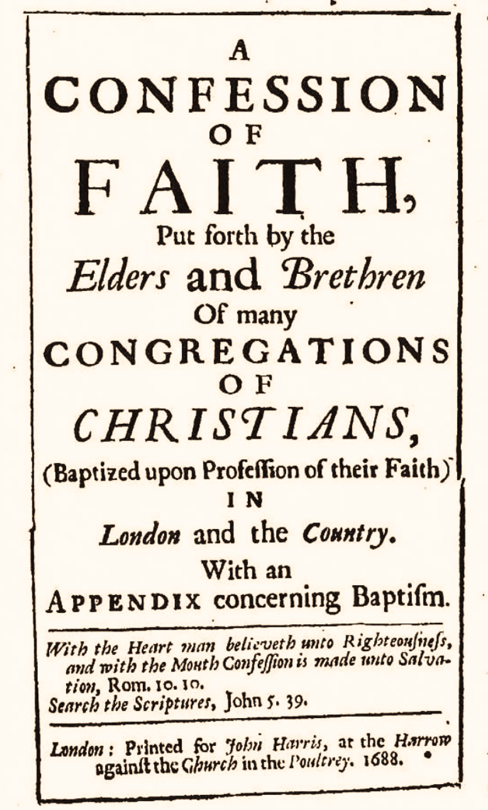

# Chapter 2 Of God and of the Holy Trinity

## [2.1 The Attributes of God](1689-02-1-the-attributes-of-God.md)

The Lord our God is but one only living and true God; whose subsistence is in and of himself, infinite in being and perfection; whose essence cannot be comprehended by any but himself; a most pure spirit, invisible, without body, parts, or passions, who only hath immortality, dwelling in the light which no man can approach unto; who is immutable, immense, eternal, incomprehensible, almighty, every way infinite, most holy, most wise, most free, most absolute; working all things according to the counsel of his own immutable and most righteous will for his own glory; most loving, gracious, merciful, long-suffering, abundant in goodness and truth, forgiving iniquity, transgression, and sin; the rewarder of them that diligently seek him, and withal most just and terrible in his judgments, hating all sin, and who will by no means clear the guilty.

>1 Corinthians 8:4–6 (CSB) About eating food sacrificed to idols, then, we know that “an idol is nothing in the world,” and that “there is no God but one.” For even if there are so-called gods, whether in heaven or on earth—as there are many “gods” and many “lords”—yet for us there is one God, the Father. All things are from him, and we exist for him. And there is one Lord, Jesus Christ. All things are through him, and we exist through him.

>Deuteronomy 6:4 (CSB) “Listen, Israel: The LORD our God, the LORD is one.

>Jeremiah 10:10 (CSB) But the LORD is the true God; he is the living God and eternal King. The earth quakes at his wrath, and the nations cannot endure his fury.

>Isaiah 48:12 (CSB) “Listen to me, Jacob, and Israel, the one called by me: I am he; I am the first, I am also the last.

>Exodus 3:14 (CSB) God replied to Moses, “I AM WHO I AM. This is what you are to say to the Israelites: I AM has sent me to you.”

>John 4:24 (CSB) God is spirit, and those who worship him must worship in Spirit and in truth.”

>1 Timothy 1:17 (CSB) Now to the King eternal, immortal, invisible, the only God, be honor and glory forever and ever. Amen.

>Deuteronomy 4:15–16 (CSB) “Diligently watch yourselves—because you did not see any form on the day the LORD spoke to you out of the fire at Horeb—so you don’t act corruptly and make an idol for yourselves in the shape of any figure: a male or female form,

>Malachi 3:6 (CSB) “Because I, the LORD, have not changed, you descendants of Jacob have not been destroyed.

>1 Kings 8:27 (CSB) But will God indeed live on earth? Even heaven, the highest heaven, cannot contain you, much less this temple I have built.

>Jeremiah 23:23 (CSB) “Am I a God who is only near”—this is the LORD’s declaration—“and not a God who is far away?

>Psalm 90:2 (CSB) Before the mountains were born, before you gave birth to the earth and the world, from eternity to eternity, you are God.

>Genesis 17:1 (CSB) When Abram was ninety-nine years old, the LORD appeared to him, saying, “I am God Almighty. Live in my presence and be blameless.

>Isaiah 6:3 (CSB) And one called to another: Holy, holy, holy is the LORD of Armies; his glory fills the whole earth.

>Psalm 115:3 (CSB) Our God is in heaven and does whatever he pleases.

>Isaiah 46:10 (CSB) I declare the end from the beginning, and from long ago what is not yet done, saying: my plan will take place, and I will do all my will.

>Proverbs 16:4 (CSB) The LORD has prepared everything for his purpose— even the wicked for the day of disaster.

>Romans 11:36 (CSB) For from him and through him and to him are all things. To him be the glory forever. Amen.

>Exodus 34:6–7 (CSB) The LORD passed in front of him and proclaimed: The LORD—the LORD is a compassionate and gracious God, slow to anger and abounding in faithful love and truth, maintaining faithful love to a thousand generations, forgiving iniquity, rebellion, and sin. But he will not leave the guilty unpunished, bringing the consequences of the fathers’ iniquity on the children and grandchildren to the third and fourth generation.

>Hebrews 11:6 (CSB) Now without faith it is impossible to please God, since the one who draws near to him must believe that he exists and that he rewards those who seek him.

>Nehemiah 9:32 (CSB) So now, our God—the great, mighty, and awe-inspiring God who keeps his gracious covenant— do not view lightly all the hardships that have afflicted us, our kings and leaders, our priests and prophets, our ancestors and all your people, from the days of the Assyrian kings until today.

>Nehemiah 9:33 (CSB) You are righteous concerning all that has happened to us, because you have acted faithfully, while we have acted wickedly.

>Psalm 5:5 (CSB) The boastful cannot stand in your sight; you hate all evildoers.

>Psalm 5:6 (CSB) You destroy those who tell lies; the LORD abhors violent and treacherous people.

>Exodus 34:7 (CSB) maintaining faithful love to a thousand generations, forgiving iniquity, rebellion, and sin. But he will not leave the guilty unpunished, bringing the consequences of the fathers’ iniquity on the children and grandchildren to the third and fourth generation.

>Nahum 1:2–3 (CSB) The LORD is a jealous and avenging God; the LORD takes vengeance and is fierce in wrath. The LORD takes vengeance against his foes; he is furious with his enemies. The LORD is slow to anger but great in power; the LORD will never leave the guilty unpunished. His path is in the whirlwind and storm, and clouds are the dust beneath his feet.

## [2.2 The Sufficiency of God](1689-02-2-the-sufficiency-of-God.md)

God, having all life, glory, goodness, blessedness, in and of himself, is alone in and unto himself all- sufficient, not standing in need of any creature which he hath made, nor deriving any glory from them, but only manifesting his own glory in, by, unto, and upon them; he is the alone fountain of all being, of whom, through whom, and to whom are all things, and he hath most sovereign dominion over all creatures, to do by them, for them, or upon them, whatsoever himself pleaseth; in his sight all things are open and manifest, his knowledge is infinite, infallible, and independent upon the creature, so as nothing is to him contingent or uncertain; he is most holy in all his counsels, in all his works, and in all his commands; to him is due from angels and men, whatsoever worship, service, or obedience, as creatures they owe unto the Creator, and whatever he is further pleased to require of them.

>John 5:26 (CSB) For just as the Father has life in himself, so also he has granted to the Son to have life in himself.

>Psalm 148:13 (CSB) Let them praise the name of the LORD, for his name alone is exalted. His majesty covers heaven and earth.

>Psalm 119:68 (CSB) You are good, and you do what is good; teach me your statutes.

>Job 22:2 (CSB) Can a man be of any use to God? Can even a wise man be of use to him?

>Job 22:3 (CSB) Does it delight the Almighty if you are righteous? Does he profit if you perfect your behavior?

>Romans 11:34–36 (CSB) For who has known the mind of the Lord? Or who has been his counselor? And who has ever given to God, that he should be repaid? For from him and through him and to him are all things. To him be the glory forever. Amen.

>Daniel 4:25 (CSB) You will be driven away from people to live with the wild animals. You will feed on grass like cattle and be drenched with dew from the sky for seven periods of time, until you acknowledge that the Most High is ruler over human kingdoms, and he gives them to anyone he wants.

>Daniel 4:34 (CSB) But at the end of those days, I, Nebuchadnezzar, looked up to heaven, and my sanity returned to me. Then I praised the Most High and honored and glorified him who lives forever: For his dominion is an everlasting dominion, and his kingdom is from generation to generation.

>Daniel 4:35 (CSB) All the inhabitants of the earth are counted as nothing, and he does what he wants with the army of heaven and the inhabitants of the earth. There is no one who can block his hand or say to him, “What have you done?”

>Hebrews 4:13 (CSB) No creature is hidden from him, but all things are naked and exposed to the eyes of him to whom we must give an account.

>Ezekiel 11:5 (CSB) Then the Spirit of the LORD came on me, and he told me, “You are to say, ‘This is what the LORD says: That is what you are thinking, house of Israel; and I know the thoughts that arise in your mind.

>Acts 15:15–18 (CSB) And the words of the prophets agree with this, as it is written: After these things I will return and rebuild David’s fallen tent. I will rebuild its ruins and set it up again, so that the rest of humanity may seek the Lord— even all the Gentiles who are called by my name— declares the Lord who makes these things known from long ago.

>Psalm 145:17 (CSB) The LORD is righteous in all his ways and faithful in all his acts.

>Revelation 5:12–14 (CSB) They said with a loud voice, Worthy is the Lamb who was slaughtered to receive power and riches and wisdom and strength and honor and glory and blessing! I heard every creature in heaven, on earth, under the earth, on the sea, and everything in them say, Blessing and honor and glory and power be to the one seated on the throne, and to the Lamb, forever and ever! The four living creatures said, “Amen,” and the elders fell down and worshiped.

## [2.3 The Triune God](1689-02-3-the-triune-God.md)

In this divine and infinite Being there are three subsistences, the Father, the Word or Son, and Holy Spirit, of one substance, power, and eternity, each having the whole divine essence, yet the essence undivided: the Father is of none, neither begotten nor proceeding; the Son is eternally begotten of the Father; the Holy Spirit proceeding from the Father and the Son; all infinite, without beginning, therefore but one God, who is not to be divided in nature and being, but distinguished by several peculiar relative properties and personal relations; which doctrine of the Trinity is the foundation of all our communion with God, and comfortable dependence on him.

>1 John 5:7–10 (CSB) For there are three that testify: the Spirit, the water, and the blood—and these three are in agreement. If we accept human testimony, God’s testimony is greater, because it is God’s testimony that he has given about his Son. The one who believes in the Son of God has this testimony within himself. The one who does not believe God has made him a liar, because he has not believed in the testimony God has given about his Son.

>Matthew 28:19 (CSB) Go, therefore, and make disciples of all nations, baptizing them in the name of the Father and of the Son and of the Holy Spirit,

>2 Corinthians 13:13 (CSB) The grace of the Lord Jesus Christ, and the love of God, and the fellowship of the Holy Spirit be with you all.

>Exodus 3:14 (CSB) God replied to Moses, “I AM WHO I AM. This is what you are to say to the Israelites: I AM has sent me to you.”

>John 14:11 (CSB) Believe me that I am in the Father and the Father is in me. Otherwise, believe because of the works themselves.

>1 Corinthians 8:6 (CSB) yet for us there is one God, the Father. All things are from him, and we exist for him. And there is one Lord, Jesus Christ. All things are through him, and we exist through him.

>John 1:14–18 (CSB) The Word became flesh and dwelt among us. We observed his glory, the glory as the one and only Son from the Father, full of grace and truth. (John testified concerning him and exclaimed, “This was the one of whom I said, ‘The one coming after me ranks ahead of me, because he existed before me.’ ”) Indeed, we have all received grace upon grace from his fullness, for the law was given through Moses; grace and truth came through Jesus Christ. No one has ever seen God. The one and only Son, who is himself God and is at the Father’s side—he has revealed him.

>John 15:26 (CSB) “When the Counselor comes, the one I will send to you from the Father—the Spirit of truth who proceeds from the Father—he will testify about me.

>Galatians 4:6 (CSB) And because you are sons, God sent the Spirit of his Son into our hearts, crying, “Abba, Father!”
