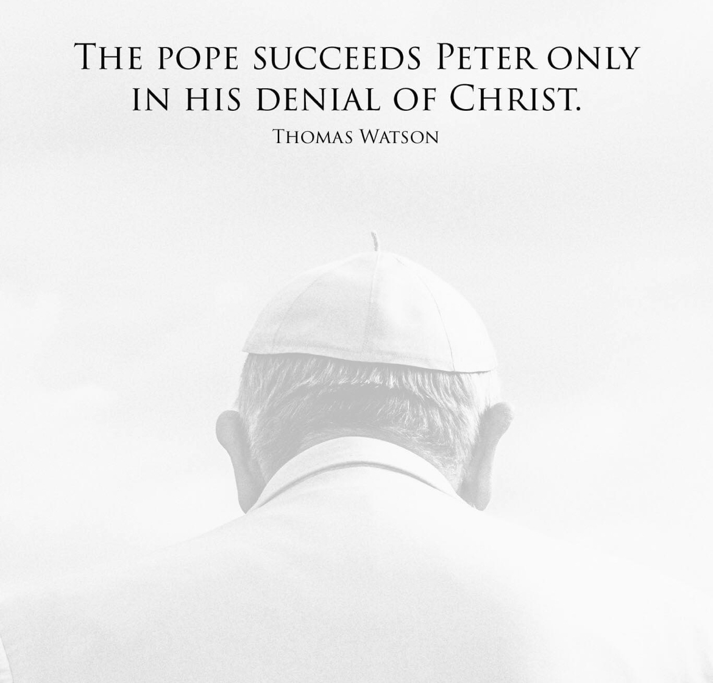

# 26.4 Of The Bride: The Head Pastor

## Table of Contents

<!-- toc -->

## The Text

>Acts 4:12 (CSB) There is salvation in no one else, for there is no other name under heaven given to people by which we must be saved.

## The Chapter

**The Lord Jesus Christ is the Head of the church, in whom, by the appointment of the Father, all power for the calling, institution, order or government of the church, is invested in a supreme and sovereign manner; neither can the Pope of Rome in any sense be head thereof, but is that antichrist, that man of sin, and son of perdition, that exalteth himself in the church against Christ, and all that is called God; whom the Lord shall destroy with the brightness of his coming.**

## The Confession

### The Lord Jesus Christ is the Head of the church, in whom, by the appointment of the Father, all power for the calling, institution, order or government of the church, is invested in a supreme and sovereign manner

>Colossians 1:18 (CSB) He is also the head of the body, the church; he is the beginning, the firstborn from the dead, so that he might come to have first place in everything.

>Matthew 28:18–20 (CSB) Jesus came near and said to them, “All authority has been given to me in heaven and on earth. Go, therefore, and make disciples of all nations, baptizing them in the name of the Father and of the Son and of the Holy Spirit, teaching them to observe everything I have commanded you. And remember, I am with you always, to the end of the age.”

>Ephesians 4:11–12 (CSB) And he himself gave some to be apostles, some prophets, some evangelists, some pastors and teachers, to equip the saints for the work of ministry, to build up the body of Christ,

And

>1 Corinthians 11:3 (CSB) But I want you to know that Christ is the head of every man, and the man is the head of the woman, and God is the head of Christ.

Christ is the Head Pastor of his church. Whatever authority we have is assumed because Christ gives that authority.  To that end, those ministers--that is the elders and deacons--are merely ordained. With the laying on of hands, they have been ordained for the work of the ministry. Yet, they are not flawless. And Satan will come to tempt them to destruction. Our own hearts will lead us astray. God is not the author of their sin and apostasy just because a church--which under heaven is always subjected to mixture and error--has ordained them to be ministers.

God did not do this. He says this about false prophets:

>Jeremiah 23:21 (CSB) I did not send out these prophets,  
>yet they ran.  
>I did not speak to them,  
>yet they prophesied.

God does not stop the false prophets dead in their tracks. But why? Why would God allow his elect to be swayed by false doctrine. I don't know why. All I know is that Christ alone is the remedy:

>Jeremiah 23:1-4 (CSB) “Woe to the shepherds who destroy and scatter the sheep of my pasture! ” This is the LORD’s declaration. “Therefore, this is what the LORD, the God of Israel, says about the shepherds who tend my people: You have scattered my flock, banished them, and have not attended to them. I am about to attend to you because of your evil acts” — this is the LORD’s declaration. “I will gather the remnant of my flock from all the lands where I have banished them, and I will return them to their grazing land. They will become fruitful and numerous. I will raise up shepherds over them who will tend them. They will no longer be afraid or discouraged, nor will any be missing.” This is the LORD’s declaration.

God will gather his flock and raise up shepherds over them. He does this because Christ has been sent to live and die for his sheep:

>Jeremiah 23:5-6 (CSB) Look, the days are coming” — this is the LORD’s declaration —  
>“when I will raise up a Righteous Branch for David.  
>He will reign wisely as king  
>and administer justice and righteousness in the land.  
>In his days Judah will be saved,  
>and Israel will dwell securely.  
>This is the name he will be called:  
>The LORD Is Our Righteousness.

### neither can the Pope of Rome in any sense be head thereof, but is that antichrist, that man of sin, and son of perdition, that exalts himself in the church against Christ, and all that is called God; whom the Lord shall destroy with the brightness of his coming

>2 Thessalonians 2:2–9 (CSB) not to be easily upset or troubled, either by a prophecy or by a message or by a letter supposedly from us, alleging that the day of the Lord has come. Don’t let anyone deceive you in any way. For that day will not come unless the apostasy comes first and the man of lawlessness is revealed, the man doomed to destruction. He opposes and exalts himself above every so-called god or object of worship, so that he sits in God’s temple, proclaiming that he himself is God. Don’t you remember that when I was still with you I used to tell you about this? And you know what currently restrains him, so that he will be revealed in his time. For the mystery of lawlessness is already at work, but the one now restraining will do so until he is out of the way, and then the lawless one will be revealed. The Lord Jesus will destroy him with the breath of his mouth and will bring him to nothing at the appearance of his coming. The coming of the lawless one is based on Satan’s working, with every kind of miracle, both signs and wonders serving the lie,

<figure style="text-align: center;">
   
   <figcaption style="font-style: italic; text-align: center;">"The Pope Succeeds Peter only in his denial of Christ." - Thomas Watson</figcaption>
</figure>

This is the absolute declaration of the word of God: there is no other mediator between God and man other than Jesus the Christ. Since Jesus is fully God and fully man, we need no mediator between the Christ and his flock.

The pope is not it--he is full of sin and seeks to exalt himself as God. But woe to the person who would do the same in any other setting.

>Matthew 23 (CSB)  
>1 Then Jesus spoke to the crowds and to his disciples: 
>
>2 “The scribes and the Pharisees are seated in the chair of Moses. 
>
>3 Therefore do whatever they tell you, and observe it. But don’t do what they do, because they don’t practice what they teach. 
>
>4 They tie up heavy loads that are hard to carry and put them on people’s shoulders, but they themselves aren’t willing to lift a finger to move them. 
>
>5 They do everything to be seen by others: They enlarge their phylacteries and lengthen their tassels. 
>
>6 They love the place of honor at banquets, the front seats in the synagogues, 
>
>7 greetings in the marketplaces, and to be called ‘Rabbi’ by people. 
>
>8 “But you are not to be called ‘Rabbi,’ because you have one Teacher, and you are all brothers and sisters. 
>
>9 Do not call anyone on earth your father, because you have one Father, who is in heaven. 
>
>10 You are not to be called instructors either, because you have one Instructor, the Messiah. 
>
>11 The greatest among you will be your servant. 
>
>12 Whoever exalts himself will be humbled, and whoever humbles himself will be exalted. 
>
>13 “Woe to you, scribes and Pharisees, hypocrites! You shut the door of the kingdom of heaven in people’s faces. For you don’t go in, and you don’t allow those entering to go in. 
>
>15 “Woe to you, scribes and Pharisees, hypocrites! You travel over land and sea to make one convert, and when he becomes one, you make him twice as much a child of hell as you are! 
>
>16 “Woe to you, blind guides, who say, ‘Whoever takes an oath by the temple, it means nothing. But whoever takes an oath by the gold of the temple is bound by his oath.’ 
>
>17 Blind fools! For which is greater, the gold or the temple that sanctified the gold? 
>
>18 Also, ‘Whoever takes an oath by the altar, it means nothing; but whoever takes an oath by the gift that is on it is bound by his oath.’ 
>
>19 Blind people! For which is greater, the gift or the altar that sanctifies the gift? 
>
>20 Therefore, the one who takes an oath by the altar takes an oath by it and by everything on it. 
>
>21 The one who takes an oath by the temple takes an oath by it and by him who dwells in it. 
>
>22 And the one who takes an oath by heaven takes an oath by God’s throne and by him who sits on it. 
>
>23 “Woe to you, scribes and Pharisees, hypocrites! You pay a tenth of mint, dill, and cumin, and yet you have neglected the more important matters of the law—justice, mercy, and faithfulness. These things should have been done without neglecting the others. 
>
>24 Blind guides! You strain out a gnat, but gulp down a camel! 
>
>25 “Woe to you, scribes and Pharisees, hypocrites! You clean the outside of the cup and dish, but inside they are full of greed and self-indulgence. 
>
>26 Blind Pharisee! First clean the inside of the cup, so that the outside of it may also become clean. 
>
>27 “Woe to you, scribes and Pharisees, hypocrites! You are like whitewashed tombs, which appear beautiful on the outside, but inside are full of the bones of the dead and every kind of impurity. 
>
>28 In the same way, on the outside you seem righteous to people, but inside you are full of hypocrisy and lawlessness. 
>
>29 “Woe to you, scribes and Pharisees, hypocrites! You build the tombs of the prophets and decorate the graves of the righteous, 
>
>30 and you say, ‘If we had lived in the days of our ancestors, we wouldn’t have taken part with them in shedding the prophets’ blood.’ 
>
>31 So you testify against yourselves that you are descendants of those who murdered the prophets. 
>
>32 Fill up, then, the measure of your ancestors’ sins! 
>
>33 “Snakes! Brood of vipers! How can you escape being condemned to hell? 
>
>34 This is why I am sending you prophets, sages, and scribes. Some of them you will kill and crucify, and some of them you will flog in your synagogues and pursue from town to town. 
>
>35 So all the righteous blood shed on the earth will be charged to you, from the blood of righteous Abel to the blood of Zechariah, son of Berechiah, whom you murdered between the sanctuary and the altar. 
>
>36 Truly I tell you, all these things will come on this generation. 
>
>37 “Jerusalem, Jerusalem, who kills the prophets and stones those who are sent to her. How often I wanted to gather your children together, as a hen gathers her chicks under her wings, but you were not willing! 
>
>38 See, your house is left to you desolate. 
>
>39 For I tell you, you will not see me again until you say, ‘Blessed is he who comes in the name of the Lord’!”

Those who seek and try to come between Christ and his people are sons of Satan and wolves who will devour the sheep.

But Christ is the good shepherd. With his rod, he beats Satan and his sons mercilessly. With his staff, he will leave the 99 to rescue us from the pit of despair and misery.
