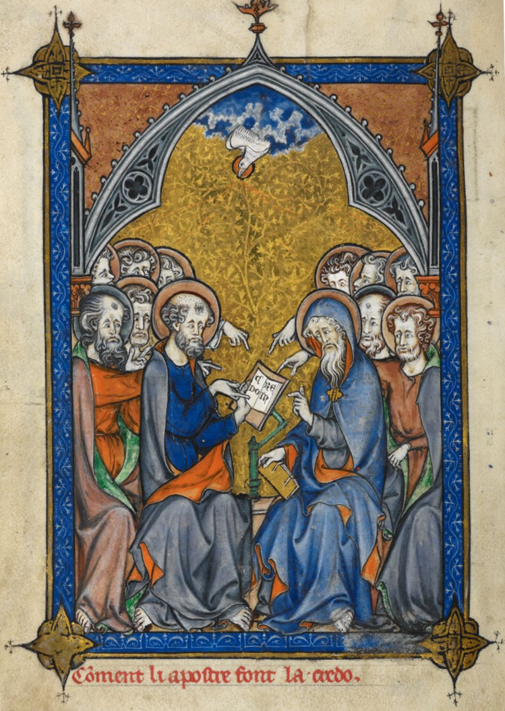

# The Apostles' Creed: The Creator of Heaven and Earth

## The Creed

>I believe in God, the Father Almighty,  
><bgy>the Creator of heaven and earth</bgy>,  
>and in Jesus Christ, His only Son, our Lord:  
>Who was conceived of the Holy Spirit,  
>born of the Virgin Mary,  
>suffered under Pontius Pilate,  
>was crucified, died, and was buried.  
>He descended into hell.  
>  
>The third day He arose again from the dead.  
>He ascended into heaven and sits at the right hand of God the Father Almighty,  
>whence He shall come to judge the living and the dead.  
>  
>I believe in the Holy Spirit, the holy catholic church,  
>the communion of saints, the forgiveness of sins,  
>the resurrection of the body, and life everlasting.  
>  
>Amen.

## The Word

>Psalm 90:1–3  
>1 Lord, you have been our refuge in every generation. 
>
>2 Before the mountains were born, before you gave birth to the earth and the world, from eternity to eternity, you are God. 
>
>3 You return mankind to the dust, saying, “Return, descendants of Adam.”

## The Belief

### That the only true God is the Creator of heaven and earth

#### Right from the get go

Page 1, Book 1, Chapter 1, Verse 1:

>Genesis 1:1 In the beginning God created the heavens and the earth.

##### God the Father, Creator

- Genesis
- Exodus
- Leviticus
- Numbers
- Deuteronomy
- Joshua
- Judges
- etc. 

#### God did it with nothing

>Hebrews 11:1-3 Now faith is the reality of what is hoped for, the proof of what is not seen. For by this our ancestors were approved. **By faith we understand that the universe was created by the word of God, so that what is seen was made from things that are not visible.**

#### Since God is Creator is before all things

>Psalm 90:2 Before the mountains were born, before you gave birth to the earth and the world, from eternity to eternity, you are God. 

#### Christ is God and therefore, is before all things

>Colossians 1:15–17  
>15 He is the image of the invisible God, the firstborn over all creation. 
>
>16 For everything was created by him, in heaven and on earth, the visible and the invisible, whether thrones or dominions or rulers or authorities— all things have been created through him and for him. 
>
>17 He is before all things, and by him all things hold together.

>John 1:1–5  
>1 In the beginning was the Word, and the Word was with God, and the Word was God. 
>
>2 He was with God in the beginning. 
>
>3 All things were created through him, and apart from him not one thing was created that has been created. 
>
>4 In him was life, and that life was the light of men. 
>
>5 That light shines in the darkness, and yet the darkness did not overcome it.

### That God made us in his image

>Genesis 1:26–27  
>26 Then God said, “Let us make man in our image, according to our likeness. They will rule the fish of the sea, the birds of the sky, the livestock, the whole earth, and the creatures that crawl on the earth.” 
>
>27 So God created man in his own image; he created him in the image of God; he created them male and female.

### That Christ has made his people in a new creation

>John 3:3  
>3 Jesus replied, “Truly I tell you, unless someone is born again, he cannot see the kingdom of God.”

>2 Corinthians 5:17–21  
>17 Therefore, if anyone is in Christ, he is a new creation; the old has passed away, and see, the new has come! 
>
>18 Everything is from God, who has reconciled us to himself through Christ and has given us the ministry of reconciliation. 
>
>19 That is, in Christ, God was reconciling the world to himself, not counting their trespasses against them, and he has committed the message of reconciliation to us. 
>
>20 Therefore, we are ambassadors for Christ, since God is making his appeal through us. We plead on Christ’s behalf, “Be reconciled to God.” 
>
>21 He made the one who did not know sin to be sin for us, so that in him we might become the righteousness of God.
