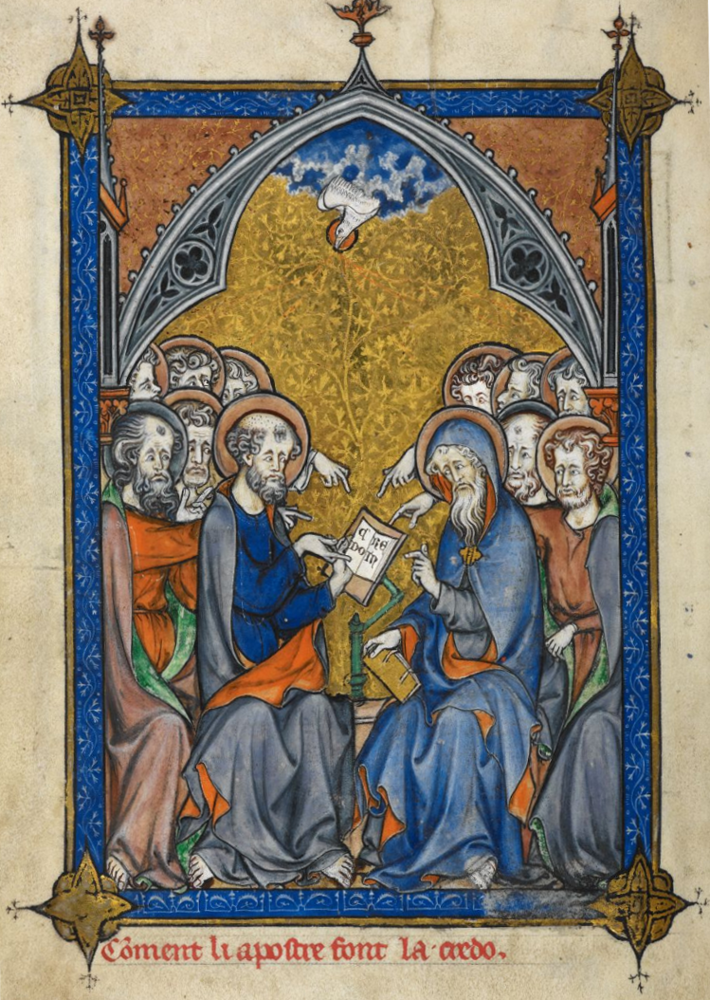

# The Apostles' Creed: Life Everlasting

## The Creed

>I believe in God, the Father Almighty,  
>the Creator of heaven and earth,  
>and in Jesus Christ, His only Son, our Lord:  
>Who was conceived of the Holy Spirit,  
>born of the Virgin Mary,  
>suffered under Pontius Pilate,  
>was crucified, died, and was buried.  
>He descended into hell.  
>  
>The third day He arose again from the dead.  
>He ascended into heaven and sits at the right hand of God the Father Almighty,  
>whence He shall come to judge the living and the dead.  
>  
>I believe in the Holy Spirit, the holy catholic church,  
>the communion of saints, the forgiveness of sins,  
>the resurrection of the body, and <bgy>life everlasting</bgy>.  
>  
>Amen.

## The Word

>John 3:16 (CSB) For God loved the world in this way: He gave his one and only Son, so that everyone who believes in him will not perish but have eternal life.

## The Belief

### From the beginning, we were created to live forever

>Genesis 1:26 (CSB) Then God said, “Let us make man in our image, according to our likeness. They will rule the fish of the sea, the birds of the sky, the livestock, the whole earth, and the creatures that crawl on the earth.”

### Sin broke all of that

>Genesis 3:7 (CSB) Then the eyes of both of them were opened, and they knew they were naked; so they sewed fig leaves together and made coverings for themselves.

### Sin separated us from God

>Genesis 3:10 (CSB) And he said, “I heard you in the garden, and I was afraid because I was naked, so I hid.”

### We are dead in our trespasses and sins

>Ephesians 2:1-2 (CSB) And you were dead in your trespasses and sins in which you previously walked according to the ways of this world, according to the ruler of the power of the air, the spirit now working in the disobedient.

>John 11:11-13 (CSB) He said this, and then he told them, “Our friend Lazarus has fallen asleep, but I’m on my way to wake him up.” Then the disciples said to him, “Lord, if he has fallen asleep, he will get well.” Jesus, however, was speaking about his death, but they thought he was speaking about natural sleep.

### But God, being rich in mercy, made us alive in Christ

>Ephesians 2:4-9 (CSB) But God, who is rich in mercy, because of his great love that he had for us, made us alive with Christ even though we were dead in trespasses. You are saved by grace! He also raised us up with him and seated us with him in the heavens in Christ Jesus, so that in the coming ages he might display the immeasurable riches of his grace through his kindness to us in Christ Jesus. For you are saved by grace through faith, and this is not from yourselves; it is God’s gift — not from works, so that no one can boast.

### Forever

>Romans 8:30 (CSB) And those he predestined, he also called; and those he called, he also justified; and those he justified, he also glorified.

>Romans 8:38–39 (CSB) For I am persuaded that neither death nor life, nor angels nor rulers, nor things present nor things to come, nor powers, nor height nor depth, nor any other created thing will be able to separate us from the love of God that is in Christ Jesus our Lord.

>Psalm 17:15 (CSB) But I will see your face in righteousness; when I awake, I will be satisfied with your presence.

>Psalm 16:11 (CSB) You reveal the path of life to me; in your presence is abundant joy; at your right hand are eternal pleasures.

>John 3:16 (CSB) For God loved the world in this way: He gave his one and only Son, so that everyone who believes in him will not perish but have eternal life.

>John 11:25-26 (CSB) Jesus said to her, “I am the resurrection and the life. The one who believes in me, even if he dies, will live. Everyone who lives and believes in me will never die. Do you believe this? ”
