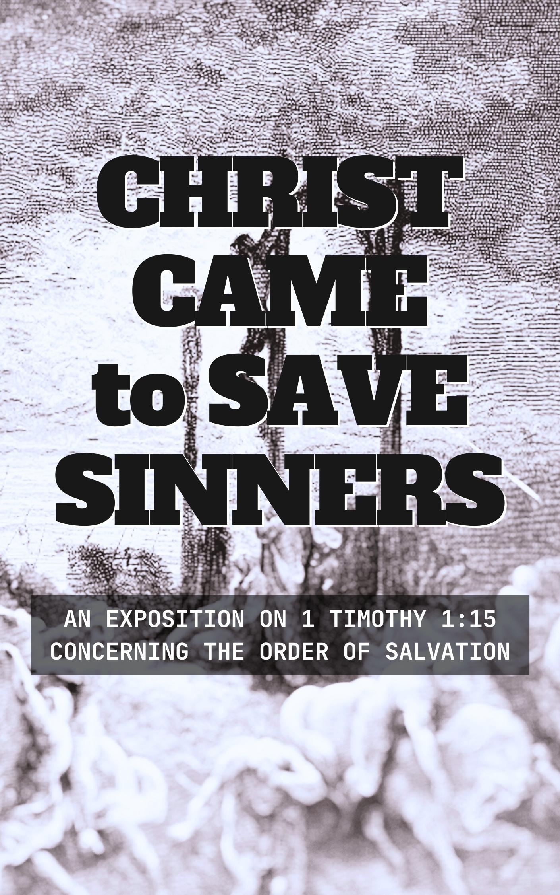

<a class="header" href="#the-weight-of-our-sin">The Weight of Our Sin</a>

The Depravity of Mankind

## The Text

>Psalm 51:4 (CSB) <bgy>Against you—you alone—I have sinned and done this evil in your sight.</bgy> So you are right when you pass sentence; you are blameless when you judge.

## The Devotion

## The Scriptures

>Leviticus 18:24–22:31 (CSB)  
>24 “Do not defile yourselves by any of these practices, for the nations I am driving out before you have defiled themselves by all these things. 
>
>25 The land has become defiled, so I am punishing it for its iniquity, and the land will vomit out its inhabitants. 
>
>26 But you are to keep my statutes and ordinances. You must not commit any of these detestable acts—not the native or the alien who resides among you. 
>
>27 For the people who were in the land prior to you have committed all these detestable acts, and the land has become defiled. 
>
>28 If you defile the land, it will vomit you out as it has vomited out the nations that were before you. 
>
>29 Any person who does any of these detestable practices is to be cut off from his people. 
>
>30 You must keep my instruction to not do any of the detestable customs that were practiced before you, so that you do not defile yourselves by them; I am the LORD your God.” 
>
>19:1 The LORD spoke to Moses: 
>
>2 “Speak to the entire Israelite community and tell them: Be holy because I, the LORD your God, am holy. 
>
>3 “Each of you is to respect his mother and father. You are to keep my Sabbaths; I am the LORD your God. 
>
>4 Do not turn to worthless idols or make cast images of gods for yourselves; I am the LORD your God. 
>
>5 “When you offer a fellowship sacrifice to the LORD, sacrifice it so that you may be accepted. 
>
>6 It is to be eaten on the day you sacrifice it or on the next day, but what remains on the third day must be burned. 
>
>7 If any is eaten on the third day, it is a repulsive thing; it will not be accepted. 
>
>8 Anyone who eats it will bear his iniquity, for he has profaned what is holy to the LORD. That person is to be cut off from his people. 
>
>9 “When you reap the harvest of your land, you are not to reap to the very edge of your field or gather the gleanings of your harvest. 
>
>10 Do not strip your vineyard bare or gather its fallen grapes. Leave them for the poor and the resident alien; I am the LORD your God. 
>
>11 “Do not steal. Do not act deceptively or lie to one another. 
>
>12 Do not swear falsely by my name, profaning the name of your God; I am the LORD. 
>
>13 “Do not oppress your neighbor or rob him. The wages due a hired worker must not remain with you until morning. 
>
>14 Do not curse the deaf or put a stumbling block in front of the blind, but you are to fear your God; I am the LORD. 
>
>15 “Do not act unjustly when deciding a case. Do not be partial to the poor or give preference to the rich; judge your neighbor fairly. 
>
>16 Do not go about spreading slander among your people; do not jeopardize your neighbor’s life; I am the LORD. 
>
>17 “Do not harbor hatred against your brother. Rebuke your neighbor directly, and you will not incur guilt because of him. 
>
>18 Do not take revenge or bear a grudge against members of your community, but love your neighbor as yourself; I am the LORD. 
>
>19 “You are to keep my statutes. Do not crossbreed two different kinds of your livestock, sow your fields with two kinds of seed, or put on a garment made of two kinds of material. 
>
>20 “If a man has sexual intercourse with a woman who is a slave designated for another man, but she has not been redeemed or given her freedom, there must be punishment. They are not to be put to death, because she had not been freed. 
>
>21 However, he must bring a ram as his guilt offering to the LORD at the entrance to the tent of meeting. 
>
>22 The priest will make atonement on his behalf before the LORD with the ram of the guilt offering for the sin he has committed, and he will be forgiven for the sin he committed. 
>
>23 “When you come into the land and plant any kind of tree for food, you are to consider the fruit forbidden. It will be forbidden to you for three years; it is not to be eaten. 
>
>24 In the fourth year all its fruit is to be consecrated as a praise offering to the LORD. 
>
>25 But in the fifth year you may eat its fruit. In this way its yield will increase for you; I am the LORD your God. 
>
>26 “You are not to eat anything with blood in it. You are not to practice divination or witchcraft. 
>
>27 You are not to cut off the hair at the sides of your head or mar the edge of your beard. 
>
>28 You are not to make gashes on your bodies for the dead or put tattoo marks on yourselves; I am the LORD. 
>
>29 “Do not debase your daughter by making her a prostitute, or the land will be prostituted and filled with depravity. 
>
>30 Keep my Sabbaths and revere my sanctuary; I am the LORD. 
>
>31 “Do not turn to mediums or consult spiritists, or you will be defiled by them; I am the LORD your God. 
>
>32 “You are to rise in the presence of the elderly and honor the old. Fear your God; I am the LORD. 
>
>33 “When an alien resides with you in your land, you must not oppress him. 
>
>34 You will regard the alien who resides with you as the native-born among you. You are to love him as yourself, for you were aliens in the land of Egypt; I am the LORD your God. 
>
>35 “Do not be unfair in measurements of length, weight, or volume. 
>
>36 You are to have honest balances, honest weights, an honest dry measure, and an honest liquid measure; I am the LORD your God, who brought you out of the land of Egypt. 
>
>37 Keep all my statutes and all my ordinances and do them; I am the LORD.” 
>
>20:1 The LORD spoke to Moses: 
>
>2 “Say to the Israelites: Any Israelite or alien residing in Israel who gives any of his children to Molech must be put to death; the people of the country are to stone him. 
>
>3 I will turn against that man and cut him off from his people, because he gave his offspring to Molech, defiling my sanctuary and profaning my holy name. 
>
>4 But if the people of the country look the other way when that man gives any of his children to Molech, and do not put him to death, 
>
>5 then I will turn against that man and his family, and cut off from their people both him and all who follow him in prostituting themselves with Molech. 
>
>6 “Whoever turns to mediums or spiritists and prostitutes himself with them, I will turn against that person and cut him off from his people. 
>
>7 Consecrate yourselves and be holy, for I am the LORD your God. 
>
>8 Keep my statutes and do them; I am the LORD who sets you apart. 
>
>9 “If anyone curses his father or mother, he must be put to death. He has cursed his father or mother; his death is his own fault. 
>
>10 “If a man commits adultery with a married woman—if he commits adultery with his neighbor’s wife—both the adulterer and the adulteress must be put to death. 
>
>11 If a man sleeps with his father’s wife, he has violated the intimacy that belongs to his father. Both of them must be put to death; their death is their own fault. 
>
>12 If a man sleeps with his daughter-in-law, both of them must be put to death. They have acted perversely; their death is their own fault. 
>
>13 If a man sleeps with a man as with a woman, they have both committed a detestable act. They must be put to death; their death is their own fault. 
>
>14 If a man marries a woman and her mother, it is depraved. Both he and they must be burned, so that there will be no depravity among you. 
>
>15 If a man has sexual intercourse with an animal, he must be put to death; you are also to kill the animal. 
>
>16 If a woman approaches any animal and mates with it, you are to kill the woman and the animal. They must be put to death; their death is their own fault. 
>
>17 If a man marries his sister, whether his father’s daughter or his mother’s daughter, and they have sexual relations, it is a disgrace. They are to be cut off publicly from their people. He has had sexual intercourse with his sister; he will bear his iniquity. 
>
>18 If a man sleeps with a menstruating woman and has sexual intercourse with her, he has exposed the source of her flow, and she has uncovered the source of her blood. Both of them are to be cut off from their people. 
>
>19 You must not have sexual intercourse with your mother’s sister or your father’s sister, for it is exposing one’s own blood relative; both people will bear their iniquity. 
>
>20 If a man sleeps with his aunt, he has violated the intimacy that belongs to his uncle; they will bear their guilt and die childless. 
>
>21 If a man marries his brother’s wife, it is impurity. He has violated the intimacy that belongs to his brother; they will be childless. 
>
>22 “You are to keep all my statutes and all my ordinances, and do them, so that the land where I am bringing you to live will not vomit you out. 
>
>23 You must not follow the statutes of the nations I am driving out before you, for they did all these things, and I abhorred them. 
>
>24 And I promised you: You will inherit their land, since I will give it to you to possess, a land flowing with milk and honey. I am the LORD your God who set you apart from the peoples. 
>
>25 Therefore you are to distinguish the clean animal from the unclean one, and the unclean bird from the clean one. Do not become contaminated by any land animal, bird, or whatever crawls on the ground; I have set these apart as unclean for you. 
>
>26 You are to be holy to me because I, the LORD, am holy, and I have set you apart from the nations to be mine. 
>
>27 “A man or a woman who is a medium or a spiritist must be put to death. They are to be stoned; their death is their own fault.” 
>
>21:1 The LORD said to Moses, “Speak to Aaron’s sons, the priests, and tell them: A priest is not to make himself ceremonially unclean for a dead person among his relatives, 
>
>2 except for his immediate family: his mother, father, son, daughter, or brother. 
>
>3 He may make himself unclean for his unmarried virgin sister in his immediate family. 
>
>4 He is not to make himself unclean for those related to him by marriage and so defile himself. 
>
>5 “Priests may not make bald spots on their heads, shave the edge of their beards, or make gashes on their bodies. 
>
>6 They are to be holy to their God and not profane the name of their God. For they present the food offerings to the LORD, the food of their God, and they must be holy. 
>
>7 They are not to marry a woman defiled by prostitution. They are not to marry one divorced by her husband, for the priest is holy to his God. 
>
>8 You are to consider him holy since he presents the food of your God. He will be holy to you because I, the LORD who sets you apart, am holy. 
>
>9 If a priest’s daughter defiles herself by promiscuity, she defiles her father; she must be burned to death. 
>
>10 “The priest who is highest among his brothers, who has had the anointing oil poured on his head and has been ordained to wear the clothes, must not dishevel his hair or tear his clothes. 
>
>11 He must not go near any dead person or make himself unclean even for his father or mother. 
>
>12 He must not leave the sanctuary or he will desecrate the sanctuary of his God, for the consecration of the anointing oil of his God is on him; I am the LORD. 
>
>13 “He is to marry a woman who is a virgin. 
>
>14 He is not to marry a widow, a divorced woman, or one defiled by prostitution. He is to marry a virgin from his own people, 
>
>15 so that he does not corrupt his bloodline among his people, for I am the LORD who sets him apart.” 
>
>16 The LORD spoke to Moses: 
>
>17 “Tell Aaron: None of your descendants throughout your generations who has a physical defect is to come near to present the food of his God. 
>
>18 No man who has any defect is to come near: no man who is blind, lame, facially disfigured, or deformed; 
>
>19 no man who has a broken foot or hand, 
>
>20 or who is a hunchback or a dwarf, or who has an eye defect, a festering rash, scabs, or a crushed testicle. 
>
>21 No descendant of the priest Aaron who has a defect is to come near to present the food offerings to the LORD. He has a defect and is not to come near to present the food of his God. 
>
>22 He may eat the food of his God from what is especially holy as well as from what is holy. 
>
>23 But because he has a defect, he must not go near the curtain or approach the altar. He is not to desecrate my holy places, for I am the LORD who sets them apart.” 
>
>24 Moses said this to Aaron and his sons and to all the Israelites. 
>
>22:1 The LORD spoke to Moses: 
>
>2 “Tell Aaron and his sons to deal respectfully with the holy offerings of the Israelites that they have consecrated to me, so they do not profane my holy name; I am the LORD. 
>
>3 Say to them: If any man from any of your descendants throughout your generations is in a state of uncleanness yet approaches the holy offerings that the Israelites consecrate to the LORD, that person will be cut off from my presence; I am the LORD. 
>
>4 No man of Aaron’s descendants who has a skin disease or a discharge is to eat from the holy offerings until he is clean. Whoever touches anything made unclean by a dead person or by a man who has an emission of semen, 
>
>5 or whoever touches any swarming creature that makes him unclean or any person who makes him unclean—whatever his uncleanness—
>
>6 the man who touches any of these will remain unclean until evening and is not to eat from the holy offerings unless he has bathed his body with water. 
>
>7 When the sun has set, he will become clean, and then he may eat from the holy offerings, for that is his food. 
>
>8 He must not eat an animal that died naturally or was mauled by wild beasts, making himself unclean by it; I am the LORD. 
>
>9 They must keep my instruction, or they will be guilty and die because they profane it; I am the LORD who sets them apart. 
>
>10 “No one outside a priest’s family is to eat the holy offering. A foreigner staying with a priest or a hired worker is not to eat the holy offering. 
>
>11 But if a priest purchases someone with his own silver, that person may eat it, and those born in his house may eat his food. 
>
>12 If the priest’s daughter is married to a man outside a priest’s family, she is not to eat from the holy contributions. 
>
>13 But if the priest’s daughter becomes widowed or divorced, has no children, and returns to her father’s house as in her youth, she may share her father’s food. But no outsider may share it. 
>
>14 If anyone eats a holy offering in error, he is to add a fifth to its value and give the holy offering to the priest. 
>
>15 The priests must not profane the holy offerings the Israelites give to the LORD 
>
>16 by letting the people eat their holy offerings and having them bear the penalty of restitution. For I am the LORD who sets them apart.” 
>
>17 The LORD spoke to Moses: 
>
>18 “Speak to Aaron, his sons, and all the Israelites and tell them: Any man of the house of Israel or of the resident aliens in Israel who presents his offering—whether they present payment of vows or freewill gifts to the LORD as burnt offerings—
>
>19 must offer an unblemished male from the cattle, sheep, or goats in order for you to be accepted. 
>
>20 You are not to present anything that has a defect, because it will not be accepted on your behalf. 
>
>21 “When a man presents a fellowship sacrifice to the LORD to fulfill a vow or as a freewill offering from the herd or flock, it has to be unblemished to be acceptable; there must be no defect in it. 
>
>22 You are not to present any animal to the LORD that is blind, injured, maimed, or has a running sore, festering rash, or scabs; you may not put any of them on the altar as a food offering to the LORD. 
>
>23 You may sacrifice as a freewill offering any animal from the herd or flock that has an elongated or stunted limb, but it is not acceptable as a vow offering. 
>
>24 You are not to present to the LORD anything that has bruised, crushed, torn, or severed testicles; you must not sacrifice them in your land. 
>
>25 Neither you nor a foreigner are to present food to your God from any of these animals. They will not be accepted for you because they are deformed and have a defect.” 
>
>26 The LORD spoke to Moses: 
>
>27 “When an ox, sheep, or goat is born, it is to remain with its mother for seven days; from the eighth day on, it will be acceptable as an offering, a food offering to the LORD. 
>
>28 But you are not to slaughter an animal from the herd or flock on the same day as its young. 
>
>29 When you sacrifice a thank offering to the LORD, sacrifice it so that you may be accepted. 
>
>30 It is to be eaten on the same day. Do not let any of it remain until morning; I am the LORD. 
>
>31 “You are to keep my commands and do them; I am the LORD.

>Psalm 51 (CSB)  
> For the choir director. A psalm of David, when the prophet Nathan came to him after he had gone to Bathsheba. 
>
>1 Be gracious to me, God, according to your faithful love; according to your abundant compassion, blot out my rebellion. 
>
>2 Completely wash away my guilt and cleanse me from my sin. 
>
>3 For I am conscious of my rebellion, and my sin is always before me. 
>
>4 Against you—you alone—I have sinned and done this evil in your sight. So you are right when you pass sentence; you are blameless when you judge. 
>
>5 Indeed, I was guilty when I was born; I was sinful when my mother conceived me. 
>
>6 Surely you desire integrity in the inner self, and you teach me wisdom deep within. 
>
>7 Purify me with hyssop, and I will be clean; wash me, and I will be whiter than snow. 
>
>8 Let me hear joy and gladness; let the bones you have crushed rejoice. 
>
>9 Turn your face away from my sins and blot out all my guilt. 
>
>10 God, create a clean heart for me and renew a steadfast spirit within me. 
>
>11 Do not banish me from your presence or take your Holy Spirit from me. 
>
>12 Restore the joy of your salvation to me, and sustain me by giving me a willing spirit. 
>
>13 Then I will teach the rebellious your ways, and sinners will return to you. 
>
>14 Save me from the guilt of bloodshed, God— God of my salvation— and my tongue will sing of your righteousness. 
>
>15 Lord, open my lips, and my mouth will declare your praise. 
>
>16 You do not want a sacrifice, or I would give it; you are not pleased with a burnt offering. 
>
>17 The sacrifice pleasing to God is a broken spirit. You will not despise a broken and humbled heart, God. 
>
>18 In your good pleasure, cause Zion to prosper; build the walls of Jerusalem. 
>
>19 Then you will delight in righteous sacrifices, whole burnt offerings; then bulls will be offered on your altar.

>1 Peter 1:13–2:12 (CSB)  
>13 Therefore, with your minds ready for action, be sober-minded and set your hope completely on the grace to be brought to you at the revelation of Jesus Christ. 
>
>14 As obedient children, do not be conformed to the desires of your former ignorance. 
>
>15 But as the one who called you is holy, you also are to be holy in all your conduct; 
>
>16 for it is written, Be holy, because I am holy. 
>
>17 If you appeal to the Father who judges impartially according to each one’s work, you are to conduct yourselves in reverence during your time living as strangers. 
>
>18 For you know that you were redeemed from your empty way of life inherited from your ancestors, not with perishable things like silver or gold, 
>
>19 but with the precious blood of Christ, like that of an unblemished and spotless lamb. 
>
>20 He was foreknown before the foundation of the world but was revealed in these last times for you. 
>
>21 Through him you believe in God, who raised him from the dead and gave him glory, so that your faith and hope are in God. 
>
>22 Since you have purified yourselves by your obedience to the truth, so that you show sincere brotherly love for each other, from a pure heart love one another constantly, 
>
>23 because you have been born again—not of perishable seed but of imperishable—through the living and enduring word of God. 
>
>24 For All flesh is like grass, and all its glory like a flower of the grass. The grass withers, and the flower falls, 
>
>25 but the word of the Lord endures forever. And this word is the gospel that was proclaimed to you. 
>
>1 Therefore, rid yourselves of all malice, all deceit, hypocrisy, envy, and all slander. 
>
>2 Like newborn infants, desire the pure milk of the word, so that by it you may grow up into your salvation, 
>
>3 if you have tasted that the Lord is good. 
>
>4 As you come to him, a living stone—rejected by people but chosen and honored by God—
>
>5 you yourselves, as living stones, a spiritual house, are being built to be a holy priesthood to offer spiritual sacrifices acceptable to God through Jesus Christ. 
>
>6 For it stands in Scripture: See, I lay a stone in Zion, a chosen and honored cornerstone, and the one who believes in him will never be put to shame. 
>
>7 So honor will come to you who believe; but for the unbelieving, The stone that the builders rejected— this one has become the cornerstone, 
>
>8 and A stone to stumble over, and a rock to trip over. They stumble because they disobey the word; they were destined for this. 
>
>9 But you are a chosen race, a royal priesthood, a holy nation, a people for his possession, so that you may proclaim the praises of the one who called you out of darkness into his marvelous light. 
>
>10 Once you were not a people, but now you are God’s people; you had not received mercy, but now you have received mercy. 
>
>11 Dear friends, I urge you as strangers and exiles to abstain from sinful desires that wage war against the soul. 
>
>12 Conduct yourselves honorably among the Gentiles, so that when they slander you as evildoers, they will observe your good works and will glorify God on the day he visits.
