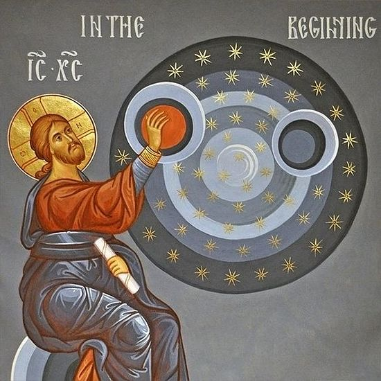

# Genesis 14:1-16 The Gospel Rescue

## The Text

> 1  In those days King Amraphel of Shinar, King Arioch of Ellasar, King Chedorlaomer of Elam, and King Tidal of Goiim 
>
> 2  waged war against King Bera of Sodom, King Birsha of Gomorrah, King Shinab of Admah, and King Shemeber of Zeboiim, as well as the king of Bela (that is, Zoar). 
>
> 3  All of these came as allies to the Siddim Valley (that is, the Dead Sea). 
>
> 4  They were subject to Chedorlaomer for twelve years, but in the thirteenth year they rebelled. 
>
> 5  In the fourteenth year Chedorlaomer and the kings who were with him came and defeated the Rephaim in Ashteroth-karnaim, the Zuzim in Ham, the Emim in Shaveh-kiriathaim, 
>
> 6  and the Horites in the mountains of Seir, as far as El-paran by the wilderness. 
>
> 7  Then they came back to invade En-mishpat (that is, Kadesh), and they defeated the whole territory of the Amalekites, as well as the Amorites who lived in Hazazon-tamar. 
>
> 8  Then the king of Sodom, the king of Gomorrah, the king of Admah, the king of Zeboiim, and the king of Bela (that is, Zoar) went out and lined up for battle in the Siddim Valley 
>
> 9  against King Chedorlaomer of Elam, King Tidal of Goiim, King Amraphel of Shinar, and King Arioch of Ellasar—four kings against five. 
>
> 10  Now the Siddim Valley contained many asphalt pits, and as the kings of Sodom and Gomorrah fled, some fell into them, but the rest fled to the mountains. 
>
> 11  The four kings took all the goods of Sodom and Gomorrah and all their food and went on. 
>
> 12  They also took Abram’s nephew Lot and his possessions, for he was living in Sodom, and they went on. 
>
> 13  One of the survivors came and told Abram the Hebrew, who lived near the oaks belonging to Mamre the Amorite, the brother of Eshcol and the brother of Aner. They were bound by a treaty with Abram. 
>
> 14  When Abram heard that his relative had been taken prisoner, he assembled his 318 trained men, born in his household, and they went in pursuit as far as Dan. 
>
> 15  And he and his servants deployed against them by night, defeated them, and pursued them as far as Hobah to the north of Damascus. 
>
> 16  He brought back all the goods and also his relative Lot and his goods, as well as the women and the other people.

## The Support

>Where do you see God in the text? What does the text say about God?

## Our God

Our God will stop at nothing to rescue his people from their sins.

Here is the gospel promise.

## His Gospel

### God will rescue those whom he declares righteous

**2 Peter 2:4-12** For if God didn’t spare the angels who sinned but cast them into hell and delivered them in chains of utter darkness to be kept for judgment; and if he didn’t spare the ancient world, but protected Noah, a preacher of righteousness, and seven others, when he brought the flood on the world of the ungodly; **and if he reduced the cities of Sodom and Gomorrah to ashes and condemned them to extinction, making them an example of what is coming to the ungodly; and if he rescued righteous Lot, distressed by the depraved behavior of the immoral (for as that righteous man lived among them day by day, his righteous soul was tormented by the lawless deeds he saw and heard)** — then the Lord knows how to rescue the godly from trials and to keep the unrighteous under punishment for the day of judgment, especially those who follow the polluting desires of the flesh and despise authority.
    Bold, arrogant people! They are not afraid to slander the glorious ones; however, angels, who are greater in might and power, do not bring a slanderous charge against them before the Lord. But these people, like irrational animals — creatures of instinct born to be caught and destroyed — slander what they do not understand, and in their destruction they too will be destroyed.

*What one thing has Lot done that is righteous?*

We all know that God rescued Lot out of Sodom and Gomorrah when he reduced to to ash from our Sunday School stories. But that is not the first time Lot placed himself in sins' way.

Because of the curse of the world and Satan and his forces, the world was coming after Lot. And Lot was not holier than thou, more righteous, read the Bible more (spoiler alert--more than likely he did not know how to read, and if he did, he would not been in possession of the Pentateuch because Moses had yet to be born to write the Pentateuch) nor prayed more than any of us.

See this righteous Lot! Kidnapped and no recording of him praying out to God to save him! No! God sent Abraham to conquered the forces of evil that have captured his precious sheep.

**Matthew 18:12-14** What do you think? If someone has a hundred sheep, and one of them goes astray, won’t he leave the ninety-nine on the hillside and go and search for the stray? And if he finds it, truly I tell you, he rejoices over that sheep more than over the ninety-nine that did not go astray. **In the same way, it is not the will of your Father in heaven that one of these little ones perish.**

### God will save his righteous ones by putting the forces of evil to open shame

**Colossians 2:13-15** And when you were dead in trespasses and in the uncircumcision of your flesh, he made you alive with him and forgave us all our trespasses. He erased the certificate of debt, with its obligations, that was against us and opposed to us, and has taken it away by nailing it to the cross. He disarmed the rulers and authorities and disgraced them publicly; he triumphed over them in him.

The kingdom of God is the upside-down version of our piss-ant little kingdoms. In fact, we tend to call it "upside-down" because how God operates his kingdom is in direct violation and contrast to our world.

Pragmatic: "We should only do things if they produce the outcome we want to see."

Kingdom of God: "It is God who gives the growth."

Our world: "Only the people who really haven't done anything too terribly shoudl be blessed.

Kingdom of God: "All have sinned and fallen short of my glory. Yet, Christ came to save sinners. While we were yet sinners, Christ died for the ungodly because he loved us so much."

Us: "In war, if you die, you lose."

God: "If the King of Kings and Lord of Lords die, then we win."

So who is in the upside kingdom?

We are in the fallen world. We are beset by sin, death, tragedy, and trauma. Our hearts are broken and our spirits are crushed.

It is our world that is upside-down.

It is God's kingdom that is right-side up.

>Let us muse upon the fact that Jesus was conducted without the gates of the city. It was the common place of death. That little rising ground, which perhaps was called Golgotha, the place of a skull, from its somewhat resembling the crown of a man's skull, was the common place of execution. It was one of Death's castles; here he stored his gloomiest trophies; he was the grim lord of that stronghold. Our great hero, the destroyer of Death, bearded the lion in his den, slew the monster in his own castle, and dragged the dragon captive from his own den. Methinks Death thought it a splendid triumph when he saw the Master impaled and bleeding in the dominions of destruction; little did he know that the grave was to be rifled, and himself destroyed, by that crucified Son of man.
>
>Charles Spurgeon. The Procession of Sorrow. Sermon 497. March 1, 1863.

### The nations foolishly rage war against God but God breaks and shatters them and gives them to his Son to be his inheritance, possession, and food stool forever

**Psalms 2** Why do the nations rage
    and the peoples plot in vain?
    The kings of the earth take their stand,
    and the rulers conspire together
    against the LORD and his Anointed One:
    “Let’s tear off their chains
    and throw their ropes off of us.”
    The one enthroned in heaven laughs;
    The Lord ridicules them.
    **Then he speaks to them in his anger
    and terrifies them in his wrath:
    “I have installed my king
    on Zion, my holy mountain.”
    I will declare the LORD’s decree.
    He said to me, “You are my Son;
    today I have become your Father.
    Ask of me,
    and I will make the nations your inheritance
    and the ends of the earth your possession.
    You will break them with an iron scepter;
    you will shatter them like pottery.”**
    So now, kings, be wise;
    receive instruction, you judges of the earth.
    Serve the LORD with reverential awe
    and rejoice with trembling.
    Pay homage to the Son or he will be angry
    and you will perish in your rebellion,
    for his anger may ignite at any moment.
    *Look at this blessed gospel promise*
    All who take refuge in him are happy.

**Ephesians 1:20-23** He exercised this power in Christ by raising him from the dead and seating him at his right hand in the heavens — far above every ruler and authority, power and dominion, and every title given, not only in this age but also in the one to come. And he subjected everything under his feet and appointed him as head over everything for the church, which is his body, the fullness of the one who fills all things in every way.

## Our Response

### Rest assure, since God has you in the double-infinite grasp of the Father and the Son, sealed by the Almighty Spirit, you have nothing to fear

Christ perfectly obeyed the will of the Father to fulfill the promise he made to rescue his people from their sins.

Christian, do you believe God has done this? Do you believe Christ died so that you might live? Do you believe that he has resurrected from the dead?

You did not reveal this to yourself but it is your Father in heaven that has revealed it to you. Rest assure, my beloved, God has you and he is never going to let you go.

### All of the enemies have been conquered by the Worthy Lamb Who Was Slained

**Revelation 19:1
20:3** Then I saw heaven opened, and there was a white horse. Its rider is called Faithful and True, and with justice he judges and makes war. His eyes were like a fiery flame, and many crowns were on his head. He had a name written that no one knows except himself. He wore a robe dipped in blood, and his name is called the Word of God. The armies that were in heaven followed him on white horses, wearing pure white linen. A sharp sword came from his mouth, so that he might strike the nations with it. He will rule them with an iron rod. He will also trample the winepress of the fierce anger of God, the Almighty. And he has a name written on his robe and on his thigh: KING OF KINGS AND LORD OF LORDS.

Then I saw an angel standing in the sun, and he called out in a loud voice, saying to all the birds flying high overhead, “Come, gather together for the great supper of God, so that you may eat the flesh of kings, the flesh of military commanders, the flesh of the mighty, the flesh of horses and of their riders, and the flesh of everyone, both free and slave, small and great.”

Then I saw the beast, the kings of the earth, and their armies gathered together to wage war against the rider on the horse and against his army. But the beast was taken prisoner, and along with it the false prophet, who had performed the signs in its presence. He deceived those who accepted the mark of the beast and those who worshiped its image with these signs. Both of them were thrown alive into the lake of fire that burns with sulfur. The rest were killed with the sword that came from the mouth of the rider on the horse, and all the birds ate their fill of their flesh.

Then I saw an angel coming down from heaven holding the key to the abyss and a great chain in his hand. He seized the dragon, that ancient serpent who is the devil and Satan, and bound him for a thousand years. He threw him into the abyss, closed it, and put a seal on it so that he would no longer deceive the nations until the thousand years were completed. After that, he must be released for a short time.

### We get to be with God forevermore

**Revelation 21:3-8** Then I heard a loud voice from the throne: Look, God’s dwelling is with humanity, and he will live with them. They will be his peoples, and God himself will be with them and will be their God. He will wipe away every tear from their eyes. Death will be no more; grief, crying, and pain will be no more, because the previous things have passed away.
    Then the one seated on the throne said, “Look, I am making everything new.” He also said, “Write, because these words are faithful and true.” Then he said to me, “It is done! I am the Alpha and the Omega, the beginning and the end. I will freely give to the thirsty from the spring of the water of life. The one who conquers will inherit these things, and I will be his God, and he will be my son. But the cowards, faithless, detestable, murderers, sexually immoral, sorcerers, idolaters, and all liars — their share will be in the lake that burns with fire and sulfur, which is the second death.”

**Psalms 17:15** But I will see your face in righteousness;
    when I awake, I will be satisfied with your presence.

**Psalms 16:9-11** (ESV)
    Therefore my heart is glad, and my whole being rejoices;
    my flesh also dwells secure.
    For you will not abandon my soul to Sheol,
    or let your holy one see corruption.
    You make known to me the path of life;
    in your presence there is fullness of joy;
    at your right hand are pleasures forevermore.
