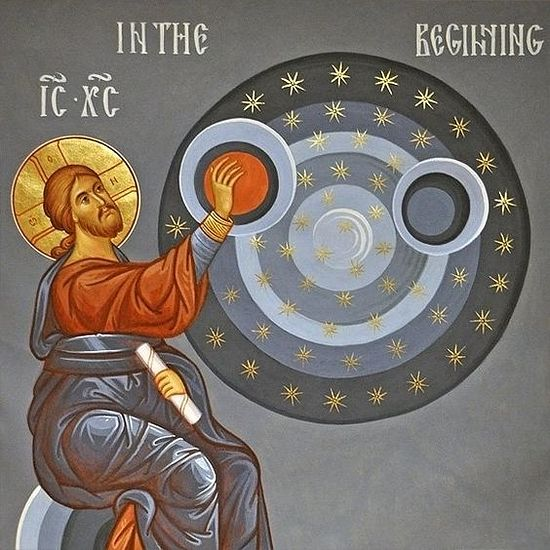

# Genesis 18:16-33 The Gospel Plea

## The Text

>Genesis 18:16–33 (CSB)  
>16 The men got up from there and looked out over Sodom, and Abraham was walking with them to see them off. 
>
>17 Then the LORD said, “Should I hide what I am about to do from Abraham? 
>
>18 Abraham is to become a great and powerful nation, and all the nations of the earth will be blessed through him. 
>
>19 For I have chosen him so that he will command his children and his house after him to keep the way of the LORD by doing what is right and just. This is how the LORD will fulfill to Abraham what he promised him.” 
>
>20 Then the LORD said, “The outcry against Sodom and Gomorrah is immense, and their sin is extremely serious. 
>
>21 I will go down to see if what they have done justifies the cry that has come up to me. If not, I will find out.” 
>
>22 The men turned from there and went toward Sodom while Abraham remained standing before the LORD. 
>
>23 Abraham stepped forward and said, “Will you really sweep away the righteous with the wicked? 
>
>24 What if there are fifty righteous people in the city? Will you really sweep it away instead of sparing the place for the sake of the fifty righteous people who are in it? 
>
>25 You could not possibly do such a thing: to kill the righteous with the wicked, treating the righteous and the wicked alike. You could not possibly do that! Won’t the Judge of the whole earth do what is just?” 
>
>26 The LORD said, “If I find fifty righteous people in the city of Sodom, I will spare the whole place for their sake.” 
>
>27 Then Abraham answered, “Since I have ventured to speak to my lord—even though I am dust and ashes—
>
>28 suppose the fifty righteous lack five. Will you destroy the whole city for lack of five?” He replied, “I will not destroy it if I find forty-five there.” 
>
>29 Then he spoke to him again, “Suppose forty are found there?” He answered, “I will not do it on account of forty.” 
>
>30 Then he said, “Let my lord not be angry, and I will speak further. Suppose thirty are found there?” He answered, “I will not do it if I find thirty there.” 
>
>31 Then he said, “Since I have ventured to speak to my lord, suppose twenty are found there?” He replied, “I will not destroy it on account of twenty.” 
>
>32 Then he said, “Let my lord not be angry, and I will speak one more time. Suppose ten are found there?” He answered, “I will not destroy it on account of ten.” 
>
>33 When the LORD had finished speaking with Abraham, he departed, and Abraham returned to his place.

## Our God

>**2 Corinthians 5:10-15** (CSB) For we must all appear before the judgment seat of Christ, so that each may be repaid for what he has done in the body, whether good or evil.
>
> Therefore, since we know the fear of the Lord, we try to persuade people. What we are is plain to God, and I hope it is also plain to your consciences. We are not commending ourselves to you again, but giving you an opportunity to be proud of us, so that you may have a reply for those who take pride in outward appearance rather than in the heart. For if we are out of our mind, it is for God; if we are in our right mind, it is for you. For the love of Christ compels us, since we have reached this conclusion, that one died for all, and therefore all died. And he died for all so that those who live should no longer live for themselves, but for the one who died for them and was raised.

## The Gospel

>**2 Corinthians 5:16-21** (CSB) From now on, then, we do not know anyone from a worldly perspective. Even if we have known Christ from a worldly perspective, yet now we no longer know him in this way. Therefore, if anyone is in Christ, he is a new creation; the old has passed away, and see, the new has come! Everything is from God, who has reconciled us to himself through Christ and has given us the ministry of reconciliation. That is, in Christ, God was reconciling the world to himself, not counting their trespasses against them, and he has committed the message of reconciliation to us.
>
>Therefore, we are ambassadors for Christ, since God is making his appeal through us. We plead on Christ’s behalf, “Be reconciled to God.” He made the one who did not know sin to be sin for us, so that in him we might become the righteousness of God.

## Our Response

>**2 Corinthians 6:1-2** (CSB) Working together with him, we also appeal to you, “Don’t receive the grace of God in vain.” For he says:
>At an acceptable time I listened to you,
>and in the day of salvation I helped you.
>See, now is the acceptable time; now is the day of salvation!
