# Luke: An Introduction & Resources

## The Introduction

I finished up [The Gospel of Mark](/mark/index.md) with my stepkids. Now I have little bitty kids.

This started out as a mere outline for Luke's Gospel. But because of the youth of my kids (pre-kindergarten whenw e started), I wanted to fold in some catechism. So I integrated the Westminster Shorter Catechism into the readings of Luke.

Yet, in the provision of God, in our move to Kentucky, we switched from Non-Denominational to Reformed Baptist. My pastor heard about what I was doing and sincerely recommended [Milk for Little Ones: An Introduction to the Baptist Catechism](https://www.goodreads.com/book/show/57867604-milk-for-little-ones?from_search=true&from_srp=true&qid=YaqYvFO9b4&rank=1).

The fruit has been outstanding. And not to go all pragmatic, but my children, now elementary age of this writing, are now baptized. Praise be to God.

After finishing the catechism, I will start to integrate this, other catechism, and confessions into my devotional writing. I suspect I will move back into Luke after Milk for Little Ones.

## The Resources

### It Goes Without Say

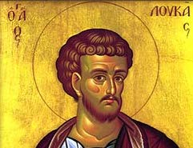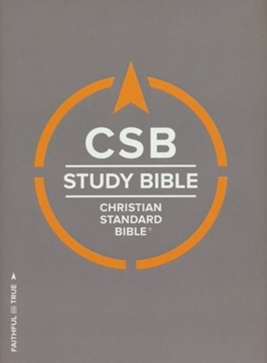Christian Standard Bible  
Holmon Publishing. 2020.  
[Goodreads](https://www.goodreads.com/book/show/30746885-csb-study-bible)

Many times, many teachers, preachers, and small group leaders (myself included) will "cut straight to the chase" and engage the commentary instead of engaging the Word of God. Remember, the commentaries are not without error—they are the observations of the author.

Slow down, pray, read, chew and meditate.

Note: I use the [Christian Standard Bible](https://csbible.com) version on this blog default. Other translations, such as the [ESV](https://www.crossway.org/bibles/) or the [NIV1984](https://bibleportal.com/version/NIV1984), will be noted as such.

ESV Reformation Study Bible  
Commentary & Edited by R.C. Sproul.  
Ligonier Ministries. March 16, 2015.  
[Goodreads](https://www.goodreads.com/book/show/53529503-esv-reformation-study-bible?ac=1&from_search=true&qid=KXDsGlDfkm&rank=1)

I don't have much to say except this: if I was restricted to one Study Bible, this would be the one. Even if they never make one for the CSB. That is how much I love R.C. Sproul's notes--they will always refer back to historical creeds and confessions.

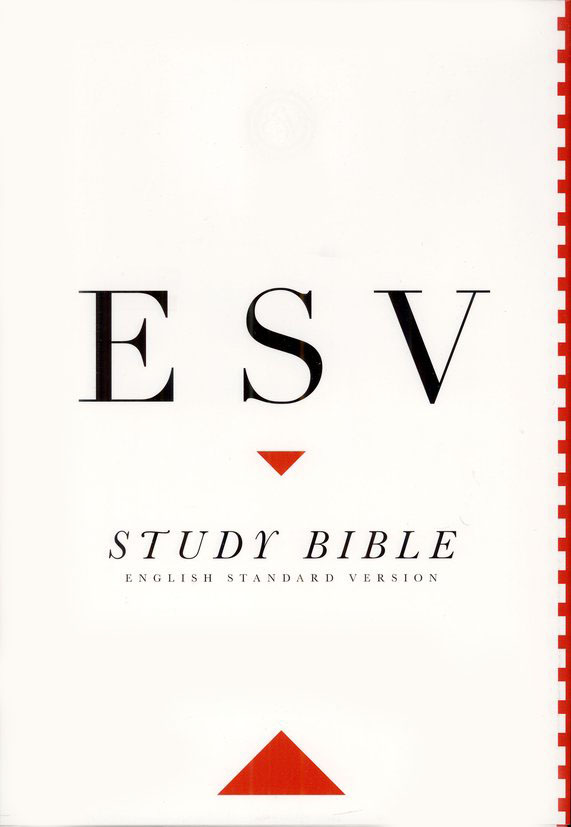ESV Study Bible  
Crossway. 2016.  
[Goodreads](https://www.goodreads.com/book/show/5031805-esv-study-bible?ac=1&from_search=true&qid=BEzDEv7NUE&rank=1)

Incredible resource.

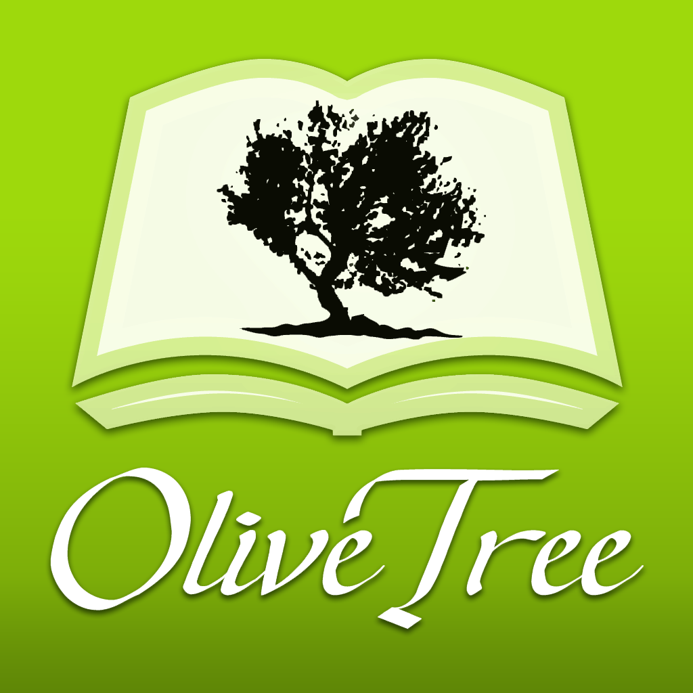If I had to pick just one format (hardcover vs. leather vs. paperback vs. digital), I use it way more in my [Olive Tree Study Bible](https://www.olivetree.com) than anything else.  

Hebrew Greek Key Word Study Bible.  
New American Standard Bible 1977.  
AMG International. 2008.  
[Goodreads](https://www.goodreads.com/book/show/52820732-the-hebrew-greek-key-word-study-bible?from_search=true&from_srp=true&qid=P0A6P8R3yU&rank=2)

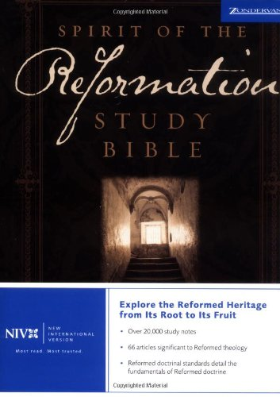Spirit of the Reformation Study Bible.  
NIV 1984.  
Zondervan. 2003.  
[Goodreads](https://www.goodreads.com/book/show/3421584-niv-spirit-of-the-reformation-study-bible)

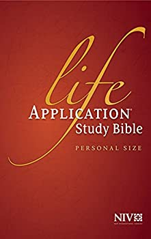Life Application Study Bible.  
NIV 2011.  
Zondervan. 2011.  
[Goodreads](https://www.goodreads.com/book/show/14330625-niv-life-application-study-bible-second-edition)

### Commentaries & Books

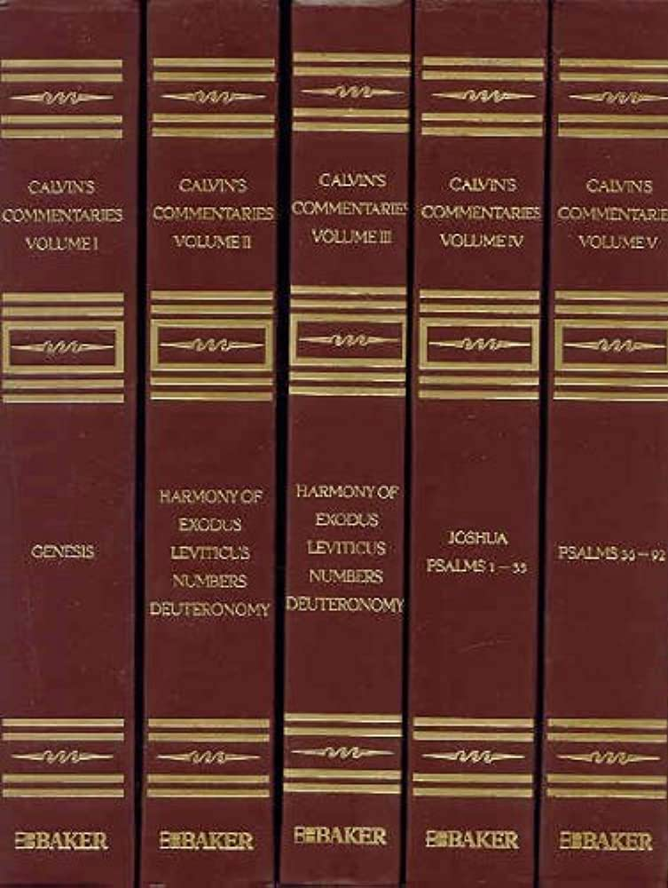Calvin's Commentaries.  
by John Calvin.  
Baker. 2009.  
[Olive Tree](https://www.olivetree.com/store/product.php?productid=17517)

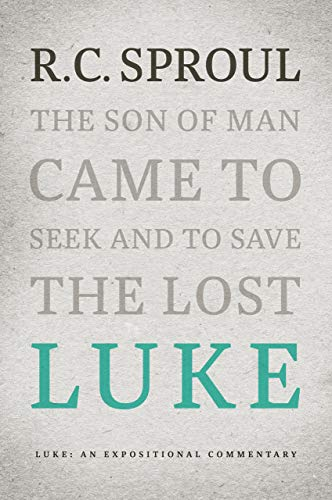Luke: An Expositional Commentary  
R.C. Sproul.  
Reformation Trust Publisher. 2020.  
[Goodreads](https://www.goodreads.com/book/show/55161506-luke)

This is fresh off the presses. I have read [Romans, John, Mark, Acts, 1 & 2 Peter, and Matthew](https://amzn.to/3jc5I02) from this set. I can easily recommend every single one of them.

If it ain't broke, don't fix it. Keep on truckin'.

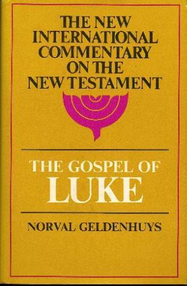The Gospel of Luke (NICNT).  
Norval Geldenhuys.  
Eerdmans. 1951.  
[Goodbooks](https://www.goodreads.com/book/show/2106649.Commentary_on_the_Gospel_of_Luke?ac=1&from_search=true&qid=pjpzVhBPMk&rank=3)

Do I know anything about this guy? Nope. A few Amazon reviewers thought he was super solid and a conservative theologian.

When I started up this series, I was hard up for good Luke resources. God's pure grace and timing, this fell into my lap.  So I am going out with the horse I rode in on and keeping this as part of the stack.  

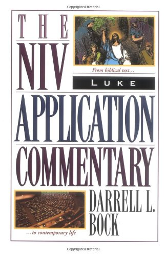Luke (NIVAC).  
Darrell L. Bock.  
Zondervan. 1996.

I swear to beans I have more books from this guy. But a quick look-see on Amazon shows that he is a one-lane kind-of-guy. He knows his Luke-Acts. (Now that I think about it, I am getting him mixed up with *Daniel I. Block* who wrote [Ezekiel (NICOT)](https://amzn.to/3azIXiq).)

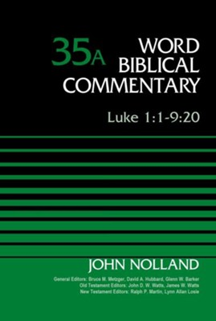Luke (WBC).  
John Nolland.  
Thomas Nelson. 1989-93.  
[Goodreads](https://www.goodreads.com/book/show/151083514-word-biblical-commentary-vol-35a-luke-1?from_search=true&from_srp=true&qid=jlCakWA5r8&rank=1)

ESV Expository Commentary: Matthew–Luke (Volume, 8).  
Dan Doriani (Author).  
Iain M. Duguid, James M. Hamilton Jr., & Jay Sklar (Editors).  
Crossway. September 7, 2021.  
[Goodreads](https://www.goodreads.com/book/show/50611048-esv-expository-commentary-volume-8?from_search=true&from_srp=true&qid=FBpWi6R83q&rank=1)

So, I got the first three volumes released back a few years ago. Now they are up to 11 volumes. Also, I just created a budget that allows me to purchase one commentary per paycheck. (Bivocational is the providence of God.)

The authors are top notch. This will be referenced for sure.