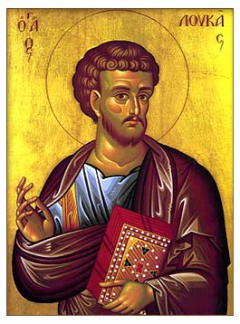

# Luke

## The Introduction

I finished up [The Gospel of Mark](/mark/index.md) with my stepkids. Now I have little bitty kids.

This started out as a mere outline for Luke's Gospel. But because of the youth of my kids (pre-kindergarten whenw e started), I wanted to fold in some catechism. So I integrated the Westminster Shorter Catechism into the readings of Luke.

Yet, in the provision of God, in our move to Kentucky, we switched from Non-Denominational to Reformed Baptist. My pastor heard about what I was doing and sincerely recommended [Milk for Little Ones: An Introduction to the Baptist Catechism](https://www.goodreads.com/book/show/57867604-milk-for-little-ones?from_search=true&from_srp=true&qid=YaqYvFO9b4&rank=1).

The fruit has been outstanding. And not to go all pragmatic, but my children, now elementary age of this writing, are now baptized. Praise be to God.

After finishing the catechism, I will start to integrate this, other catechism, and confessions into my devotional writing. I suspect I will move back into Luke after Milk for Little Ones.
