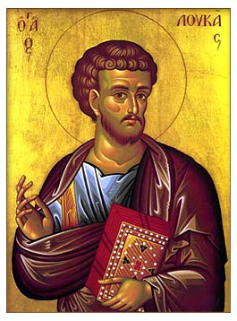

# Luke 1-2:21 The Incarnation of the Word of God

<!-- toc -->

## Luke 1:1-4 To Be Called A Witness

>Luke 1:1–4 (CSB) Many have undertaken to compile a narrative about the events that have been fulfilled among us,  just as the original eyewitnesses and servants of the word handed them down to us.  So it also seemed good to me, since I have carefully investigated everything from the very first, to write to you in an orderly sequence, most honorable Theophilus,  so that you may know the certainty of the things about which you have been instructed.

What is it to witness? In the court of law, it is one who testifies to crime that was committed or to the whereabouts of one that is accused.

To witness about God among us is merely more than what we see and know.

It is that God sees us and knows us.

Christ said in Matthew 10:32–33, "So everyone who acknowledges me before men, I also will acknowledge before my Father who is in heaven, but whoever denies me before men, I also will deny before my Father who is in heaven."

Paul goes on in Romans 8, "The Spirit himself bears witness with our spirit that we are children of God, and if children, then heirs—heirs of God and fellow heirs with Christ, provided we suffer with him in order that we may also be glorified with him."

It is any wonder then why Christ will tell those who call themselves witnesses, disciples, and gospel proclaimers in Matthew 10:16–23 “Behold, I am sending you out as sheep in the midst of wolves, so be wise as serpents and innocent as doves. Beware of men, for they will deliver you over to courts and flog you in their synagogues, and you will be dragged before governors and kings for my sake, to bear witness before them and the Gentiles. When they deliver you over, do not be anxious how you are to speak or what you are to say, for what you are to say will be given to you in that hour. For it is not you who speak, but the Spirit of your Father speaking through you. Brother will deliver brother over to death, and the father his child, and children will rise against parents and have them put to death, and you will be hated by all for my name's sake. But the one who endures to the end will be saved. When they persecute you in one town, flee to the next, for truly, I say to you, you will not have gone through all the towns of Israel before the Son of Man comes."

What is our response? In Acts 1:6–11, the author Luke bore witness: So when they had come together, they asked him, “Lord, will you at this time restore the kingdom to Israel?” He said to them, “It is not for you to know times or seasons that the Father has fixed by his own authority. But you will receive power when the Holy Spirit has come upon you, and you will be my witnesses in Jerusalem and in all Judea and Samaria, and to the end of the earth.” And when he had said these things, as they were looking on, he was lifted up, and a cloud took him out of their sight. And while they were gazing into heaven as he went, behold, two men stood by them in white robes, and said, “Men of Galilee, why do you stand looking into heaven? This Jesus, who was taken up from you into heaven, will come in the same way as you saw him go into heaven.”

1. To whom is the author speaking to? What is the author intending to do?

2. What is it mean to bear witness of the truth?

3. Can you proclaim the truth and live in contradiction to that truth?

## Luke 1:5–7 How Can We Be Righteous Before God?

>Luke 1:5–7 (CSB) In the days of King Herod of Judea, there was a priest of Abijah’s division named Zechariah. His wife was from the daughters of Aaron, and her name was Elizabeth.  Both were righteous in God’s sight, living without blame according to all the commands and requirements of the Lord.  But they had no children because Elizabeth could not conceive, and both of them were well along in years. 

What is righteous?

How can we be righteous before God? Can we make ourselves righteous? What does God have to do?

>Ezekiel 36:22–38 “Therefore say to the house of Israel, Thus says the Lord God: It is not for your sake, O house of Israel, that I am about to act, but for the sake of my holy name, which you have profaned among the nations to which you came. And I will vindicate the holiness of my great name, which has been profaned among the nations, and which you have profaned among them. And the nations will know that I am the Lord, declares the Lord God, when through you I vindicate my holiness before their eyes. I will take you from the nations and gather you from all the countries and bring you into your own land. I will sprinkle clean water on you, and you shall be clean from all your uncleannesses, and from all your idols I will cleanse you. And I will give you a new heart, and a new spirit I will put within you. And I will remove the heart of stone from your flesh and give you a heart of flesh. And I will put my Spirit within you, and cause you to walk in my statutes and be careful to obey my rules. You shall dwell in the land that I gave to your fathers, and you shall be my people, and I will be your God. And I will deliver you from all your uncleannesses. And I will summon the grain and make it abundant and lay no famine upon you. I will make the fruit of the tree and the increase of the field abundant, that you may never again suffer the disgrace of famine among the nations. Then you will remember your evil ways, and your deeds that were not good, and you will loathe yourselves for your iniquities and your abominations. It is not for your sake that I will act, declares the Lord God; let that be known to you. Be ashamed and confounded for your ways, O house of Israel.  
>
>“Thus says the Lord God: On the day that I cleanse you from all your iniquities, I will cause the cities to be inhabited, and the waste places shall be rebuilt. And the land that was desolate shall be tilled, instead of being the desolation that it was in the sight of all who passed by. And they will say, ‘This land that was desolate has become like the garden of Eden, and the waste and desolate and ruined cities are now fortified and inhabited.’ Then the nations that are left all around you shall know that I am the Lord; I have rebuilt the ruined places and replanted that which was desolate. I am the Lord; I have spoken, and I will do it.  
>
>“Thus says the Lord God: This also I will let the house of Israel ask me to do for them: to increase their people like a flock. Like the flock for sacrifices, like the flock at Jerusalem during her appointed feasts, so shall the waste cities be filled with flocks of people. Then they will know that I am the Lord.” 

## Luke 1:8–10 How Can We Worship God Everyday?

>Luke 1:8–10 (CSB) When his division was on duty and he was serving as priest before God,  it happened that he was chosen by lot, according to the custom of the priesthood, to enter the sanctuary of the Lord and burn incense.  At the hour of incense the whole assembly of the people was praying outside.

>1 Corinthians 7:24 So, brothers, in whatever condition each was called, there let him remain with God.

>Colossians 3:17 And whatever you do, in word or deed, do everything in the name of the Lord Jesus, giving thanks to God the Father through him.

Beyond reading the Bible, praying, singing, going to church--how can we worship God all the time?

## Luke 1:11–17 Who is the Last Prophet of the Old Testament?

>Luke 1:11–17 (CSB) An angel of the Lord appeared to him, standing to the right of the altar of incense.  When Zechariah saw him, he was terrified and overcome with fear.  But the angel said to him, “Do not be afraid, Zechariah, because your prayer has been heard. Your wife Elizabeth will bear you a son, and you will name him John.  There will be joy and delight for you, and many will rejoice at his birth.  For he will be great in the sight of the Lord and will never drink wine or beer. He will be filled with the Holy Spirit while still in his mother’s womb.  He will turn many of the children of Israel to the Lord their God.  And he will go before him in the spirit and power of Elijah, to turn the hearts of fathers to their children, and the disobedient to the understanding of the righteous, to make ready for the Lord a prepared people.” 

Malachi 4:1–6 (ESV) “For behold, the day is coming, burning like an oven, when all the arrogant and all evildoers will be stubble. The day that is coming shall set them ablaze, says the Lord of hosts, so that it will leave them neither root nor branch. But for you who fear my name, the sun of righteousness shall rise with healing in its wings. You shall go out leaping like calves from the stall. And you shall tread down the wicked, for they will be ashes under the soles of your feet, on the day when I act, says the Lord of hosts. “Remember the law of my servant Moses, the statutes and rules that I commanded him at Horeb for all Israel. “Behold, I will send you Elijah the prophet before the great and awesome day of the Lord comes. And he will turn the hearts of fathers to their children and the hearts of children to their fathers, lest I come and strike the land with a decree of utter destruction.”

Jesus' cousin, John, was in the long lineage of prophets throughout the Old Testament who passionately, emphatically, weirdly, and for most prophets, ultimately murdered, in order to preach one thing that started with God's proclamation in Genesis 3:15. "God himself will fix everything and make all things right with him. Just believe in God and trust his word!" 

But that gospel is either the aroma of Christ for those being saved or the stench of death for those who are perishing. You would think that a life-giving, life-saving message would be eagerly received like a cup of water in a dry desert. No! We are so quick to dump that thirst quenching water on the blistering sand so that we can keep doing the things we want to do.

What are the things we want to keep doing? Sin all the more as if there is no God. Don't think about non-believers right now. I know plenty of pastors who preach as if there is a God, he doesn't care about breaking his promises (which God would cease to be God if he broke promises.)  

What are the things we want to keep doing? Continue to try to earn favor and righteousness with doing what is right in own eyes? Thank you, I will take a hard pass on that back-breaking yoke and burden of legalism.

Or the newest one: For those who believe and trust in Christ, our sin is perfectly nailed to the cross with Him and buried with Him into the ground. The difference is when Christ conquered death and arose out of the grave by the power of the Holy Spirit, sin didn't come out of the grave with him! Our sin stays dead! Sin is not holy nor perfect. Our sins were buried with Christ a long time ago. BUT now the world and Christians want to redefine what is sin and not sin. They are say, "No problem, let me go back 2000 years ago, climb up the cross and use my Jesus Christ's bloodied and broken body for leverage and retrieve my sin out of his nails because I now want to be identified by my sin and not by Jesus Christ!" Insanity. Why would you do that when Christ died once and all for our sin? 

The gospel cuts across all of this madness.

You are a great sinner dead in your sins against the Triune God.

You are not and will not ever be good enough to be saved by God.

But God, alone being rich in love, mercy, and grace alone, by the power of the Holy Spirit alone, through the torn-body of His only begotten Son, Jesus Christ, saved you. Before you even had a thought. Before you even were born. Before you even nursed by your mother. Before the foundations of the world. From everlasting to everlasting, He is God alone.

Believe upon His Son's name, Jesus Christ, and you will be saved.

That gospel will save. (Romans 1:16-17) But it also will incite violence. It will tear families apart. It will cause you to be rejected and scorn; to be betrayed and vilified and to be persecuted and stripped bare. 

It was this violence that killed most of the prophets in the Old Testament.

And John the Baptist would not the be the exception.

Choose this day on Whom you will serve.

## Luke 1:18-25 Can We Keep Secrets From God?

>Luke 1:18–25 (CSB) “How can I know this?” Zechariah asked the angel. “For I am an old man, and my wife is well along in years.”  The angel answered him, “I am Gabriel, who stands in the presence of God, and I was sent to speak to you and tell you this good news.  Now listen. You will become silent and unable to speak until the day these things take place, because you did not believe my words, which will be fulfilled in their proper time.”  Meanwhile, the people were waiting for Zechariah, amazed that he stayed so long in the sanctuary.  When he did come out, he could not speak to them. Then they realized that he had seen a vision in the sanctuary. He was making signs to them and remained speechless.  When the days of his ministry were completed, he went back home.  After these days his wife Elizabeth conceived and kept herself in seclusion for five months. She said,  “The Lord has done this for me. He has looked with favor in these days to take away my disgrace among the people.” 

>Matthew 7:21-23 Not everyone who says to me, Lord, Lord, will enter the kingdom of heaven, but the one who does the will of my Father who is in heaven.  On that day many will say to me, Lord, Lord, did we not prophesy in your name, and cast out demons in your name, and do many mighty works in your name?  And then will I declare to them, I never knew you; depart from me, you workers of lawlessness.

>I Chronicles 28:9 And you, Solomon my son, know the God of your father and serve him with a whole heart and with a willing mind, for the Lord searches all hearts and understands every plan and thought. If you seek him, he will be found by you, but if you forsake him, he will cast you off forever.

>Romans 8:27 And he who searches hearts knows what is the mind of the Spirit, because the Spirit intercedes for the saints according to the will of God.

## Luke 1:26-38 God Calls Us To Him

>Luke 1:26–38 (CSB) In the sixth month, the angel Gabriel was sent by God to a town in Galilee called Nazareth,  to a virgin engaged to a man named Joseph, of the house of David. The virgin’s name was Mary.  And the angel came to her and said, “Greetings, favored woman! The Lord is with you.”  But she was deeply troubled by this statement, wondering what kind of greeting this could be.  Then the angel told her, “Do not be afraid, Mary, for you have found favor with God.  Now listen: You will conceive and give birth to a son, and you will name him Jesus.  He will be great and will be called the Son of the Most High, and the Lord God will give him the throne of his father David.  He will reign over the house of Jacob forever, and his kingdom will have no end.”  Mary asked the angel, “How can this be, since I have not had sexual relations with a man?”  The angel replied to her, “The Holy Spirit will come upon you, and the power of the Most High will overshadow you. Therefore, the holy one to be born will be called the Son of God.  And consider your relative Elizabeth—even she has conceived a son in her old age, and this is the sixth month for her who was called childless.  For nothing will be impossible with God.”  “See, I am the Lord’s servant,” said Mary. “May it happen to me as you have said.” Then the angel left her. 
>
>And Mary said to the angel, How will this be, since I am a virgin?
>
>And the angel answered her, The Holy Spirit will come upon you, and the power of the Most High will overshadow you; therefore the child to be born will be called holy—the Son of God.  And behold, your relative Elizabeth in her old age has also conceived a son, and this is the sixth month with her who was called barren.  For nothing will be impossible with God.  And Mary said, Behold, I am the servant of the Lord; let it be to me according to your word. And the angel departed from her.

>Genesis 6:5-14 The Lord saw that the wickedness of man was great in the earth, and that every intention of the thoughts of his heart was only evil continually.  And the Lord regretted that he had made man on the earth, and it grieved him to his heart.  So the Lord said, I will blot out man whom I have created from the face of the land, man and animals and creeping things and birds of the heavens, for I am sorry that I have made them.  But Noah found favor in the eyes of the Lord.    These are the generations of Noah. Noah was a righteous man, blameless in his generation. Noah walked with God.  And Noah had three sons, Shem, Ham, and Japheth.   Now the earth was corrupt in God’s sight, and the earth was filled with violence.  And God saw the earth, and behold, it was corrupt, for all flesh had corrupted their way on the earth.  And God said to Noah, I have determined to make an end of all flesh, for the earth is filled with violence through them. Behold, I will destroy them with the earth.  Make yourself an ark of gopher wood. Make rooms in the ark, and cover it inside and out with pitch. 

>Genesis 12:1-3 Now the Lord said to Abram, Go from your country and your kindred and your father’s house to the land that I will show you.  And I will make of you a great nation, and I will bless you and make your name great, so that you will be a blessing.  I will bless those who bless you, and him who dishonors you I will curse, and in you all the families of the earth shall be blessed.  

>Exodus 3:1-7 Now Moses was keeping the flock of his father-in-law, Jethro, the priest of Midian, and he led his flock to the west side of the wilderness and came to Horeb, the mountain of God.  And the angel of the Lord appeared to him in a flame of fire out of the midst of a bush. He looked, and behold, the bush was burning, yet it was not consumed.  And Moses said, I will turn aside to see this great sight, why the bush is not burned.  When the Lord saw that he turned aside to see, God called to him out of the bush, Moses, Moses! And he said, Here I am.  Then he said, Do not come near; take your sandals off your feet, for the place on which you are standing is holy ground.  And he said, I am the God of your father, the God of Abraham, the God of Isaac, and the God of Jacob. And Moses hid his face, for he was afraid to look at God.   Then the Lord said, I have surely seen the affliction of my people who are in Egypt and have heard their cry because of their taskmasters. I know their sufferings, 

>Isaiah 6:1-7 In the year that King Uzziah died I saw the Lord sitting upon a throne, high and lifted up; and the train of his robe filled the temple.  Above him stood the seraphim. Each had six wings: with two he covered his face, and with two he covered his feet, and with two he flew.  And one called to another and said:   Holy, holy, holy is the Lord of hosts; the whole earth is full of his glory!   And the foundations of the thresholds shook at the voice of him who called, and the house was filled with smoke.  And I said: Woe is me! For I am lost; for I am a man of unclean lips, and I dwell in the midst of a people of unclean lips; for my eyes have seen the King, the Lord of hosts!   Then one of the seraphim flew to me, having in his hand a burning coal that he had taken with tongs from the altar.  And he touched my mouth and said: Behold, this has touched your lips; your guilt is taken away, and your sin atoned for.  

>Jeremiah 1:4-8 Now the word of the Lord came to me, saying,    Before I formed you in the womb I knew you, and before you were born I consecrated you; I appointed you a prophet to the nations.   Then I said, Ah, Lord God! Behold, I do not know how to speak, for I am only a youth.  But the Lord said to me,   Do not say, I am only a youth; for to all to whom I send you, you shall go, and whatever I command you, you shall speak.  Do not be afraid of them, for I am with you to deliver you, declares the Lord.  

>Acts 9:1-6 But Saul, still breathing threats and murder against the disciples of the Lord, went to the high priest  and asked him for letters to the synagogues at Damascus, so that if he found any belonging to the Way, men or women, he might bring them bound to Jerusalem.  Now as he went on his way, he approached Damascus, and suddenly a light from heaven shone around him.  And falling to the ground he heard a voice saying to him, Saul, Saul, why are you persecuting me?  And he said, Who are you, Lord? And he said, I am Jesus, whom you are persecuting.  But rise and enter the city, and you will be told what you are to do.

## Luke 1:39-45 Jump For Joy

>Luke 1:39–45 (CSB) In those days Mary set out and hurried to a town in the hill country of Judah  where she entered Zechariah’s house and greeted Elizabeth.  When Elizabeth heard Mary’s greeting, the baby leaped inside her, and Elizabeth was filled with the Holy Spirit.  Then she exclaimed with a loud cry, “Blessed are you among women, and your child will be blessed!  How could this happen to me, that the mother of my Lord should come to me?  For you see, when the sound of your greeting reached my ears, the baby leaped for joy inside me.  Blessed is she who has believed that the Lord would fulfill what he has spoken to her!” 

1. What are some of the ways you have seen God given you sweet grace and tender mercies?

2. What is your heart response? How can you give thanks to God right now for who He is and what He has done for you?

## Luke 1:46–56 What is Your Song?

>Luke 1:46–55 (CSB) 
>And Mary said:  
>My soul magnifies the Lord,  
>and my spirit rejoices in God my Savior,  
>because he has looked with favor  
>on the humble condition of his servant.  
>Surely, from now on all generations  
>will call me blessed,  
>because the Mighty One  
>has done great things for me,  
>and his name is holy.  
>His mercy is from generation to generation  
>on those who fear him.  
>He has done a mighty deed with his arm;  
>he has scattered the proud  
>because of the thoughts of their hearts;  
>he has toppled the mighty from their thrones  
>and exalted the lowly.  
>He has satisfied the hungry with good things  
>and sent the rich away empty.  
>He has helped his servant Israel,  
>remembering his mercy  
>to Abraham and his descendants forever,  
>just as he spoke to our ancestors.
>
>And Mary stayed with her about three months; then she returned to her home.

>Revelations 15:3-4 And they sing the song of Moses, the servant of God, and the song of the Lamb, saying,  
>“Great and amazing are your deeds,  
>      O Lord God the Almighty!  
>      Just and true are your ways,  
>      O King of the nations!  
>      Who will not fear, O Lord,  
>      and glorify your name?  
>      For you alone are holy.  
>      All nations will come  
>      and worship you,  
>      for your righteous acts have been revealed."

Adam and Eve?

John the Apostle?

Paul?

Nebuchadnezzar?

>Daniel 4:28-35 (CSB) All this happened to King Nebuchadnezzar. At the end of twelve months, as he was walking on the roof of the royal palace in Babylon, the king exclaimed, “Is this not Babylon the Great that I have built to be a royal residence by my vast power and for my majestic glory?”
>
>While the words were still in the king’s mouth, a voice came from heaven: “King Nebuchadnezzar, to you it is declared that the kingdom has departed from you. You will be driven away from people to live with the wild animals, and you will feed on grass like cattle for seven periods of time, until you acknowledge that the Most High is ruler over human kingdoms, and he gives them to anyone he wants.”
>
>At that moment the message against Nebuchadnezzar was fulfilled. He was driven away from people. He ate grass like cattle, and his body was drenched with dew from the sky, until his hair grew like eagles’ feathers and his nails like birds’ claws.
>
>But at the end of those days, I, Nebuchadnezzar, looked up to heaven, and my sanity returned to me. Then I praised the Most High and honored and glorified him who lives forever:
>For his dominion is an everlasting dominion,  
>and his kingdom is from generation to generation.  
>All the inhabitants of the earth are counted as nothing,  
>and he does what he wants with the army of heaven  
>and the inhabitants of the earth.  
>There is no one who can block his hand  
>or say to him, “What have you done?”

## Luke 1:57-66 What is Your Calling?

>Luke 1:57–66 (CSB) Now the time had come for Elizabeth to give birth, and she had a son.  Then her neighbors and relatives heard that the Lord had shown her his great mercy, and they rejoiced with her.  When they came to circumcise the child on the eighth day, they were going to name him Zechariah, after his father.  But his mother responded, “No. He will be called John.”  Then they said to her, “None of your relatives has that name.”  So they motioned to his father to find out what he wanted him to be called.  He asked for a writing tablet and wrote, “His name is John.” And they were all amazed.  Immediately his mouth was opened and his tongue set free, and he began to speak, praising God.  Fear came on all those who lived around them, and all these things were being talked about throughout the hill country of Judea.  All who heard about him took it to heart, saying, “What then will this child become?” For, indeed, the Lord’s hand was with him.

>Jeremiah 1:5  Before I formed you in the womb I knew you, and before you were born I consecrated you; I appointed you a prophet to the nations.

>Psalms 22:9-10  Yet you are he who took me from the womb; you made me trust you at my mother’s breasts.  On you was I cast from my birth, and from my mother’s womb you have been my God.

>Ephesians 1:3-6 Blessed be the God and Father of our Lord Jesus Christ, who has blessed us in Christ with every spiritual blessing in the heavenly places,  even as he chose us in him before the foundation of the world, that we should be holy and blameless before him. In love  he predestined us for adoption as sons through Jesus Christ, according to the purpose of his will,  to the praise of his glorious grace, with which he has blessed us in the Beloved.

>Romans 8:28-30 And we know that for those who love God all things work together for good, for those who are called according to his purpose.  For those whom he foreknew he also predestined to be conformed to the image of his Son, in order that he might be the firstborn among many brothers.  And those whom he predestined he also called, and those whom he called he also justified, and those whom he justified he also glorified.

When did God know you?

When did God save you?

How do you know if you are saved by God?

## Luke 1:67-80 What Are You Saved From and To?

>Luke 1:67–80 (CSB)  
>Then his father Zechariah was filled with the Holy Spirit and prophesied:  
>      Blessed is the Lord, the God of Israel,  
>      because he has visited  
>      and provided redemption for his people.  
>      He has raised up a horn of salvation for us  
>      in the house of his servant David,  
>      just as he spoke by the mouth  
>      of his holy prophets in ancient times;  
>      salvation from our enemies  
>      and from the hand of those who hate us.  
>      He has dealt mercifully with our ancestors  
>      and remembered his holy covenant—  
>      the oath that he swore to our father Abraham.  
>      He has given us the privilege,  
>      since we have been rescued  
>      from the hand of our enemies,  
>      to serve him without fear  
>      in holiness and righteousness  
>      in his presence all our days.  
>      And you, child, will be called  
>      a prophet of the Most High,  
>      for you will go before the Lord  
>      to prepare his ways,  
>      to give his people knowledge of salvation  
>      through the forgiveness of their sins.  
>      Because of our God’s merciful compassion,  
>      the dawn from on high will visit us  
>      to shine on those who live in darkness  
>      and the shadow of death,  
>      to guide our feet into the way of peace.  
>
>The child grew up and became strong in spirit, and he was in the wilderness until the day of his public appearance to Israel.

Giving Zechariah's prophesy, what did the Old Testament reveal about God and what He promised He will do for his people?

What was Zechariah's son called to do?

What are we called to do if we believe and trust in God?

## Luke 2:1-7 God Becomes Man (Part 1)

>Luke 2:1–7 (CSB) In those days a decree went out from Caesar Augustus that the whole empire should be registered.  This first registration took place while Quirinius was governing Syria.  So everyone went to be registered, each to his own town.  Joseph also went up from the town of Nazareth in Galilee, to Judea, to the city of David, which is called Bethlehem, because he was of the house and family line of David,  to be registered along with Mary, who was engaged to him and was pregnant.  While they were there, the time came for her to give birth.  Then she gave birth to her firstborn son, and she wrapped him tightly in cloth and laid him in a manger, because there was no guest room available for them.

Why was it so important for Christ to be born in Bethlehem?

Is it coincidence that that the ruler at the time would be make a law for everybody to be counted?

Who determines our boundaries and the times we live in?

>Acts 17:22–28 (ESV) So Paul, standing in the midst of the Areopagus, said: “Men of Athens, I perceive that in every way you are very religious. For as I passed along and observed the objects of your worship, I found also an altar with this inscription: ‘To the unknown god.’ What therefore you worship as unknown, this I proclaim to you. The God who made the world and everything in it, being Lord of heaven and earth, does not live in temples made by man, nor is he served by human hands, as though he needed anything, since he himself gives to all mankind life and breath and everything. And he made from one man every nation of mankind to live on all the face of the earth, having determined allotted periods and the boundaries of their dwelling place, that they should seek God, and perhaps feel their way toward him and find him. Yet he is actually not far from each one of us, for “ ‘In him we live and move and have our being’; as even some of your own poets have said, “ ‘For we are indeed his offspring.’

## Luke 2:8-21 God Becomes Man (Part 2)

>​Luke 2:8–21 (CSB) In the same region, shepherds were staying out in the fields and keeping watch at night over their flock.  Then an angel of the Lord stood before them, and the glory of the Lord shone around them, and they were terrified.  But the angel said to them, “Don’t be afraid, for look, I proclaim to you good news of great joy that will be for all the people:  Today in the city of David a Savior was born for you, who is the Messiah, the Lord.  This will be the sign for you: You will find a baby wrapped tightly in cloth and lying in a manger.”  
>
>Suddenly there was a multitude of the heavenly host with the angel, praising God and saying:  
>
>Glory to God in the highest heaven,  
>and peace on earth to people he favors!  
>
>When the angels had left them and returned to heaven, the shepherds said to one another, “Let’s go straight to Bethlehem and see what has happened, which the Lord has made known to us.”  They hurried off and found both Mary and Joseph, and the baby who was lying in the manger.  After seeing them, they reported the message they were told about this child,  and all who heard it were amazed at what the shepherds said to them.  But Mary was treasuring up all these things in her heart and meditating on them.  The shepherds returned, glorifying and praising God for all the things they had seen and heard, which were just as they had been told.  When the eight days were completed for his circumcision, he was named Jesus—the name given by the angel before he was conceived.

Consider all of Old Testament, why were these shepherds so joyful in this little baby boy being born?