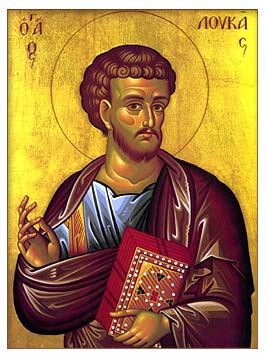

# Luke 3 The Start of the Ministry of the Christ

<!-- toc -->

## Luke 3:1–6 Who Heralds The Kingdom of God?

>Luke 3:1–6 In the fifteenth year of the reign of Tiberius Caesar, while Pontius Pilate was governor of Judea, Herod was tetrarch of Galilee, his brother Philip tetrarch of the region of Iturea and Trachonitis, and Lysanias tetrarch of Abilene, during the high priesthood of Annas and Caiaphas, God’s word came to John the son of Zechariah in the wilderness. He went into all the vicinity of the Jordan, proclaiming a baptism of repentance for the forgiveness of sins, as it is written in the book of the words of the prophet Isaiah:
>
>A voice of one crying out in the wilderness:  
>Prepare the way for the Lord;  
>make his paths straight!  
>Every valley will be filled,  
>and every mountain and hill will be made low;  
>the crooked will become straight,  
>the rough ways smooth,  
>and everyone will see the salvation of God.

Who is the last prophet of the Old Testament?

Why was John the Baptist’s ministry so important?

What was John’s mission?

How is our calling exactly like John’s?

## Luke 3:7–14 What Is The Mark of A Person Who Believes and Trusts in God?

>Luke 3:7–14 He then said to the crowds who came out to be baptized by him, “Brood of vipers! Who warned you to flee from the coming wrath?  Therefore produce fruit consistent with repentance. And don’t start saying to yourselves, ‘We have Abraham as our father,’ for I tell you that God is able to raise up children for Abraham from these stones.  The ax is already at the root of the trees. Therefore, every tree that doesn’t produce good fruit will be cut down and thrown into the fire.”  “What then should we do?” the crowds were asking him.  He replied to them, “The one who has two shirts must share with someone who has none, and the one who has food must do the same.”  Tax collectors also came to be baptized, and they asked him, “Teacher, what should we do?”  He told them, “Don’t collect any more than what you have been authorized.”  Some soldiers also questioned him, “What should we do?” He said to them, “Don’t take money from anyone by force or false accusation, and be satisfied with your wages.” 

According to John, what is the mark of a person who believes and trusts in God?

What is difference between doing the law and loving God?

## Luke 3:15–17 Can John the Baptist be the Christ?

>Luke 3:15–17 Now the people were waiting expectantly, and all of them were questioning in their hearts whether John might be the Messiah.  John answered them all, “I baptize you with water, but one who is more powerful than I am is coming. I am not worthy to untie the strap of his sandals. He will baptize you with the Holy Spirit and fire.  His winnowing shovel is in his hand to clear his threshing floor and gather the wheat into his barn, but the chaff he will burn with fire that never goes out.” 

Can John the Baptist be the Christ?

What makes Jesus Christ the Savior of the world?

## Luke 3:18–20 What Happens When We Proclaim the Good News of God?

>Luke 3:18–20 Then, along with many other exhortations, he proclaimed good news to the people.  But when John rebuked Herod the tetrarch because of Herodias, his brother’s wife, and all the evil things he had done,  Herod added this to everything else—he locked up John in prison. 

If we tell others of the good news of God, will all people love to hear it or will some hate it?

>2 Corinthians 2:14–17 But thanks be to God, who always leads us in Christ’s triumphal procession and through us spreads the aroma of the knowledge of him in every place. For to God we are the fragrance of Christ among those who are being saved and among those who are perishing. To some we are an aroma of death leading to death, but to others, an aroma of life leading to life. Who is adequate for these things? For we do not market the word of God for profit like so many. On the contrary, we speak with sincerity in Christ, as from God and before God.

## Luke 3:21-22 How Did Jesus Began His Ministry?

>Luke 3:21–22 When all the people were baptized, Jesus also was baptized. As he was praying, heaven opened,  and the Holy Spirit descended on him in a physical appearance like a dove. And a voice came from heaven: “You are my beloved Son; with you I am well-pleased.”

How did Jesus began his ministry on earth?

Are we to do it any different?

## Luke 3:23-38 How was Jesus Like You and Me?

>Luke 3:23–38  
> 23  As he began his ministry, Jesus was about thirty years old and was thought to be the son of Joseph, son of Heli, 
>
> 24  son of Matthat, son of Levi, son of Melchi, son of Jannai, son of Joseph, 
>
> 25  son of Mattathias, son of Amos, son of Nahum, son of Esli, son of Naggai, 
>
> 26  son of Maath, son of Mattathias, son of Semein, son of Josech, son of Joda, 
>
> 27  son of Joanan, son of Rhesa, son of Zerubbabel, son of Shealtiel, son of Neri, 
>
> 28  son of Melchi, son of Addi, son of Cosam, son of Elmadam, son of Er, 
>
> 29  son of Joshua, son of Eliezer, son of Jorim, son of Matthat, son of Levi, 
>
> 30  son of Simeon, son of Judah, son of Joseph, son of Jonam, son of Eliakim, 
>
> 31  son of Melea, son of Menna, son of Mattatha, son of Nathan, son of David, 
>
> 32  son of Jesse, son of Obed, son of Boaz, son of Salmon, son of Nahshon, 
>
> 33  son of Amminadab, son of Ram, son of Hezron, son of Perez, son of Judah, 
>
> 34  son of Jacob, son of Isaac, son of Abraham, son of Terah, son of Nahor, 
>
> 35  son of Serug, son of Reu, son of Peleg, son of Eber, son of Shelah, 
>
> 36  son of Cainan, son of Arphaxad, son of Shem, son of Noah, son of Lamech, 
>
> 37  son of Methuselah, son of Enoch, son of Jared, son of Mahalalel, son of Cainan, 
>
> 38  son of Enos, son of Seth, son of Adam, son of God.

How was Jesus just like you and me?
