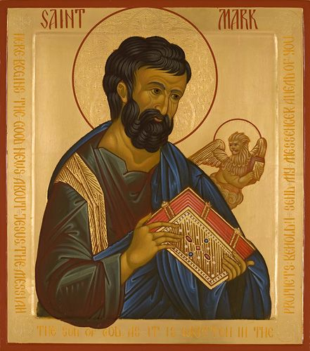

# Mark 4:26-29 Jesus Grows Us

## The Text

>Mark 4:26–29  
> 26  “The kingdom of God is like this,” he said. “A man scatters seed on the ground. 
>
> 27  He sleeps and rises night and day; the seed sprouts and grows, although he doesn’t know how. 
>
> 28  The soil produces a crop by itself—first the blade, then the head, and then the full grain on the head. 
>
> 29  As soon as the crop is ready, he sends for the sickle, because the harvest has come.”

## The Devotion

>John 3:1–8  
> 1  There was a man from the Pharisees named Nicodemus, a ruler of the Jews. 
>
> 2  This man came to him at night and said, “Rabbi, we know that you are a teacher who has come from God, for no one could perform these signs you do unless God were with him.” 
>
> 3  Jesus replied, “Truly I tell you, unless someone is born again, he cannot see the kingdom of God.” 
>
> 4  “How can anyone be born when he is old?” Nicodemus asked him. “Can he enter his mother’s womb a second time and be born?” 
>
> 5  Jesus answered, “Truly I tell you, unless someone is born of water and the Spirit, he cannot enter the kingdom of God. 
>
> 6  Whatever is born of the flesh is flesh, and whatever is born of the Spirit is spirit. 
>
> 7  Do not be amazed that I told you that you must be born again. 
>
> 8  The wind blows where it pleases, and you hear its sound, but you don’t know where it comes from or where it is going. So it is with everyone born of the Spirit.”
