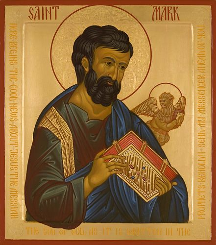

# Mark 6:1-6	Jesus is the Lord of Life

## The Text

> 1  He left there and came to his hometown, and his disciples followed him. 
>
> 2  When the Sabbath came, he began to teach in the synagogue, and many who heard him were astonished. “Where did this man get these things?” they said. “What is this wisdom that has been given to him, and how are these miracles performed by his hands? 
>
> 3  Isn’t this the carpenter, the son of Mary, and the brother of James, Joses, Judas, and Simon? And aren’t his sisters here with us?” So they were offended by him. 
>
> 4  Jesus said to them, “A prophet is not without honor except in his hometown, among his relatives, and in his household.” 
>
> 5  He was not able to do a miracle there, except that he laid his hands on a few sick people and healed them. 
>
> 6  And he was amazed at their unbelief. He was going around the villages teaching.

## The Devotion

### Christ Alone is to Live

>John 3:36 The one who believes in the Son has eternal life, but the one who rejects the Son will not see life; instead, the wrath of God remains on him.

### Christ Alone Can Make Us Alive

>Acts 2:14–21  
>14 Peter stood up with the Eleven, raised his voice, and proclaimed to them, “Fellow Jews and all you residents of Jerusalem, let this be known to you, and pay attention to my words. 
>
>15 For these people are not drunk, as you suppose, since it’s only nine in the morning. 
>
>16 On the contrary, this is what was spoken through the prophet Joel: 
>
>17 And it will be in the last days, says God, that I will pour out my Spirit on all people; then your sons and your daughters will prophesy, your young men will see visions, and your old men will dream dreams. 
>
>18 I will even pour out my Spirit on my servants in those days, both men and women and they will prophesy. 
>
>19 I will display wonders in the heaven above and signs on the earth below: blood and fire and a cloud of smoke. 
>
>20 The sun will be turned to darkness and the moon to blood before the great and glorious day of the Lord comes. 
>
>21 Then everyone who calls on the name of the Lord will be saved.

### Christ Alone Calls Us to Live

>Mark 10:17-22 As he was setting out on a journey, a man ran up, knelt down before him, and asked him, “Good teacher, what must I do to inherit eternal life?”
18 “Why do you call me good?” Jesus asked him. “No one is good except God alone. You know the commandments: Do not murder; do not commit adultery; do not steal; do not bear false witness; do not defraud; honor your father and mother.”
20 He said to him, “Teacher, I have kept all these from my youth.”
21 Looking at him, Jesus loved him and said to him, “You lack one thing: Go, sell all you have and give to the poor, and you will have treasure in heaven. Then come, follow me.” But he was dismayed by this demand, and he went away grieving, because he had many possessions.

>Matthew 27:57-61 When it was evening, a rich man from Arimathea named Joseph came, who himself had also become a disciple of Jesus. He approached Pilate and asked for Jesus’s body. Then Pilate ordered that it be released. So Joseph took the body, wrapped it in clean, fine linen, and placed it in his new tomb, which he had cut into the rock. He left after rolling a great stone against the entrance of the tomb. Mary Magdalene and the other Mary were seated there, facing the tomb.
