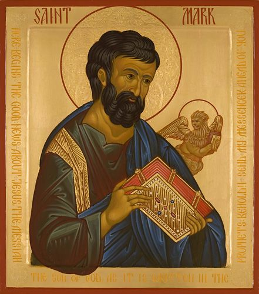

# Mark 10:13-16 God Alone Receives the Fatherless

## The Text

>Mark 10:13–16 (CSB)  
> 13  People were bringing little children to him in order that he might touch them, but the disciples rebuked them. 
>
> 14  When Jesus saw it, he was indignant and said to them, “Let the little children come to me. Don’t stop them, because the kingdom of God belongs to such as these. 
>
> 15  Truly I tell you, whoever does not receive the kingdom of God like a little child will never enter it.” 
>
> 16  After taking them in his arms, he laid his hands on them and blessed them.

## The Devotion

To know that God welcomes all sinners into his kingdom is to know the heart of the Father. Throughout the Bible, we see the tenderness of the heart of the Father towards the lost because they don't have a home; towards the widow because we are all wandering from the only Husband who will never leave us nor forsake us; towards the poor because they have nothing good and will perish without help; and towards the orphan because our spiritual father that we were all born with, Satan, who only lies, kill, steals, and destroys--which is to say, in the spiritual and eternal sense, we don't have any parents to really speak of. 

We are born orphans. Born into a kingdom that tells you that even if everyone agrees with you, you stand alone.  The world wants to tell you what to do but you will need to figure out how to stand on your own. If you need help, you might have to do it yourself. No one else is going to help you. Pull yourself up by your bootstraps. That is the only way to do it.

And to a degree, that is stock with the modern world. Babies are born into this world completely helpless. If no one looks after them, they will die. Children are raised by parents in hopes that they will turn into independent, autonomous, functioning, contributing members of society. And that is a good thing.

Between the kingdom of the world and the kingdom of God, there is one similarity: we are born into it. In this world, like all the sons of Adam, you are born helpless and dependent on someone to look after you. Christ said to Nicodemus, “Truly I tell you, unless someone is born again, he cannot see the kingdom of God.” 

There is no work, no skill, no knowledge, no old heart, no kept sins, no pride, no power that will get us into the kingdom of God as we are if we are not in Christ. Romans 6 and 2 Corinthians 5 calls that "our old selves." We are born again, fresh and new, just like a baby into the kingdom of God. When that happens, our old selves are dead and buried in the same grave with Christ. Holy, good, and righteous will always rise once more. We were not that way. Our old selves with our sins, stayed buried while His righteousness and His Spirit, the same who raised Christ from death, now dwells in us giving us eternal life.
