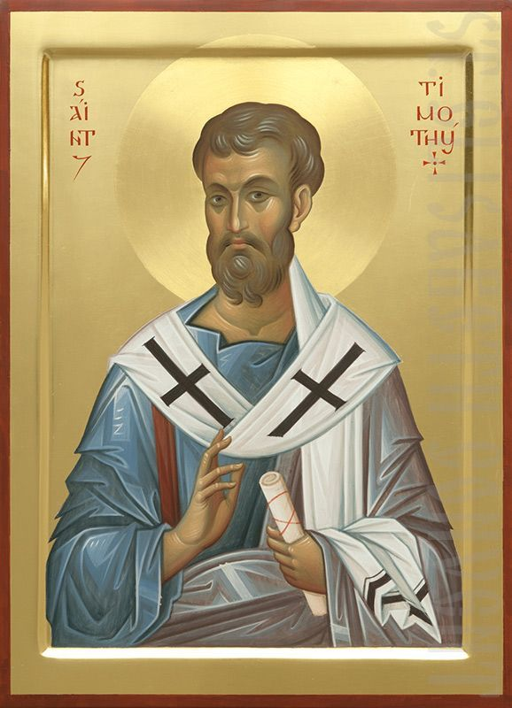

# 1 Timothy 6:17-19 Hope in Christ

## The Text

>1 Timothy 6:17–19 (CSB)  
>17 Instruct those who are rich in the present age not to be arrogant or to set their hope on the uncertainty of wealth, but on God, who richly provides us with all things to enjoy. 
>
>18 Instruct them to do what is good, to be rich in good works, to be generous and willing to share, 
>
>19 storing up treasure for themselves as a good foundation for the coming age, so that they may take hold of what is truly life.

## The Meditation

>1 Timothy 6:17-19 (CSB) Instruct those who are rich in the present age not to be arrogant or to set their hope on the uncertainty of wealth, but on God, who richly provides us with all things to enjoy.

### We are rich

How about a people who don't think they are rich and then act entitled to a easy life because they did the right things or they worked hard.

We are not to put our hope in anything else but Christ our Lord. And I don't care how you are built or your personality is like, we all struggle with redirecting our hope in other things not God.

"Today, I will hope in God. Whatever circumstances and the world might do, I will put my hope in God." And then we wake up the next morning and look at Twitter or the news or read this article and go down this rabbit trail of "investigation". We all struggle with it. And it is nuts.

>Romans 8:18-25 (CSB) For I consider that the sufferings of this present time are not worth comparing with the glory that is going to be revealed to us. 19 For the creation eagerly waits with anticipation for God’s sons to be revealed. 20 For the creation was subjected to futility—not willingly, but because of him who subjected it—in the hope 21 that the creation itself will also be set free from the bondage to decay into the glorious freedom of God’s children. 22 For we know that the whole creation has been groaning together with labor pains until now. 23 Not only that, but we ourselves who have the Spirit as the firstfruits—we also groan within ourselves, eagerly waiting for adoption, the redemption of our bodies. 24 Now in this hope we were saved, but hope that is seen is not hope, because who hopes for what he sees? 25 Now if we hope for what we do not see, we eagerly wait for it with patience.

> 18 Instruct them to do what is good to be rich in good works to be generous and willing to share

### We get to give because God so freely gave to us

Tithing or Offering? Yes.

Not prosperity - we have to deal with 2 Corinthians 8 & 9--another episode.

> 19 storing up treasure for themselves as a good foundation for the coming age, so that they may take hold of what is truly life.

## The Gospel

>Mark 12:41-44 (CSB) Sitting across from the temple treasury, he watched how the crowd dropped money into the treasury. Many rich people were putting in large sums. 42 Then a poor widow came and dropped in two tiny coins worth very little. 43 Summoning his disciples, he said to them, “Truly I tell you, this poor widow has put more into the treasury than all the others. 44 For they all gave out of their surplus, but she out of her poverty has put in everything she had —all she had to live on.”

What is the difference between this poor widow versus an unrepentant believer who gave a ga-billion dollars to the same church?

Only one of them is going to be with God.

Giving and generosity does not make you good. God makes us good. And the only way we can be good is if we repent from sin and turn to trust in Jesus Christ.

We cannot do enough good works to make God like us. We cannot do enough Bible Studies to know God. We cannot give enough money to good causes to buy our way into heaven. You will have to lay your life down, pick up your cross, change your life, and follow Christ.
