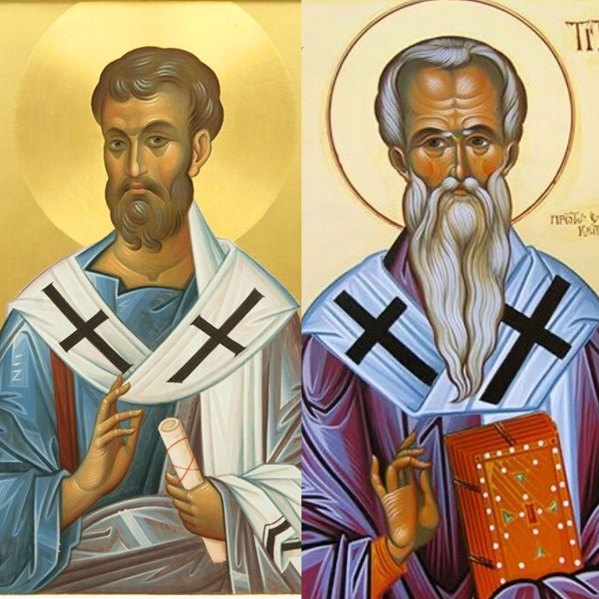

# The Pastoral Epistles

## The Introduction

This series was born out of two things: a desire to serve my local church as an elder and a conversation with my mentor.

I was saved by Christ in April of 2007. Six months later, I wanted to preach the gospel of Christ every day and twice on Sunday. And since then, I have wrestled with that unction. I can preach anywhere but I had serious convictions to do so only as an ordained minister to the local church. What does it mean to be ordained? There are qualifications. And despite the numerous church and denominations, I turned to the Pastoral Epistles to see what the Bible says about the qualifications of an elder and if I fit that qualification.

And then, just have breakfast with a mentor, he suggested journaling my thoughts on the Pastoral Epistles. These are those thoughts.
