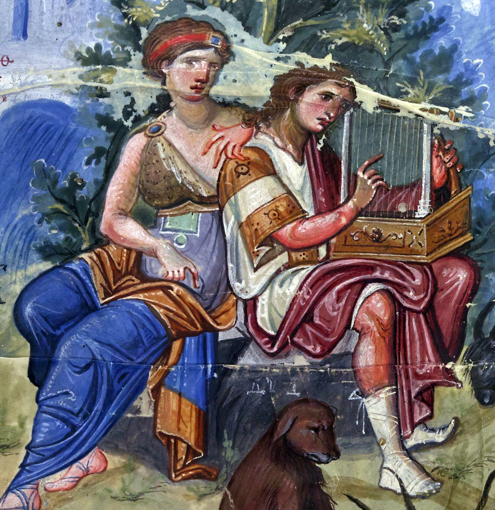

# Praying Through: Psalm 119:129-136

## The Psalm

>Psalm 119:129–136 (CSB)  
>129 Your decrees are wondrous; therefore I obey them. 
>
>130 The revelation of your words brings light and gives understanding to the inexperienced. 
>
>131 I open my mouth and pant because I long for your commands. 
>
>132 Turn to me and be gracious to me, as is your practice toward those who love your name. 
>
>133 Make my steps steady through your promise; don’t let any sin dominate me. 
>
>134 Redeem me from human oppression, and I will keep your precepts. 
>
>135 Make your face shine on your servant, and teach me your statutes. 
>
>136 My eyes pour out streams of tears because people do not follow your instruction.

## The Prayer

My Living Word

