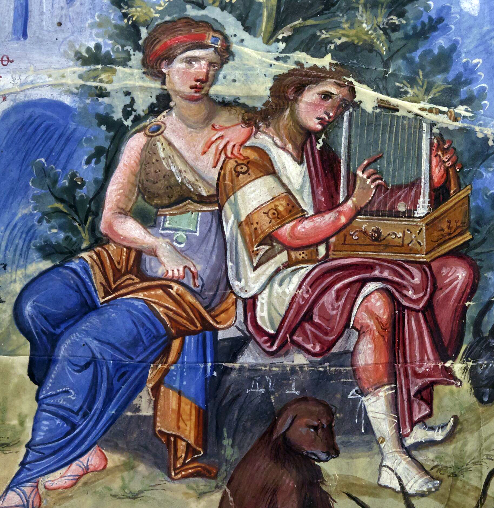

# 📖 Psalm 1

## The Text

>Psalm 1  
>1 How happy is the one who does not walk in the advice of the wicked or stand in the pathway with sinners or sit in the company of mockers!
>
>2 Instead, his delight is in the Lord's instruction, and he meditates on it day and night.
>
>3 He is like a tree planted beside flowing streams that bears its fruit in its season, and its leaf does not wither. Whatever he does prospers.
>
>4 The wicked are not like this; instead, they are like chaff that the wind blows away.
>
>5 Therefore the wicked will not stand up in the judgment, nor sinners in the assembly of the righteous.
>
>6 For the Lord watches over the way of the righteous, but the way of the wicked leads to ruin.

## The Prayer — 1 Timothy 1:12-17

Dear God,

I give thanks to Christ Jesus our Lord who has strengthened me, because he considered me faithful, appointing me to the ministry — even though I was formerly a blasphemer, a persecutor, and an arrogant man. But I received mercy because I acted out of ignorance in unbelief, and the grace of our Lord overflowed, along with the faith and love that are in Christ Jesus. This saying is trustworthy and deserving of full acceptance: "Christ Jesus came into the world to save sinners" — and I am the worst of them. But I received mercy for this reason, so that in me, the worst of them, Christ Jesus might demonstrate his perfect patience as an example to those who would believe in him for eternal life. Now to the King of ages, immortal, invisible, the only God, be honor and glory forever and ever.

Amen.

## The Intro

A few have told me that they have heard Psalm 1 be distilled down to one application: "Read the Bible more."

As tempted as I was to try to preach it the same exact way and then as I am closing, hit you with some radical idea, I resisted that temptation, mostly because I don't have that type of time.

So let me tell you the end from the beginning:

Psalm 1 is about Jesus Christ.

Psalm 1 does not describe who we must become to be blessed—it describes who Christ already is for us.

Since I am a preacher of Christ, and the faith comes by hearing the message of Christ, I am not going to waste any more time and just get straight into it.

## The Sermon

### 1 How happy is the one who does not walk in the advice of the wicked or stand in the pathway with sinners or sit in the company of mockers!

Why is that so important? Why does King David start off this way?

#### Why is Psalm 1 the first psalm of psalms?

>**Whoever collected the psalms of David (probably it was Ezra) with good reason put this psalm first, as a preface to the rest, because it is absolutely necessary to the acceptance of our devotions that we be righteous before God (for it is only the prayer of the upright that is his delight), and therefore that we be right in our notions of blessedness and in our choice of the way that leads to it. Those are not fit to put up good prayers who do not walk in good ways.**
>
>Matthew Henry, *Matthew Henry's Commentary on the Whole Bible: Complete and Unabridged in One Volume* (Peabody: Hendrickson, 1994), 743.

#### God has shown us in his word what being a child of God looks like

Starting off with who we are not. Christ called us to be in the world and not of the world. God makes no mistakes — there is no third way:

- sheep and goats
- wheat and chaff
- believers and unbelievers

That is, sinners, mockers, wicked. Never ever forget that this was once us:

>**Titus 3:3** For we too were once foolish, disobedient, deceived, enslaved by various passions and pleasures, living in malice and envy, hateful, detesting one another.

Do you know one of the many reasons why Christ is so glorious?

Christ is without sin! Tempted in every which way as we are but without sin. Christ is so glorious that he came to our world, not of our world, but to sinners, to live amongst sinners, live for sinners, and die for sinners so that he alone would save sinners.

Sinners like us — we were once ungodly. We were once foolish. We were once sexually immoral.

Christ is so glorious because he came to us, wicked sinners all, and he saved us!

### 2 Instead, his delight is in the Lord's instruction, and he meditates on it day and night.

So the law of God requires the hearer to do many things: obey the law, meditate — read it, memorize it, talk about the law of God. Oh, just one more thing: delight. We must delight in the law of God!

>**Romans 7:22** For in my inner self I delight in God's law,

>**Psalms 19:9-11** The ordinances of the LORD are reliable and altogether righteous. They are more desirable than gold — than an abundance of pure gold; and sweeter than honey dripping from a honeycomb. In addition, your servant is warned by them, and in keeping them, there is an abundant reward.

*Have we ever loved God with our whole heart, as he commanded?*

*Have we ever delighted in the Lord's instruction?*

*Have we ever meditated on it day and night?*

### 3 He is like a tree planted beside flowing streams that bears its fruit in its season, and its leaf does not wither. Whatever he does prospers.

What would bearing fruit in its season, never withering, and always prospering look like? I imagine it looking like:

>**Isaiah 61:1–3** The Spirit of the Lord God is on me, because the Lord has anointed me to bring good news to the poor. He has sent me to heal the brokenhearted, to proclaim liberty to the captives and freedom to the prisoners; to proclaim the year of the Lord's favor, and the day of our God's vengeance; to comfort all who mourn, to provide for those who mourn in Zion; to give them a crown of beauty instead of ashes, festive oil instead of mourning, and splendid clothes instead of despair. **And they will be called righteous trees (*ESV "oaks of righteousness"*), planted by the Lord to glorify him.**

We want to be this. We desperately want to be this. Some of us even strive hard to be this. But is this us?

### We can start reading this psalm and think, "I want to be happy! I want to be blessed! I can do this and then I will be happy and be blessed. Tell me what to do so I can be happy and blessed."

This is the law of God in Psalm 1: "Read your Bible!"

Some pastors will tell you, "Read your Bible!" And if that doesn't work, read your Bible more!

Yes, every January 1st. We hear this — maybe at church but certainly on social media — and we think, "Yeah, I can do this!" New year, new me!

So, how far do we get into a new Bible reading plan come January?

**"But what if I tried harder?"**

Let me answer your question with a question: how is that working out for you?

So maybe, the "secret" to being blessed and happy is not "read your Bible more." Or maybe, in our most sincere efforts, we cannot obey God's law as commanded — to do perfectly and to do it with delight.

In light of all that, here is the first point we should get from Psalm 1:

**We are not the blessed nor happy man.**

We, as image bearers of God, are commanded by God to be that blessed and happy man who delights in meditating on the law of God both day and night. But we cannot because we are born in sin and broke every one of God's commandments by breaking just one.

And I don't care how much you think you can try harder and read the Bible more, you and I will not be the blessed man in Psalm 1.

That might sound like condemnation. But to believers who have the gospel of Christ, we know it is not condemnation but outright joy! Why?

### Because the first Psalm blessed & happy man is none other than the Son of Man — Christ Jesus our Lord!

Psalm 1 does not describe who we must become to be blessed—it describes who Christ already is for us.

We know Psalm 1 is about the Christ because the Bible says so. Christ came to fulfill the Law and the Prophets, saving sinners from their sin! (Matt 5:17, 1:21, 1 Tim 1:15)

Christ is the blessed happy man who delighted in the law of God, meditated on it day and night. He is the oak of righteousness, planted by the Lord, always bearing fruit, never withering, always prospering.

When we read Psalm 1, we know that it is all about the Christ. We know that Psalm 1 is not about us because the Bible is not about us — it is about Christ.

In contrast:

### 4–5 The wicked are not like this; instead, they are like chaff that the wind blows away. Therefore the wicked will not stand up in the judgment, nor sinners in the assembly of the righteous.

Those who turn away from God will look different and go down a very different path.

>**Matthew 3:12** [. . .] **but the chaff he will burn with unquenchable fire.**

>**Matthew 7:15–23** [. . .] **Every tree that does not bear good fruit is cut down and thrown into the fire.**

The law bears the character of God. Sinners, wicked and unholy, will fall short of God's glory, and they will stand condemned in their sin, because the law cannot save them.

The most frightening part: it seems to me, the more I see of the world, sin increases. If I was honest, the more God matures and sanctifies me, the more sin I see in my own life. How about you?

Yet, I see more and more of the exponential grace upon grace that can only be found in Christ Jesus our Lord. How about you?

Here is an apt reminder: sinners sin.

Yet, here is the gospel reminder: Christ came to save sinners.

### 6 For the Lord watches over the way of the righteous, but the way of the wicked leads to ruin.

We already know we are not righteous based on anything we do. God calls our self-righteousness "filthy rags" (Isaiah 64:6).

Do you know why I love RTC? We make the historical, orthodox, Reformed claim that "the best commentary on the Scripture is Scripture." I say that to say this: I am surely convinced that Paul was expositing Psalm 1 when he wrote Romans chapters 7–8.

#### For the Lord watches over the way of the righteous

Think on verse 6 and listen to this:

>**Romans 8:3-6** For God has done what the law, weakened by the flesh, could not do. By sending his own Son in the likeness of sinful flesh and for sin, he condemned sin in the flesh, in order that **the righteous requirement of the law might be fulfilled in us, who walk not according to the flesh but according to the Spirit. For those who live according to the flesh set their minds on the things of the flesh, but those who live according to the Spirit set their minds on the things of the Spirit. For to set the mind on the flesh is death, but to set the mind on the Spirit is life and peace.**

>**Romans 8:9-11** You, however, are not in the flesh, but in the Spirit, if indeed the Spirit of God lives in you. If anyone does not have the Spirit of Christ, he does not belong to him. Now if Christ is in you, the body is dead because of sin, but the Spirit gives life because of righteousness. And if the Spirit of him who raised Jesus from the dead lives in you, then he who raised Christ from the dead will also bring your mortal bodies to life through his Spirit who lives in you.

In complete contrast, the way of the wicked is hostile to God because they do not submit to God's law that condemns them. Yet the gospel of Christ has no power to condemn — it only has the power to save. And believer, we are saved in Christ Jesus.

Every one of us wants to be blessed. We want to be happy. But we can't do what Psalm 1 requires us to do in order to be blessed and happy. What can we do?

We trust the Holy One of God who alone holds the words of eternal life (John 6:68-69).

That is the free offer of the gospel: **Trust in the One Just Man and believe on his name and you will live.**

Jesus Christ alone is the blessed man — the tree that is planted beside flowing streams, always bearing fruit in his season, and the only one who prospers in whatever he does. Jesus Christ is the blessed man who joyfully meditated on the law of God both day and night. He did this because the law demanded him to do so and he alone is good, holy, and righteous. And we know Christ did all of this for us — delightfully meditating and obeying the law of God for us — and we are now saved by Christ in Christ forever.

Because of what he has done, we want to obey God. We want to delightfully meditate on the Scriptures. How do we do this?

Is it "read our Bible more?" Yes, but not exactly.

Think on this: most of the believers in the Bible could not read. They had little education and very little access to the Scriptures. Pick a saint in the Bible who did not write a book of the Bible. My favorite example is Mary. She was barely a teenage girl from a po-dunk country town *from the holla*. Ain't no way she knew how to read. Yet, listen to her response to Elizabeth's blessing:

>**Luke 1:46-55**
>
>**My soul magnifies the Lord,**  
>**and my spirit rejoices in God my Savior,**  
>**because he has looked with favor**  
>**on the humble condition of his servant.**  
>**Surely, from now on all generations**  
>**will call me blessed,**  
>**because the Mighty One**  
>**has done great things for me,**  
>**and his name is holy.**  
>
>[. . .]

And on my best day, I couldn't come up with a song half as beautiful. How did Mary do this? How did Mary come up with such beautiful words to magnify our Great God? There was only one way to hear and then meditate on the law of God for the people of God — to gather together, every Sabbath, that is, the Lord's Day, and hear the preached word of God.

Listen, this is not about just going to church. Remember, Psalm 1: you must walk in the way of the righteous and not the wicked. You must trust in the Blessed Man that is Christ Jesus. That trust and faith and repentance comes not from your own but from the Triune God dwelling in you. And because he is in us, we can now understand the word of God.

The solution to Psalm 1 is not "read your Bible more and be happy." The solution is to be born again, receive all of the blessings and grace that is in Christ Jesus, gather with the saints on the Lord's Day, and hear the preaching of the word of God — to see what Christ has already done!

To know we have every blessing in the heavens. We get to gather and hear the preached word so that the law and the gospel of God are "to be on our hearts, repeated to our children, talk about them when you are chilling at home, or taking a walk outside, when you lie down and when you get up" (Deut 6:4-9). Because:

>**Romans 10:17** [. . .] **faith comes from what is heard, and what is heard comes through the message about Christ.**

We preach the same Christ who perfectly and delightfully meditated on and obeyed the law of God. And this is the covenant of grace — Christ has done this, obeyed the entire law of God, perfectly. And by doing so, we have his benefits! We have his obedience! And his righteousness!

If you put Romans 8 and Hebrews 1 together, the Scriptures declare that we are co-heirs with the Son who has inherited everything! (Romans 8:16 cf. Hebrews 1:1-2)

Believers get the Infinite Triune God making his home in us for all time.

## The Closing

### How is the Christ like a tree planted beside flowing streams that bears its fruit in its season?

By blessing us with every spiritual blessing in the heavens (Eph 1:3). That includes all of God. We get to possess God. We have God! Because God so firmly has us by his Almighty power. And everything the law declares God to be — his salvation, power, love, mercy, grace, steadfast love, his adoption, righteousness, holiness, just, and blessed assurance.

### How does his "leaf does not wither"?

Think of God's covenant with you: Christ's perfect work is completely done for you!

>**"It is finished"** — John 19:30

Since we have every spiritual blessing in the heavens, we don't have a checklist to check off. We have every spiritual blessing in the heavens!

So, as your preacher today, I am telling you to read your Bible more. But don't do it just to get past Leviticus or check some list. We do not read the Bible more to become blessed or happy. Christ has given us every blessing in the heavens. We **get** to read the Bible.

And because of what Christ has done, he has made us good soil, and the Holy Spirit will plant the seed of the word, and it will bear fruit in us.

"Read your Bible more" by coming to church, sit under the preached word of God, first, just like every believer before you. Then go home, dwell on them, talk about them, read commentaries on them, write about them, and memorize them, whatever. By the grace of God, delight in them.

*This is all well and good. How about the times we don't often feel blessed nor happy? Instead we feel sadly, alone, anxious, depressed, worried, hurt. I know many of your stories — your lives and what you are going through right now. If I have heard about it, know that I pray for you every day. I will not dismiss your pain by placing a Biblical label on it and calling it "good." That pain is very real. Whatever you're going through right now, I know it doesn't make sense right now.*

*All I have for you is the eternal comfort of our loving God: "Our suffering right now will not compare to the glory that will be revealed to us when we are finally face to face with our loving Savior" (Rom 8:18, Psa 17:15). Can you imagine getting to hold the face of the Savior who saved you from sin and death? Imagine a face so lovely — the Puritans called him "the fairest of 10,000." That's why I know the psalmist calls it, on that day, when we do see him face to face, "the fullness of joy, pleasures evermore, and utter satisfaction."*

For the moment, we do our best by keeping our eyes fixed on the same Blessed and Happy Man who delightfully meditated on, and obeyed the law of God perfectly, both day and night.

Psalm 1 does not describe who we must become to be blessed—it describes who Christ already is and what he has done for us.

We are blessed because we have the Christ because the Almighty Christ has us forever. He will never let us go.

Keep your eyes upon Jesus.

Let us pray.

## The Closing Prayer

*Source: [Theologicus - Praying Through: Psalm 1](https://theologic.us/psalms/psalm001)*

O Lord,

Like a child, so many times, we have fallen, and all of our strength has left us. As our precious Father, put us back up on our feet and hold our hands so we can run back to you.

Give us your strength and might.

Give us your word and your promises.

Give us your heart, O Father.

Give us your Spirit.

Bless us. And you will bless us because you have given us everything by giving us your Son, Jesus Christ our Lord. Oh, how you give so freely and abundantly! Thank you.

In your Son's beautiful and mighty name, I pray. His name is Jesus Christ.

Amen.

## Bibliography

- Akin, Daniel L., Johnny M. Hunt, and Tony Merida. *Exalting Jesus in Psalms 101–150*. Edited by David Platt, Daniel L. Akin, and Tony Merida. Christ-Centered Exposition. Nashville, TN: Holman Reference, 2021.
- Boice, James Montgomery. *Psalms 1–41: An Expositional Commentary*. Grand Rapids, MI: Baker Books, 2005.
- ———. *Psalms 42–106: An Expositional Commentary*. Grand Rapids, MI: Baker Books, 2005.
- ———. *Psalms 107–150: An Expositional Commentary*. Grand Rapids, MI: Baker Books, 2005.
- Briggs, Charles A., and Emilie Grace Briggs. *A Critical and Exegetical Commentary on the Book of Psalms*. International Critical Commentary. New York: C. Scribner's Sons, 1906.
- Calvin, John, and James Anderson. *Commentary on the Book of Psalms*. Bellingham, WA: Logos Bible Software, 2010.
- Custis, Miles. *Psalms: A Life of Worship*. Not Your Average Bible Study. Bellingham, WA: Lexham Press, 2014.
- German, Brian T. *Psalms of the Faithful: Luther's Early Reading of the Psalter in Canonical Context*. Studies in Historical and Systematic Theology. Bellingham, WA: Lexham Press, 2017.
- Gillingham, Susan. *Psalms through the Centuries*. Edited by John Sawyer, Christopher Rowland, Judith Kovacs, and David M. Gunn. Vol. 1. Blackwell Bible Commentaries. Malden, MA; Oxford; Carlton, Victoria: Blackwell Publishing, 2008.
- ———. *Psalms through the Centuries: A Reception History Commentary on Psalms 1–72*. Edited by John Sawyer, Christopher Rowland, Judith Kovacs, and David M. Gunn. Vol. 2. Wiley Blackwell Bible Commentaries. Hoboken, NJ; West Sussex, UK: Wiley Blackwell, 2018.
- ———. *Psalms through the Centuries: A Reception History Commentary on Psalms 73–151*. Edited by John Sawyer, Christopher Rowland, Judith Kovacs, and David M. Gunn. Vol. 3. Wiley Blackwell Bible Commentaries. Hoboken, NJ; West Sussex, UK: Wiley Blackwell, 2022.
- Hamilton, James M. *Psalms*. Evangelical Biblical Theology Commentary. Bellingham, WA: Lexham Academic, 2021.
- Harman, Allan. *Psalms: A Mentor Commentary*. Vols. 1–2. Mentor Commentaries. Ross-shire, Great Britain: Mentor, 2011.
- Hawker, Robert. *Poor Man's Old Testament Commentary: Job–Psalms*. Vol. 4. Bellingham, WA: Logos Bible Software, 2013.
- Henry, Matthew. *Matthew Henry's Commentary on the Whole Bible: Complete and Unabridged in One Volume*. Peabody: Hendrickson, 1994. 743.
- Augustine of Hippo. *Expositions on the Book of Psalms: Psalms 1–150*. Vol. I–VI. A Library of Fathers of the Holy Catholic Church. Oxford; London: F. and J. Rivington; John Henry Parker, 1847.
- Horne, Charles, and Julius Bewer. *The Bible and Its Story: History–Poetry, II Chronicles to Psalms*. Vol. 5. New York, NY: Francis R. Niglutsch, 1909.
- ———. *The Bible and Its Story: Poetry–Prophets, Psalms to Isaiah*. Vol. 6. New York, NY: Francis R. Niglutsch, 1909.
- Joseph, Oscar L. *The Expositor's Bible: Psalms to Isaiah*. Edited by W. Robertson Nicoll. Vol. 3. Expositor's Bible. Hartford, CT: S.S. Scranton Co., 1903.
- Kuyper, Abraham. *Ever in Thy Sight: 31 Devotions on the Psalms*. Edited by James A. De Jong. Bellingham, WA: Lexham Press, 2020.
- Longman, III, Tremper. *How to Read the Psalms*. Downers Grove, IL; Nottingham, England: IVP Academic; Inter-Varsity Press, 1988.
- Murray, Andrew. *Have Mercy upon Me: The Prayer of the Penitent in the Fifty-First Psalm Explained and Applied*. Edited by J. P. Lilley. London: J. Nisbet & Co., 1896.
- Parks, Jimmy. *All the Songs in the Bible*. Faithlife Biblical and Theological Lists. Bellingham, WA: Faithlife, 2021.
- Pentz, Croft M. *Sermon Outlines from the Psalms*. Dollar Sermon Library Series. Grand Rapids, MI: Baker Book House, 1974.
- Platt, David, Matt Mason, and Jim Shaddix. *Exalting Jesus in Psalms 51-100*. Nashville, TN: Holman Reference, 2020.
- *Psalms 1–72: Old Testament*. Vol. VII. Reformation Commentary on Scripture. Downers Grove, IL: IVP Academic, 2015.
- Robertson, O. Palmer. *The Flow of the Psalms: Discovering Their Structure and Theology*. Phillipsburg, NJ: P&R Publishing, 2015.
- Ross, Allen P. *A Commentary on the Psalms (90–150): Commentary*. Vol. 3. Kregel Exegetical Library. Grand Rapids, MI: Kregel Academic, 2016.
- ———. *A Commentary on the Psalms (90–150): Text*. Vol. 3. Kregel Exegetical Library. Grand Rapids, MI: Kregel Academic, 2016.
- *Saint Augustin: Expositions on the Book of Psalms*. Vol. 8. A Select Library of the Nicene and Post-Nicene Fathers of the Christian Church, First Series. New York: Christian Literature Company, 1888.
- Smith, J. Josh, and Daniel L. Akin. *Exalting Jesus in Psalms 1–50*. Edited by David Platt, Daniel L. Akin, and Tony Merida. Christ-Centered Exposition Commentary. Nashville, TN: Holman Reference, 2022.
- Spurgeon, C. H. *Our Own Hymn Book: A Collection of Psalms and Hymns for Public, Social and Private Worship*. London: Passmore & Alabaster, 1883.
- ———. *The Treasury of David: Psalms 1-26*. Vol. 1. London; Edinburgh; New York: Marshall Brothers, n.d.
- ———. *The Treasury of David: Psalms 27-57*. Vol. 2. London; Edinburgh; New York: Marshall Brothers, n.d.
- ———. *The Treasury of David: Psalms 56-87*. Vol. 3. London; Edinburgh; New York: Marshall Brothers, n.d.
- ———. *The Treasury of David: Psalms 88-110*. Vol. 4. London; Edinburgh; New York: Marshall Brothers, n.d.
- ———. *The Treasury of David: Psalms 111-119*. Vol. 5. London; Edinburgh; New York: Marshall Brothers, n.d.
- ———. *The Treasury of David: Psalms 120-150*. Vol. 6. London; Edinburgh; New York: Marshall Brothers, n.d.
- Storms, Sam. *Biblical Studies: Meditations on the Psalms*. Edmond, OK: Sam Storms, 2016.
- ———. *Biblical Studies: Psalms*. Edmond, OK: Sam Storms, 2016.
- Wilcock, Michael. *The Message of Psalms: Songs for the People of God*. Edited by J. A. Motyer. The Bible Speaks Today. Nottingham, England: Inter-Varsity Press, 2001.
- Witthoff, David, Kristopher A. Lyle, and Matt Nerdahl. *Psalms Form and Structure*. Edited by Eli Evans. Bellingham, WA: Faithlife, 2014.
