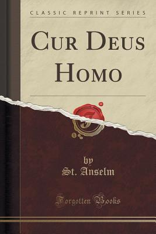

# Cur Deus Homo by Anselm of Canterbury

## The Review

Anselm's Cur Deus Homo or Why Did God Become Man? is an excellent, deep theological work that attempts to unravel the mystery behind the Incarnation of God in Christ Jesus our Lord and Savior. I gave this book only four out of five stars only because half of the book was letters back and forth between Anselm and people in the church and the monastery and it felt like filler to me. Despite the filler, the first 100 pages are well worth the price of the book and I recommend it to anyone who is not only interested in the "God became flesh and dwelt among us" but exploring the deep theological and philosophical aspects on the supposed free will of man versus the true and absolute free will of God.

The format is quite unique in that this is the first theological book I have read that is a discussion between two men. In this, we have Boso, a compatriot of the author's, who serves as the one inquiring about the Incarnation from a layperson's view and the unregenerate's view. And then we have Anselm, who seems to provide the answers but even more so, sharpens iron with Boso and sharpens iron with the reader.

I was pleased and fortunately to read this book after finishing Athanasius' On the Incarnation of the Word (which was a double joy to read around Christmas) and I felt like Athanasius' work serves as great, worshipful setup to this book. Athanasius lobs the pitch up and Anselm swings for the fences. If I could give the highest recommendation, it would to read On The Incarnation followed by Cur Deus Homo.

After reading, praying, processing and meditating, I would summed up the entire book in this:

In man's sinful nature, man lacks the power, ability and free will to fully live for God. However, in His divine nature, God has the power, ability and the free will to die for man so that man might fully live for Him.
