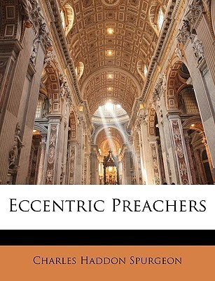

# Eccentric Preachers by Charles Spurgeon

## The Review

Since this is the Kindle edition, I have to quickly cover the technical before getting into the content. This edition is the one you want for the Kindle, not the other Kindle version (with the black cover). I have purchased the other and to my dismay, the continuous lines are not in place. Thus, the formatting are all jacked up.

Onward to the content.

If you are called to teach or preach Christ and him crucified, this book is a must-have for you. If you hear other preacher greats and think, "Gosh, I have to be like them in order to be "successful" like them", this book is mandatory for you.

In essence, Spurgeon encourages simply, "You be you. It is okay to be yourself. Be faithful to the gospel and let the Holy Spirit do all the hard work." Yes, it doesn't matter how weird or 'eccentric' others might think, you are called to be faithful to the text and preach because our lives depend on it.

What is a very pleasant surprise is the inclusion of across-the-range preachers from around his time or a bit before (late 1700s to late 1800s). What I love is the respect and love he had for these other ministers of God above and despite their differences in theology (Calvinism and Arminianism) or ordained in other denominations. To lest you think that all preachers need to be formally educated, Spurgeon offers a few without formal training.

Above all, Spurgeon writes as though he is having a personal conversation with you, the reader. His descriptions are vivid and detailed. His mini-biographies are suffice in information to portray the man of God. His admonishments are clear and precise as they cut to our hearts.

My favorite portion of the book (and was deeply surprised) where he read how the great Puritan theologian, John Owen (The Death of Death, The Mortification of Sin), once remarked how he longed to preach in the same manner as John Bunyan (Pilgrim's Progress) with poetic and flowery words. To which, Spurgeon offering this exhortation to a saint who has long joined Christ in heaven a bit before Spurgeon was even born:

>No, Dr. Owen, you had better remain Dr. Owen, for we could by no means afford to lose that mine of theological wealth which you have bequeathed to us. You would have looked very awkward if you had tried to talk like the marvelous dreamer, and he would have played the fool if he had imitated you. It is pitiful to hear comparisons made between the different servants of the same Lord.

Pitiful, indeed, Mr. Spurgeon.

God has created you to bring him glory. Preach your heart out. Preach as though you have lost yourself in your own words. Preach as though you are trying your best to describe the beautiful glory of Christ. Above all, just preach: His word never return void and faith comes by hearing and hearing by the Word of God.
