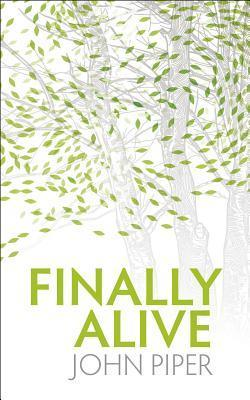

# Finally Alive by John Piper

## The Review

A gorgeous call to the Christian to finally and fully understand the blessed doctrine of regeneration--not only the swapping of hearts by God alone but the call to evangelize to proclaim what God has done in us.

The regeneration and faith issue (chicken-egg argument) is settled here. Piper wonderfully exegetes passages such as John 3, 1 John 5, 2 Peter 3 and Ephesians 2 to serve as the basis for the entire book. While the faith-first arguments have passages to ponder but not necessarily concrete "this is so" statement, the regeneration-first argument has absolute concrete "this is so" passages, to which, Piper highlights the clearest here:

>1 John 5:1 (CSB) Everyone who believes that Jesus is the Christ has been born of God, and everyone who loves the Father also loves the one born of him.

Catch the wording: Everyone who believes that Jesus is the Christ has been born of God--not, everyone who believes that Jesus is the Christ is now born of God.

Fortunately, the book is bigger than that age-old debate.

What made this a real joy to read was the wonderful surprise in the practical application: that is the call for evangelism. You love God? You love others? You love yourself? Then do what Christ has commissioned us all to do:

>Matthew 28:16–20 (CSB) The eleven disciples traveled to Galilee, to the mountain where Jesus had directed them. When they saw him, they worshiped, but some doubted. Jesus came near and said to them, “All authority has been given to me in heaven and on earth. Go, therefore, and make disciples of all nations, baptizing them in the name of the Father and of the Son and of the Holy Spirit, teaching them to observe everything I have commanded you. And remember, I am with you always, to the end of the age.”

>Mark 16:14–20 (CSB) Later he appeared to the Eleven themselves as they were reclining at the table. He rebuked their unbelief and hardness of heart, because they did not believe those who saw him after he had risen. Then he said to them, “Go into all the world and preach the gospel to all creation. Whoever believes and is baptized will be saved, but whoever does not believe will be condemned. And these signs will accompany those who believe: In my name they will drive out demons; they will speak in new tongues; they will pick up snakes; if they should drink anything deadly, it will not harm them; they will lay hands on the sick, and they will get well.” So the Lord Jesus, after speaking to them, was taken up into heaven and sat down at the right hand of God. And they went out and preached everywhere, while the Lord worked with them and confirmed the word by the accompanying signs.]

>John 21:15–18 (CSB) When they had eaten breakfast, Jesus asked Simon Peter, “Simon, son of John, do you love me more than these?” “Yes, Lord,” he said to him, “you know that I love you.” “Feed my lambs,” he told him. A second time he asked him, “Simon, son of John, do you love me?” “Yes, Lord,” he said to him, “you know that I love you.” “Shepherd my sheep,” he told him. He asked him the third time, “Simon, son of John, do you love me?” Peter was grieved that he asked him the third time, “Do you love me?” He said, “Lord, you know everything; you know that I love you.” “Feed my sheep,” Jesus said. “Truly I tell you, when you were younger, you would tie your belt and walk wherever you wanted. But when you grow old, you will stretch out your hands and someone else will tie you and carry you where you don’t want to go.”

>Acts 1:6–8 (CSB) So when they had come together, they asked him, “Lord, are you restoring the kingdom to Israel at this time?” He said to them, “It is not for you to know times or periods that the Father has set by his own authority. But you will receive power when the Holy Spirit has come on you, and you will be my witnesses in Jerusalem, in all Judea and Samaria, and to the ends of the earth.”

This is an excellent little book for self-study and group study alike. Piper is master of reading deep rich theological books and concise, to-the-point books. This book leans to the latter.

I would highly recommend this book to any English-speaking saint.
