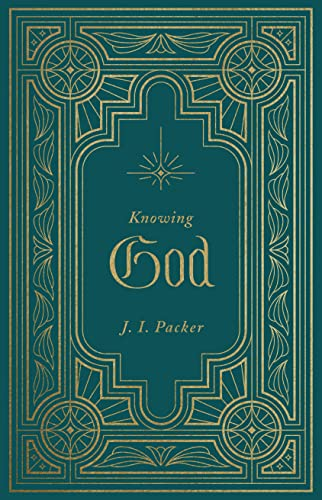

# Knowing God by J.I. Packer

## The Review

Not so small to give you taste.

Not too big to be overwhelming.

This is the perfect book to give you a fine taste into Systematic Theology.

More importantly, this book will show you just how good our God is. For many Christians, this might just show how great, sovereign, loving, kind and wonderful our Lord truly is.

Highly recommended to be taught.

Highly recommended for small groups.

Highly recommended for personal study.

Must read for any seminary student in their first year systheo class.
