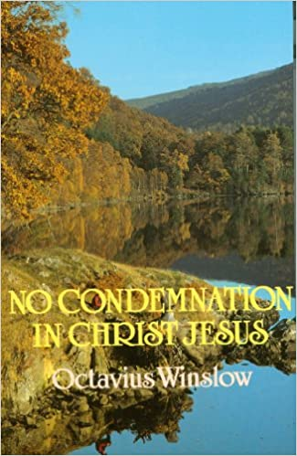

# No Condemnation in Christ Jesus by Octavius Winslow

## The Review

The premise of the entire book is the exposition of Romans chapter 8. Heck, go ahead and write down Romans 8 on paper and that alone is worth more than diamonds. Paul's words are more than sufficient to explain the awe and wonder of the summit of the Mount Everest that is Chapter 8 within the Himalayas of the Bible that is the Epistle to the Romans.

This is where Octavius Winslow separates himself from the pack of scholars and theologians. I feel like it wasn't that Winslow had to explain the depth and weight of Romans 8 for the scholarly purposes but he had to write this book because if he did not, his heart would have burst in worship and love to our sweet God and Lord. Let me contend that his heart did burst and this book was the result.

Winslow's love for God drips and flows over every single page of this book. If you love to highlight important passages, you will soon be wishing for a device that will highlight entire pages. (I thought it might be more convenient just to dip pages into a vat of highlighter ink. But I digress.)

That's what makes this book so special. You start with the chapter that is the richest source of the plenary doctrines of our Christian and dare I say the framework of our Biblical theology. Romans 8 covers it: Gospel, Trinity, Perfect Atonement, Justification, Regeneration, Adoption, Redemption, Grace, Law, Creation, Fall, Depravity, Sin, Suffering, Intercession and Love. Not that Romans 8 is complete in these things but it when the reader, blessed with the indwelling of the Holy Spirit or even the non-believer blessed with being pursued by the same Holy Spirit, that you have suddenly realized the glitter in the ground are not mere shards of glass but a path leading to a gem mine that knows no depths and knows no limit on the treasure that can be only in found in Jesus Christ. This book written by a man of God who has descended into the depths of that mine shaft and has only come back to the surface to share with the world with what he has found in Him.

I ask you, dear reader, have you read this book yet? No? Then why are you not doing so now.

To the Christian, it is a full-blown out description of Christ as the path of life, the fullness of joy and pleasures forevermore (Psalm 16:11). This is a book that cries out, “See what God has done! Come to Him, one who gives great love and sweet rest for your tiresome soul!”

For here is love:

>Genesis 3:15 I will put hostility between you and the woman, and between your offspring and her offspring. He will strike your head, and you will strike his heel.

And here is love: 

>Matthew 1:21 She will give birth to a son, and you are to name him Jesus, because he will save his people from their sins.”

And here is love:

>2 Corinthians 5:21 He made the one who did not know sin to be sin for us, so that in him we might become the righteousness of God.

And here is love:

>Ezekiel 11:19–20 I will give them integrity of heart and put a new spirit within them; I will remove their heart of stone from their bodies and give them a heart of flesh, so that they will follow my statutes, keep my ordinances, and practice them. They will be my people, and I will be their God.

And here is love:

>Romans 9:25–26 As it also says in Hosea, I will call Not my People, My People, and she who is Unloved, Beloved. And it will be in the place where they were told, you are not my people, there they will be called sons of the living God.

And here is love:

>John 3:16 For God loved the world in this way: He gave his one and only Son, so that everyone who believes in him will not perish but have eternal life.

And here is love:

>Romans 8:1 Therefore, there is now no condemnation for those in Christ Jesus,

And here is love:

>Romans 8:38–39 For I am persuaded that neither death nor life, nor angels nor rulers, nor things present nor things to come, nor powers, nor height nor depth, nor any other created thing will be able to separate us from the love of God that is in Christ Jesus our Lord.

To the non-believer who denies the Triune God, this book displays the empirical evidence that you have been seeking that, yes, God does exists and He is not far. May the Holy Spirit show you the power of God by which you can be saved if you would only trust in Him!

To those who are strong in the faith, it book will only serve to prepare your heart to anchor in Christ alone against any stormy gale and fill your heart with such sweet truths.

To those who are weak in the faith, it serves as the sweet, joyous rest for your soul as you lay your head against the bosom of God and rest in the His finished work.

Among my other favorite books, I cannot recommend any one of them to every single person. Yet, “No Condemnation in Christ Jesus" by Octavius Winslow, is the first Christian book I have read outside of the Bible that I can fully recommend to anyone who can read English.

Likewise, most of the modern Christian self-help books have fallen short in displaying the marvelous and weighty beauty and majesty of our sweet Savior, King and Lord. Those self-help books are just that: about self, in vain and encourages no one. This book is godly encouragement that is rooted in the very breath of God himself.

>2 Timothy 3:16–17 All Scripture is inspired by God and is profitable for teaching, for rebuking, for correcting, for training in righteousness, so that the man of God may be complete, equipped for every good work.
