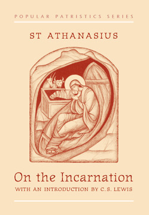

# On The Incarnation by Athanasius of Alexandria

## The Review

Am I giving this extra stars because it was written in the 4th century and thus, getting some sort of extra credit for a very readable translation? Perhaps.

But it is what it is and what it is, is this: a simple, wonderful, foundational, Biblically-doctrinal book of great importance.

Easy to read.

Thick with Biblical truth.

Glorifies Christ in the highest.

I read this at the same time as Advent and I can't think of a better book to read during the holidays.

There is a lot of books that Christians should not read (namely, any book that likes to talk about you). This book should be one of those ones that are given away for free to help us understand the significance and importance of the Word becoming flesh or as C.S. Lewis so aptly puts it:

>The Son of God became a man so that men would become sons of God.
