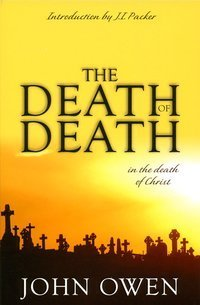

# The Death of Death in the Death of Christ by John Owen

## The Review

The Doctrine of Limited Atonement.

For those who are not familiar with this doctrine, it seeks to answer this question:

*For whom did Christ die?*

There are some points to ponder for sure but I have never seen anyone but old theologians wrestle with this question. (I couldn’t even name one New Calvinist who has grappled with this question—understanding the fact that my perspective is quite finite.)

In that context, I wasn’t sure if the polemic nature of John Owen’s work, The Death of Death in the Death of Christ, wasn’t somewhat outdated. Besides, is this a hill for us to stand and die on when it comes to theological issues?

Initially, no—not really. The fact that idea of that Christ died for the possibility of salvation and the idea that Christ to save His people from their sins could fall under the and-also truths and not necessary squarely as a either-or truth. In other words, Christians holding to either doctrine and understanding can still have the indwelling of the Holy Spirit, faith in Christ and love of God and still are saved to Him forever.

However, those who have planted themselves firmly in the Non-Calvinist camp (knowingly or unknowingly) will, from time to time, especially in my lifetime, would try to contest the doctrine of Limited Atonement—the doctrine that states that the work of Christ is perfect, as though the Evangelical world would have to take sides.

And that is where points of Biblical theology, doctrinal truth and overall, logic must be given as a response in order not to simply contests contentions but rather, to challenge the contender with deep thinking in order to esteem the glory of God.

I was a very young Christian (by all accounts, still am) when I started wrestling through theology just a few years ago. The thing that troubled my mind was, “How can the tenets of Calvinistic soteriology stand up beyond a millennium only to challenged so close to my lifetime?” (Close to my lifetime being relative as those challenges were brought up not 500 years ago.) In other words, the truth of theology, after carefully being worked out and confirmed by our Apostolic and Patristic fathers, were trying to be undone by the uplifting and glorifying of the free (albeit undeniably very limited) will of man. That made me dive deep into Calvinistic theology—a theology I have once written off as bullshit.

My introduction to Calvinism came in the form of Wikipedia page bullet-pointing each of the doctrines of grace after a late night conversation talks of Calvinism and lots of eye-rolling. That’s was it. No great book like Packer’s Knowing God or Piper’s Desiring God. I never grew up in a Reformed church. I was and still am faithfully attending a Spirit-filled, non-denomination church in the suburbs of Dallas/Fort Worth. Because Calvinism apparently dismissed my personal (stressing that it was my) golden idol of free will, Calvinism was still crap to me. However, for some reason, my interests have been piqued.

It was in around the same time I started to seriously read the Bible for the first time as a Christian. I would say that I was saved for no more than a month when all of this came together. Here’s the thing: as I was reading the Bible is where the doctrines of grace started becoming obviously apparent:

*“Hmm, that is total depravity.”*

*“That is irresistible grace.”*

*“That’s unconditional election for sure.”*

*“Crap, that’s obviously limited atonement!”*

Over and over again, what started as a basic whisper of an introduction to Calvinism made the passages jump off the page.

From what I believe by the Spirit alone, by the will of the Father alone, by the Word of God alone, my mind was able to grab a hold of the Calvinism and make them my own.

Yes, Limited (or to use a more modern vernacular, perfect, definite, precise, complete) Atonement was the one that I most struggled with the longest. It wasn’t because I struggled with that Christ died on the cross for the possibility of us being saved because that is completely illogical and in a way, antithesis to the attributes of God himself but rather, there were still many passages, most of them Johannine, that suggest that Christ did die for the world.

Still, I was convinced of the truth of Scripture and if I take Proverbs 25:2 to heart and push through any mystery of God using the truth of God, I shall be rewarded with God. I was going to push into this truth once and for all.

That is where this book and John Owen comes in.

This is not an easy book. Don’t turn your nose at the 300 page count. I did the same thing and thought, “Psssh, I can burn through this.” Then you get to Owen’s text itself and the publisher decided to use 7 point font.

It took me six months to read through this book. Often, I would read the left side of the open book, read the right side of the open book, close the book and then dwell on it for a while.

Those words were thick, heady and weighty. In the weight of those words, Owen takes all the offenses of opponents of Christ’s Perfect Atonement and turns them on their head.

For example, John 3:16.

There is a book out now called Whosoever Will. The one of the main premises of this book is that John 3:16 is in the defense of the possibility of salvation by God.

But let us actually look at the all-time famous verse:

>John 3:16 For God loved the world in this way: He gave his one and only Son, so that everyone who believes in him will not perish but have eternal life.

It is not ‘whosever will’ but ‘whosever believes’.

In other words, It is not ‘the gospel is the power of God in salvation for those who believe and do not believe’ but rather ‘for those who believe’. (Romans 1:16)

>Romans 1:16 For I am not ashamed of the gospel, because it is the power of God for salvation to everyone who believes, first to the Jew, and also to the Greek.

It is not ‘for our sake and the sake of the unbelievers, that God made Christ to be sin who knew no sin so that in him we might be the righteousness of God’ but rather ‘for our sake—the sake of those believe’. (2 Corinthians 5:21)

But what about 1 John 2:2?

>1 John 2:2 He himself is the atoning sacrifice for our sins, and not only for ours, but also for those of the whole world.

If that was the only passage in that epistle, then you would have a strong case. But it is not. Look at verse 3:

>1 John 2:3 This is how we know that we know him: if we keep his commands.

I would be absolute remiss if I did not proclaim the gospel at this moment.

>James 2:10 For whoever keeps the entire law, and yet stumbles at one point, is guilty of breaking it all.

>Galatians 3:10 For all who rely on the works of the law are under a curse, because it is written, Everyone who does not do everything written in the book of the law is cursed.

And.

>John 3:36 The one who believes in the Son has eternal life, but the one who rejects the Son will not see life; instead, the wrath of God remains on him.

You and I never kept the law and do not possess the ability to keep all of the law. You and I are born of Adam and therefore, born into sin.

You have two ways to look at these passages: One, despair and rebellion. Why even bother?

Or the other, in the words of the Apostles Paul: "Who is going to save me from this body of death?"

The answer is the only man who perfectly obey the law of God and died in our place for our sins: Jesus Christ our Lord. Believe in him and you will be saved!

By cherry-picking John’s verses, we can easily make the case that salvation is possible and that possibility rests on us. But when we take in the words of John (inspired by God, 2 Timothy 3:16), as a whole, we can easily see that John is not even contending for the possibility of salvation for all of mankind but laying out actual marks of the Christian.

Hear me out: what I am not contending is the apparent opposite, that is, “Joe, are you say that there are some people (many people if you believe Jesus 1) who have no possibility of being saved?”

No, what I am adamantly, vehemently, boldly, loudly, and passionately contending for is this:

The only way somebody is saved is by God alone for salvation is of the Lord alone and He alone is mighty to save.

One and done.

We are not going to sit here and try to determine who is elect and who is not. If Salvation is of God alone then Election completely is on God alone. The Doctrine of Predestination and Election is this absolute truth, “God predestines those destined to death into life.” and “God elects.”. That’s it. No, not because’s or maybe’s or hopefully’s. He choosing of His people happened before the foundation of the earth was in place. He didn’t choose out of some jacked-up game of “Duck Duck Damn”. Instead, He chose His people out of the overflow of His unmatched love because He is Love. This is a love that is not defined by our broken minds in a fallen world within the context a darken culture. This is the absolute truth and the standard bearing of what love actual is—defined by God alone.

Those who would rail against God, say blasphemous and traitorous things against God until their last and final breath, they will then be judged once and be hated in that judgment just like Esau. 3 and not a moment before their dying breath.

But, for as long as they draw breath on this earth, I know that God saves. How can I say? Because God is the only one who saves. Because the weight of any person’s salvation rests on not that person but rather rests on the person of Jesus Christ and his perfect, definite, complete, and satisfactory work, I will continue preaching, teaching and discussing the precious gospel of the Lord Jesus Christ with all of the world—both believers and non-believers alike—until He comes and gets me or I drop dead in the ground.

John Owen’s magnificent book, The Death of Death in the Death of Christ, did not just solidify one little doctrine for me, it changed the way I read Scripture, which has, in turn, not only secondarily solidify my theology but has primarily exploded my heart in doxology and has only infinitely fueled my heart for evangelism. For that, I owe him a debt of gratitude and praise to my sweet God in his mercy and provision for my soul.
