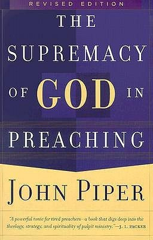

# The Supremacy of God in Preaching by John Piper

## The Review

>1 Corinthians 2:2–5 (CSB) I decided to know nothing among you except Jesus Christ and him crucified. I came to you in weakness, in fear, and in much trembling. My speech and my preaching were not with persuasive words of wisdom but with a demonstration of the Spirit’s power, so that your faith might not be based on human wisdom but on God’s power.

You know something? I don’t have to preach like anybody else I have ever heard.

I get to make much of God when I proclaim His Word. I get to lift Christ on high and know nothing except him crucified. I get to be totally and utterly dependent on the power of the Holy Spirit.

What a joy it is to preach the passage at hand. What a relief it is that I don’t have to mention the verse once in the sermon, then go on my own diatribe and spit out my own opinions. What heart-filled gladness that I can see the magnificence of God exalted and in falling so short, I would my very best to explain to others what I am seeing.

But oh, how naïve of me: to be called to preach but only preached just a few sermons. Every single little opportunity savored, gracious and humbled to get that one opportunity to preach the gospel of God—well, that is maybe your one and only shot. You may not be asked back. You might be barred from preaching there ever again. You might not make it back to preach again next Sunday.

But then, you get another try at it. God’s grace abounds and you get one more chance to love, serve, and feed His flock. You get to swallow your pride and open your heart and mind and let His Spirit work through you.

So, what are you going to do with that one shot?

>2 Timothy 4:1–5 (CSB) I solemnly charge you before God and Christ Jesus, who is going to judge the living and the dead, and because of his appearing and his kingdom: Preach the word; be ready in season and out of season; correct, rebuke, and encourage with great patience and teaching. For the time will come when people will not tolerate sound doctrine, but according to their own desires, will multiply teachers for themselves because they have an itch to hear what they want to hear. They will turn away from hearing the truth and will turn aside to myths. But as for you, exercise self-control in everything, endure hardship, do the work of an evangelist, fulfill your ministry.

Do the work. Praise be to God!
