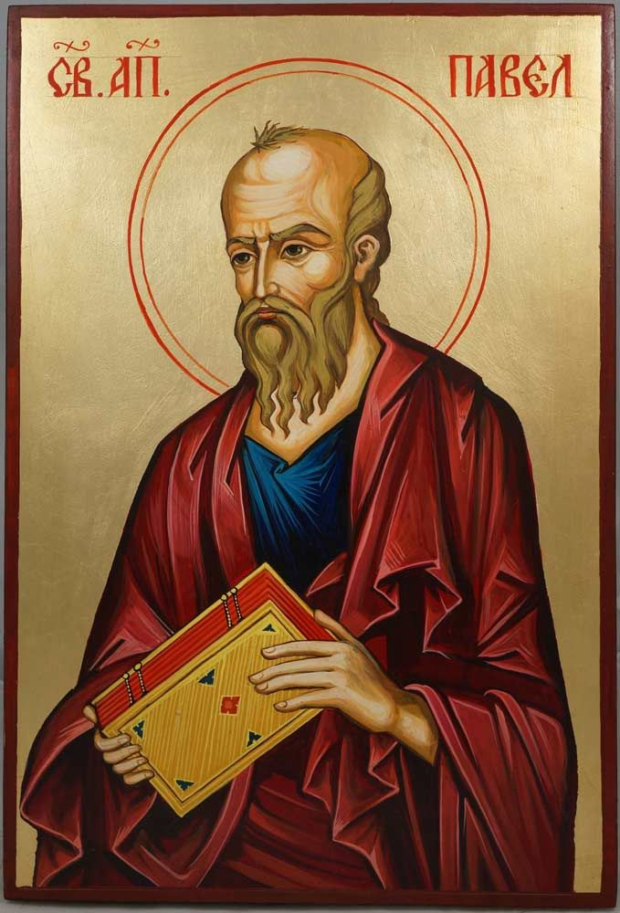

# Romans 5:6–11 Future Sin, Future Grace

## The Text

>Romans 5:6–11 (CSB)  
> 6  For while we were still helpless, at the right time, Christ died for the ungodly. 
>
> 7  For rarely will someone die for a just person—though for a good person perhaps someone might even dare to die. 
>
> 8  But God proves his own love for us in that while we were still sinners, Christ died for us. 
>
> 9  How much more then, since we have now been justified by his blood, will we be saved through him from wrath. 
>
> 10  For if, while we were enemies, we were reconciled to God through the death of his Son, then how much more, having been reconciled, will we be saved by his life. 
>
> 11  And not only that, but we also boast in God through our Lord Jesus Christ, through whom we have now received this reconciliation.

## Our God

> 6  For while we were still helpless, at the right time, Christ died for the ungodly.

### Future Sin Future Grace: Our Helpless Estate

What is the hymn that we sing often on Sundays?

>Though Satan should buffet, though trials should come  
>Let this blest assurance control  
>That Christ has regarded my helpless estate  
>And has shed His own blood for my soul  
>
>Horatio Spafford. It Is Well With My Soul.

Why do we need the building up of character, of endurance and hope?

You and I must consider our helpless estate before we met God:

Upon the prophet Isaiah seeing the glory of Christ (John 12:41), he cries out:

>Isaiah 6:5 (CSB) **Woe is me for I am ruined because I am a man of unclean lips and live among a people of unclean lips, and because my eyes have seen the King, the LORD of Armies.**

David feeling the pangs of separation from God:

>Psalms 22:6 (CSB) **But I am a worm and not a man, scorned by mankind and despised by people.**

This is you and me in our unbelief:

>Ephesians 2:1 (CSB) **And you were dead in your trespasses and sins**

And this you and me apart from God:

>Titus 3:3 (CSB) **For we too were once foolish, disobedient, deceived, enslaved by various passions and pleasures, living in malice and envy, hateful, detesting one another.**

Let me contend that the Christian comes upon seeing the glory and beauty and the holiness of God and just becomes undone. 

Now you and I might not have the Paul's Road to Damascus radical transformation. Some do. Others might have been like C.S. Lewis who just gets on their motorcycle and at the end of a very short ride through the countryside, Mr. Lewis just believes and trust in God. 

But we are all undone in one way or another at the sight of God and the beauty of his grace and gospel. And once you see it, you are never the same. You can't go back to what you once was. 

If your eyes were opened to the gospel of God, you cannot go back to your helpless estate because that feeling of being helpless is terrible and the worst feeling in the world. 

You now know that you need help--super help, something outside of yourself. Like Paul, you cry out, "Wretched man that I am! Who is going to save me from this body of sin and death!" Or like the tax collector, standing in the back of the sanctuary, beating his chest and crying out, "Lord, have mercy on me, a sinner!"

It was there, in that moment, when God revealed his glory to you, is when God saved you completely and perfectly to himself. For good. 

You and I as sinners in the sight of God are helpless. I used to say 'helpless as babes' but even babies breath on their own. We were helpless as dead corpses at the bottom of the ocean. Who is going to save us?

---

> 7  For rarely will someone die for a just person—though for a good person perhaps someone might even dare to die. 

### Future Sin Future Grace: Far From God

Let me shoot straight: we are not born just and righteous people. Romans 3:10 quoting Psalm 14: 

>None of us were born good. No, not even one.

>For rarely will someone die for a just person

What is Paul saying here? I venture to say that I don't think anybody here has ever been in a situation where you put yourself in danger in order of someone else to live. Now, if you have, share with us afterwards because that would be an awesome story to hear.

I was a kid of the 80s where I was constantly exposed to the greatest movie genre ever to be invented: The Action Movie! Rambo, Robocop, Predator, Transformers. Over and over, someone died so that someone else might live. And man, as fan of the genre, I got to see so many times where this played out, that I grew up thinking, "Man, this is just life for now on. I need to psych myself out and take one for the team."

And I went into the Air Force, I didn't see any action like that. My job title even had the word, "Combat" in it. Alas, no action like that to be found.

And in these action movies, it was someone being saved was if not a good person, at least someone redeemable. 

But life is not an action movie. As awesome as it might sound, we do not live in constant danger with bullets whizzing by our heads every second of the day. 

But this life is certainly not an action movie because the ones needing to be saved--you and I--were not good in the sight of God and by own strength, could not redeem ourselves.

But yet, in verse 6, do you see what Christ did here?

> 6b  at the right time, Christ died for the ungodly.

Let me give it to you in another the way. Let me give you some good news...

## The Gospel

> 8  But God proves his own love for us in that while we were still sinners, Christ died for us.

### But God

Let us start off here. Who is God? If we are ungodly, dead in our sins, how can we relate to God?

Simply put, we cannot. In his book, *Cross of Christ*, John Stott puts it bluntly on how we are not God and in fact, very far from God:

- **God is high above** our sin and idolatry
- **God is far** from our wickedness and depravity
- **He is glorious** - He shines the brightest

>I am in sweet communion with Christ as a poor sinner can be; and am only pained that he hath much beauty and fairness, and I little love; he great power and mercy, and I little faith; he much light and I bleared eyes.
>
>Samuel Rutherford. The Loveliness of Christ.

- **He is all-consuming** - he will perfectly eradicate all sin from everywhere
- **He is rejects all sin** from his presence - no toleration, does not have to live with it; he vomits it out of his being

So right from birth and choice, we are far from God.

Is there anything makes us relatable to God? We are far from him, do we have anything else in common? Is there something in us that makes him love us?

What about does God have good and bad days and whatever life circumstances give him, he deals with accordingly like we do? No. In actuality, he is completely sovereign over all circumstances. Things don't happen to him unless he allows it. That makes him omnipotent--which is a fancy way of calling him, the Almighty God.

Of all the things that he is and we are not, there are a few things that we can relate to him--even as unbelievers. 

We do get to love one another. And her is the connection, but God...

### proves his own love

Let's talk about love. How many songs about love have you heard. Just the words "let's talk about love"--I can name three off the top of my head.

I am not going to sugar coat this: the world has try to taken the word 'love' by God's definition and twist it like their father Satan does. But tonight, using the words of God, how God defines love.

For here is love, God proclaims the good news that He will make all things right:  
>Genesis 3:15 (CSB) I will put hostility between you and the woman, and between your offspring and her offspring. He will strike your head, and you will strike his heel.

<!-- And here is love, God is faithful:  
>Psalm 103:15–18 (CSB) As for man, his days are like grass— he blooms like a flower of the field; when the wind passes over it, it vanishes, and its place is no longer known. **But from eternity to eternity the LORD’s faithful love is toward those who fear him, and his righteousness toward the grandchildren of those who keep his covenant, who remember to observe his precepts.** -->

And here is love, God's faithful love and mercies will never come to an end:  
>Lamentations 3:22–23 (CSB) Because of the LORD’s faithful love we do not perish, **for his mercies never end**. They are new every morning; great is your faithfulness!

<!-- And here is love, God does everything for you to be with Him:  
>Ezekiel 36:25–28 (CSB) I will also sprinkle clean water on you, and you will be clean. I will cleanse you from all your impurities and all your idols. I will give you a new heart and put a new spirit within you; I will remove your heart of stone and give you a heart of flesh. I will place my Spirit within you and cause you to follow my statutes and carefully observe my ordinances. You will live in the land that I gave your ancestors; you will be my people, and I will be your God. -->

And here is love, God saves us from our sins:  
>Matthew 1:21 (CSB) She will give birth to a son, and you are to name him Jesus, because he will save his people from their sins.”

<!-- And here is love:  
>John 1:16–18 (CSB) Indeed, we have all received grace upon grace from his fullness, for the law was given through Moses; grace and truth came through Jesus Christ. No one has ever seen God. The one and only Son, who is himself God and is at the Father’s side—he has revealed him. -->

And here is love, God sent his only begotten Son, Jesus Christ:  
>John 3:16 (CSB) For God loved the world in this way: He gave his one and only Son, so that everyone who believes in him will not perish but have eternal life.

<!-- And here is love, God adopts us into his family:  
>Romans 9:25–26 (CSB) As it also says in Hosea, I will call Not my People, My People, and she who is Unloved, Beloved. And it will be in the place where they were told, you are not my people, there **they will be called sons of the living God.** -->

And here is love, Christ loved me and lived and died for me:  
>Galatians 2:20 (CSB) I have been crucified with Christ, and I no longer live, but Christ lives in me. The life I now live in the body, I live by faith in the Son of God, who loved me and gave himself for me.

And here is love, we have no condemnation and no separate from God:  
>Romans 8:1; 38-39 (CSB) Therefore, there is now no condemnation for those in Christ Jesus... and nothing will every separate us from the love of God that is in Jesus Christ our Lord.

And the ultimate form of love? The Triune Almighty God loved us first...  
>1 John 4:10 (ESV) In this is love, not that we have loved God but that he loved us and sent his Son to be the propitiation for our sins.

And what is so good about our Holy God is that he will spend all of your days in order to open your eyes and see what is actual love and how much He loves you.

I could have taken the book of Leviticus and prove to you that is the love of God for you. And you might think, "How is the law of God is the love of God for us?"

Because in delivering the law to us, he shown us how far we are from him. If you read the law correctly, you are going to shout out, "I can't do this! It is impossible!" God is saying, "I know. I know. That is why I sent my Son."

### for us

And he sent his Son for us!

And here is love:  
>2 Corinthians 5:21 (CSB) He made the one who did not know sin to be sin for us, so that in him we might become the righteousness of God.

Or as the ESV reads, "For our sake." That is the most amazing part. God does this **for us**. For our sake because we were so helpless, dead, woeful, and far from him.

That God doesn't have a generic all encompassing love generic for all things.  No other created being. Not the puppy dogs. Not the kitty cats or the cute things of this world--although adorable, he does not target his love on them because he is already their Lord. He does not have this type of love for the angels because they are His already and they worship him perfectly. 

No. This love, this saving love, this perfect love, this sanctifying love, this glorifying love, this satisfying love, this maxed out joy love is specifically directly targeting you, the children of God, the people of God, the sheep of his flock, the apple of his eye and the joy of his heart.

He has a specific love for his people because He made us in his image from the start. Not anything else ever created holds that distinction. We are made in his image.

And you might be asking, "But what about unbelievers who don't love and trust God." Let me reply by asking you how God replied to the prophet Isaiah: "Is the saving Almighty arm of God too short?" In other words, does our God have T-Rex arms? No! **He is mighty to save**. And let me submit to you because in eternity before the foundation of world God the Father and God the Son set out to save His people from their sins and we know this in full because God proved his love for us already...

### in that while we were still sinners

I had to avoid the temptation of making this the main point "while we were still sinners." You can already see the main point of this sermon is God and His great love for us. But don't miss this point. Don't gloss over it. Don't speed read over this:

>But God proves his own love for us in that while were still sinners

I know we are in Romans 5, but let me give you a spoiler alert for Romans 8:

>Romans 8:28–30 (CSB) We know that all things work together for the good of those who love God, who are called according to his purpose. For those he foreknew he also predestined to be conformed to the image of his Son, so that he would be the firstborn among many brothers and sisters. And those he predestined, he also called; and those he called, he also justified; and those he justified, he also glorified.

You might want to say that "God looked down the corridors of time and look to see when we accepted him as our Savior and God picked that timeline."

That is a nice theory but there is one glitch. The Bible says "God foreknew us". It never says, "God foresaw us." 

In other words, he didn't see us changing our minds and hearts and choosing him to be our God. No! He knew us in our sin and depravity and wickedness and evil and he knew that we were always going to run away from him unto death because He alone knows the depths of our hearts. 

And you know what the Almighty God, creator of the heavens, earth, and hell, when he saw us sinning and rebelling against Him all day long, do you know what he said?

"That's who I want in my family. That person I want in my family forever. And I am going to send my Son live and die for that person and send my Spirit to give them life so we can be together forever."

He knows our hearts. And still he loves us. Because...

### Christ died for us

As many of you know, God saved my oldest son, Yusef, not that long ago. And I have shared this story tons of times and I am going to share it again. I don't care. I love worshiping the Lord because He is so good.

One week, out of nowhere, Yusef tells me, "Dad, I hav always told you I could not be a Christian because false preachers and hypocrite Christians. But to be honest, that is the not the reason at all. What if I go 'all-in' into this faith and it doesn't work out. There are no guarantees in life. What if this doesn't work out."

And I simply responded, "You are right. In this life and in this world, there are no guarantees. But out of all the faiths, cults, religions, and philosophies, we Christians have a guarantee--our guarantee is in the life and death and resurrection of Jesus Christ our Lord. And you know what makes it even more amazing? All of what Christ did happened 2000 years ago. Our guarantee is an historical fact."

A few days later after that unforgettable phone call, Yusef was saved by God. A couple months later, I got to baptize him. Praise be to God!

God foreknew my son. God knew that my son's heart was far from Him. God knew my son, knew his sins, knew his disbelief, knew him to be dead. God knew that Yusef saw God as a mythological being  and nothing more. God knew him and saved him.

God knew that I was deceived into wickedness and sin. I tasted the goodness of God when I was young but spent so much of my life rebelling and trespassing against a holy God. I was at war with God and his creation. I was a violent and arrogant God-opposer. God knew me and sent his Son to love me, die for me, to save me from my sins.

Because of what God has done through Jesus Christ our Lord, we are...

### Saved by him through him for him

> 9  How much more then, since we have now been justified by his blood, will we be saved through him from wrath.

Jesus Christ, the son of God who is God, the Alpha and the Omega, and the Beginning and the End, who was and is and is to come, came into our existence and timeline, stepped into our world, by the sovereign decree of God the Father, conceived by the power of the Spirit, born of the virgin Mary, live perfectly under the law of God, then was arrested, tried, suffered under Pontius Pilate, was tortured, beaten, hung and crucified on that cross, unto to death, buried in a rich man's tomb and he descended into Hell to snatch up the keys to Hades and Death, and on the third day, he was raise back to life and then ascended to the right hand of the Father forever. 

Christ's life was given for me. His death was meant for me. His resurrection is that I might be born again and now live to him. His ascension to glory means that since he justified me, he also glorified me.

My salvation is secure and set because I am in Christ and Christ is in me. And guess what? If you are in Christ, your salvation is secure and set. Because our God is perfect, Christ is perfect, the Holy Spirit is perfect and what they promised to do is perfectly done. The Almighty Holy God lacks the sin and wickedness and deceit to break any of his promises.

## Our Response

What? So you struggle with sinful desires and thoughts and your heart sometimes flee?

> 10  For if, while we were enemies, we were reconciled to God through the death of his Son, then how much more, having been reconciled, will we be saved by his life. 

### Future Sin Future Grace: Christ has already saved you

Listen to the words:

reconciled... 
the death of his Son... 
reconciled...
saved by his life...

Hear the past tense. Hear the already done. Hear that God is our Perfect Father in Heaven who doesn't lose his kids. Hear that Christ is the Good Shepherd who has never lost one of his sheep because the sheep hears his voice because Christ knows us and we will follow him. The Holy Spirit has put a seal upon our heart and marked us as and bear witness with our spirit that we are children of God.

God foreknew our wicked hearts. Psalm 103 says that God remembers that we are made from dust. How are we going to save ourselves? That is why he sent his Son to live and die so that we might live and never die.

---

> 11  And not only that, but we also boast in God through our Lord Jesus Christ, through whom we have now received this reconciliation.

### Future Sin Future Grace: God is ours

What is the reconciliation? To appease, harmonize, to rectify, to resolve... to reunite.

To reconcile with someone in this life is one thing. In my experience, when I hear of a reconciliation between two people, I think that is simply astounding! Especially in the times of divorce or relationships ending on a whim or our jerkiness and the lack of tact and wisdom and grace on social media, we are so easily offended and often quick to dismiss and block. But when people can sit in front of each other, and give grace and understanding to one another, I think that is a miracle. I don't see it happening as often as I would like to. But that is what it is like to live in a post-Genesis 3 world.

If I am calling that a miracle, then how would you define the sons of Adam now belonging to God because of Christ. (If you want to see the details of this real miracle, keep reading Romans 5 starting at first 12. That is another sermon.)

How would you explain how Paul quotes the prophet Hosea in Romans 9:

>Not my People, My People, **reconciled** and she who is Unloved, Beloved. **reconciled** And it will be in the place where they were told, you are not my people, there they will be called sons of the living God.**reconciled**

Because we were all born sons and daughters of Adam and therefore away and separated from God, we are now reunited with God by power of the Holy Spirit through the atoning death of the Lord Jesus Christ.

Listen to me: Christ didn't die so that you were just saved from hell and now you are on neutral ground with God. No! Reconciliation to God means you and I get it all. We get the whole kit and caboodle! The whole enchilada! Reconciliation to God means:

- we are saved to God
- predestined by God
- called by God
- justified in the sight of God
- adopted by God
- co-heirs with Christ who has inherited everything (Heb 1:1-2)
- glorified by God
- alive by God
- maxed out joy by God
- pleasures evermore by God
- completely satisfied by God
- beautifully and preciously loved by God
- forevermore with God by God for God

We are truly love by God. Nothing is going to separate us from the love of God who, as the prophet Zephaniah absolutely declares, that God "rejoices over you with gladness, who is quiet in his love, and delights in you with singing." (Zephaniah 3:17)

Our great God who sent his only begotten Son for you has saved you. God rejoices, loves, and delights in you. God sings and rejoices over you? Why? Nothing that you and I have ever done. We were born sinners. But God loves us because you are in Christ and Christ is in you.

The question I asked us from Romans 5:1-5, "What is God preparing us for? Why do we need to be build up in character, endurance and hope?" I am reminded of the Day 4 Advent Reading from Ronnie Martin's God Who is With Us and he expounded on Genesis 50:20:

>Genesis 50:20 (CSB) You planned evil against me; God planned it for good to bring about the present result—the survival of many people.

I think some of you know that I suffered abuse as a child at the hands of my dad and my stepmother. And I still suffer the effects of PTSD till this day. And by God's grace, I was saved many years later--about 15 years ago.

There was this moment in time, before I had met Sarah, even with the Triune God dwelling in me and making his home in me, I had made some foolish decisions.

I was married to someone I shouldn't have. I have always said, "I am not God's brightest star" because my life is filled with regrets that had devastating consequences.

In this particular dark time of my life, I was facing so much abuse, that I attempted suicide just so I could at least see the face of my God and stop the suffering.

The world, Satan and his demons planned great evil against me, but God planned it for good.

I get that. I get that down in my bones and in my heart and in my soul.

But believe me when I said, if God approached me moments before that dark moment in my life and told me what I was about to face, I would have said, "NO!" and did everything in my power to avoid that kind of pain and anguish.

And I am not going to lie to you, if time machines were an actual thing, every single moment of my life would be overwhelming temptation to go back in time and change the past so I wouldn't have to endure that affliction... that trial... that tribulation.

And I wish I could tell you today, when that trial ended, I came out victorious! Stronger than ever! Unbreakable faith! Never end joy. To tell you the truth, I was the opposite. I was defeated. I was lost. I ran back to my old self--trying to recreate my past dead life of trash and sin.

But here is love, God rescued me once more. God was never one and done with me. He is always rescuing me because even on my best days, I fail and sin against him. And on my worst days, I surpass the chief of sinners.

God knew that. God knew that and he loved me. God knew that, made up his mind about me before he created the universe. God knew that and He sent his Son, Jesus Christ, to live and die for me.

I don't know if you are struggling with regret and sins of your past life. I don't know if you are regretting something now that is going on.

Let me tell you, you are never too far from the saving grace of the Almighty God. Christ died for the ungodly. It is an historical fact that God has already proven his love for us because while you and I were sinners, Christ died for you and me.

Boast in that. Worship God in that. Give thanks to God in that. Praise his holy name today.
