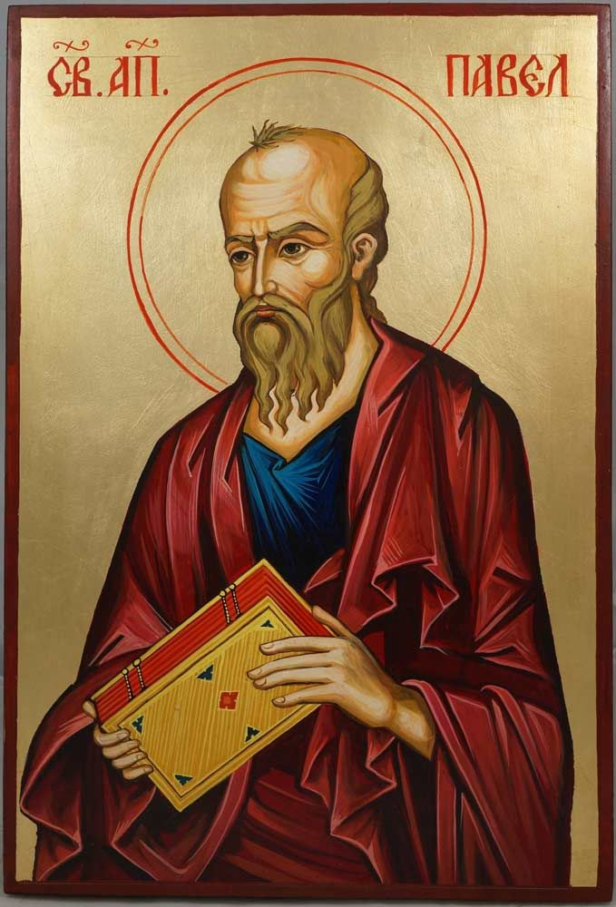

# Romans 7:14-25 Then, God Saves Us From Our Sin

## The Text

>Romans 7:14–25  
> 14  For we know that the law is spiritual, but I am of the flesh, sold as a slave under sin. 
>
> 15  For I do not understand what I am doing, because I do not practice what I want to do, but I do what I hate. 
>
> 16  Now if I do what I do not want to do, I agree with the law that it is good. 
>
> 17  So now I am no longer the one doing it, but it is sin living in me. 
>
> 18  For I know that nothing good lives in me, that is, in my flesh. For the desire to do what is good is with me, but there is no ability to do it. 
>
> 19  For I do not do the good that I want to do, but I practice the evil that I do not want to do. 
>
> 20  Now if I do what I do not want, I am no longer the one that does it, but it is the sin that lives in me. 
>
> 21  So I discover this law: When I want to do what is good, evil is present with me. 
>
> 22  For in my inner self I delight in God’s law, 
>
> 23  but I see a different law in the parts of my body, waging war against the law of my mind and taking me prisoner to the law of sin in the parts of my body. 
>
> 24  What a wretched man I am! Who will rescue me from this body of death? 
>
> 25  Thanks be to God through Jesus Christ our Lord! So then, with my mind I myself am serving the law of God, but with my flesh, the law of sin.

## Our God

While I have not experienced this teaching directly, I have been told that many, many current Bible teachers confidently teach this passage in such a way that Paul was speaking, not as a Christian, but rather as a unbeliever. Many Bible teachers teach this passage from Paul's point of view *before* he was saved by God. I say, I have been told this, because many of my Christian friends were taught this way and therefore, understand this passage in that exact same way--that Paul's struggle with sin is surely as Paul as an unbeliever because the train of thought goes like this, "Well, apostles never struggle with sin. Well, at least super-Christians don't struggle with sin. And I am not a super-Christian because I sin what feels like all the time. But surely the Apostle Paul never struggle with sin--he sounds like an ordinary Christian like me."

Fellow believer--you and I live on this side of heaven and on this side of glory. We will live in a fallen, post-Genesis 3 world. You and I will struggle with sin because we were both born of Adam.

If you have been a Christian for longer than five minutes, you already know that all Christians struggle with sin. When I say this, a Christian might naively think, "Well, I don't struggle with *this* certain sin" and therefore, we can fall into the trap of thinking that we don't struggle with sin. "I am not tempted with porn," one may hastily think. Congratulations, your heart is not broken by sin in such a way to be tempted by lust or avoidance or slothfulness. But, since we are all sons of Adam--therefore, all sinners--we are struggle with sin.

It might not be the same sin as your brother or sister, but you struggle with sin because we all struggle with sin.

And to further make clear--the term "struggle with sin" is an oxymoron and a misnomer. Fellow believer in Christ, you and I and every son of God, expect for the Son of God, have sinned and fallen short of the glory of God. And by what James has said, since we have broken the law once upon a time, congratulations, we have broken all of the law. And since we have failed even once to keep the law, we there is no amount of law keeping that can restore our righteousness. 

Let us move away from saying "struggle with sin" and call it: we sin. Christians sin.

And you cannot even keep your kids from not sinning since birth--because we have the inheritance of sin from Adam in us. From birth we are corrupted, and from birth we have always sinned against God and failed to always obey God all the time in all things.

You and I sin against God. And the Apostle Paul sin as well. The only difference was he was just mature enough to know it--if only by the will of the Father (Hebrews 6:3) and the illumination of the Holy Spirit. (1 Corinthians 2:10-16) And by the authority of the Spirit through the hand of Paul, he writes to the church in Rome and to us with real honest take on he sins. And if we are honest enough with ourselves, we will start to see that this is how we sin as well.

### God is at work: you will begin to see the difference between the spiritual and the flesh

> 14  For we know that the law is spiritual, but I am of the flesh, sold as a slave under sin. 

First of all, dear believer, take heart. There is no dot nor iota nor jot nor tittle in all of the sixty-six books of the canonical Holy Scriptures that is written to speak to the unbeliever. This epistle and my words to you is to never cast doubt on your salvation. This word of God has been written for and to us, the children of God, so that we can know his revealed will and his great love for us.

Why would God write a book for not-his-people who as unbelievers, as people without the indwelling of the Holy Spirit, who are dead in their trespasses and sins, cannot possibly understand his word? It is only the people of God who have been bought by the blood of his precious Son and possess the eternal indwelling of the Holy Spirit within them so that they can hear his word and *truly* understand it.

You are in the Christ. How do I know? Because you know the things of God for you. Because of God, you see the difference between the law of God--which is by God and therefore, spiritual. Furthermore, because of God, you and I know that we are of the flesh, sold as a slave under sin. There is no deny this. To deny that we were slaves to sin because us liars and therefore, unbelievers.

>John 8:34 Jesus responded, “Truly I tell you, everyone who commits sin is a slave of sin.

>1 John 1:10 If we say, “We have not sinned,” we make him a liar, and his word is not in us.

### God is at work: you will begin to hate sin that you do, you will begin to feel the pain of the cutting of the law on your life

> 15  For I do not understand what I am doing, because I do not practice what I want to do, but I do what I hate.  16  Now if I do what I do not want to do, I agree with the law that it is good.  17  So now I am no longer the one doing it, but it is sin living in me. 

Believer, because your eyes are opened to your sin--however dimly and imperfectly that might be--your eyes are opened to the sin that you do. You can keep doing it, you can keep falling into it, you can keep "struggling" with by keep sinning. But guess what, you repent, you confess. You keep falling and you get up some more.

>Proverbs 24:16 Though a righteous person falls seven times, he will get up, but the wicked will stumble into ruin.

Does that mean that righteous people sin only seven times? That is like saying Christians only forgive seventy times seven. In other words, what it means is not the literal number of times but rather, guess what, you are going to forgive much because you have been forgiven much. Likewise, you are going to fall and stumble and sin not just seven times but seventy billion times more.

In other words, a lot. A whole heck of a lot.

Then, if that is the case, what is the difference between the unbeliever and the believer? The goat and the sheep? The sons of Satan and the sons of God? You and I and every child of God will get up just once more. That is it. We will get up once more. And it isn't because of our own hard work and can-do attitude that raises us up from our sin but only rather by the Spirit who raised Christ from the dead. That is the only way--by the power of the Spirit, we will have life from death in our mortal bodies through his Spirit who lives in us. (Romans 8:11)

In other words, we get up one more time not by our trash self-righteousness but rather, only by the righteousness of Christ in us.

## The Gospel

Just by using a decent reading comprehension, we read this passage and be assured that if Paul struggled with sin, and I struggled with sin, yet, Paul was in Christ, therefore I must be in Christ because we both have the same Christ!

Just like Paul, we are new creations in Christ.

### We are a new creation: before, we started far from him

> 18  For I know that nothing good lives in me, that is, in my flesh. For the desire to do what is good is with me, but there is no ability to do it. 

This is the madness of sin. Once we know our own sin, it is kicks us straight in the teeth. I want to do good but with a honest look at our hearts, even when I do something good, it is infected with sin. "Maybe this person will think I am a good person" or "Maybe I can atone for all sin I have done in my life." Thought those thoughts? Guess what, our good works are not even pure. Think those thoughts and your good works are stained with sin. You are doing it for reasons outside of pure good.

But sweet child, please don't discount those good works--your neighbor, friend, co-worker, shop owner, barista, cashier, mechanic, boss, child, spouse, significant other, other church goers, Trump supporter and the liberal hippie--all need your good works. Remember, we don't do good works for God--God does not need anything from us. He is God--self-sufficient and self-sustaining. But Christ is in us and we want to obey the commands of God, we do these good works because we love our neighbor as our selves.

### We are a new creation: before, we started with no ability to obey him at all

> 19  For I do not do the good that I want to do, but I practice the evil that I do not want to do. 

And as the Bible so often stated, we cannot do anything good on our own. For:

>Isaiah 64:6 All of us have become like something unclean, and all our righteous acts are like a polluted garment; all of us wither like a leaf, and our iniquities carry us away like the wind.

We are born sinners and lived our lives according to sin. Even some of us who were saved in riper years, have used a lifetime to build up habits and addictions to sin. [^1]

[^1]: [1689.15.1](https://theologic.us/confession-1689/1689-15-1-god-gives-more-repentance)

Nevertheless, we are new creations in Christ and therefore, because we are in Christ, God has granted each child of God repentance unto eternal life.

### We are a new creation: we are not at peace with sin

> 20  Now if I do what I do not want, I am no longer the one that does it, but it is the sin that lives in me. 

Since we are in Christ, we are never all the way comfortable with sin. Habitual sins will come and go--just like temptations, just like attacks of Satan, and wisdom of the world--it doesn't endlessly torment us. Somehow, much like the protection of Israel against her enemies, so too, the mercies of God is upon us that we are not overwhelmed and consumed by our sin and the sin around us.

But take heed, Christian, it has come and it will come again.

And we hate it all. And we get broken by it all.

### We are a new creation: we will not be perfectly obedient

> 21  So I discover this law: When I want to do what is good, evil is present with me. 

And we will struggle--even as Christians--we will struggle.

### We are a new creation: we are at war with sin

> 22-23  For in my inner self I delight in God’s law, but I see a different law in the parts of my body, waging war against the law of my mind and taking me prisoner to the law of sin in the parts of my body. 

We love the word of God. Only the people of God love the word of God--not what they can agree with and discard the rest but all of it. But part of that love for his word is the pain and the struggle when we hold up our lives to the word and we see our sin more clearly. We love his word but the exposure of sin in our lives hurts so bad.

## The Response

What can do we do? In the midst of this struggle and torment, what can we do?

> 24  What a wretched man I am! Who will rescue me from this body of death? 

Who is going to rescue us from the dead? Who will save us from our sins?

>Romans 3:23 For all have sinned and fall short of the glory of God;

>Ephesians 2:1-3 And you were dead in your trespasses and sins in which you previously walked according to the ways of this world, according to the ruler of the power of the air, the spirit now working in the disobedient. We too all previously lived among them in our fleshly desires, carrying out the inclinations of our flesh and thoughts, and we were by nature children under wrath as the others were also.

>Titus 3:3 For we too were once foolish, disobedient, deceived, enslaved by various passions and pleasures, living in malice and envy, hateful, detesting one another.

The law, Satan, demons, world, my own sin--they are perfectly correct. I am a wretched and a sinner. I am darkness and despair. I am a child of wrath. Sometimes it does feel like Satan is my father.

But, thanks be to God through Jesus Christ our Lord--we get to praise his holy name forever!

### Praise his name: we are fully alive in Christ

> 25  Thanks be to God through Jesus Christ our Lord! 

We have all sinned and fallen short of the glory of God but:

>Romans 3:22-24 The righteousness of God is through faith in Jesus Christ to all who believe, since there is no distinction. For all have sinned and fall short of the glory of God; they are justified freely by his grace through the redemption that is in Christ Jesus.

We were once dead in our sins but:

>Ephesians 2:4-7 But God, who is rich in mercy, because of his great love that he had for us, 5 made us alive with Christ even though we were dead in trespasses. You are saved by grace! 6 He also raised us up with him and seated us with him in the heavens in Christ Jesus, 7 so that in the coming ages he might display the immeasurable riches of his grace through his kindness to us in Christ Jesus.

We too were once foolish and disobedient but:

>Titus 3:4-7 But when the kindness of God our Savior and his love for mankind appeared, 5 he saved us—not by works of righteousness that we had done, but according to his mercy—through the washing of regeneration and renewal by the Holy Spirit. 6 He poured out his Spirit on us abundantly through Jesus Christ our Savior 7 so that, having been justified by his grace, we may become heirs with the hope of eternal life.

### Praise be his name: go and sin no more

>So then, with my mind I myself am serving the law of God, but with my flesh, the law of sin.

This is our new identity: in Christ. For:

>Galatians 2:20 I have been crucified with Christ, and I no longer live, but Christ lives in me. The life I now live in the body, I live by faith in the Son of God, who loved me and gave himself for me.

You are now in the Almighty arms of the Savior, Jesus Christ. Your sin cannot keep him from saving you. Therefore, your sins are not strong enough to pull you away from him. You are in Christ. You are going to fall but you are going to get back up. You are in Christ.
