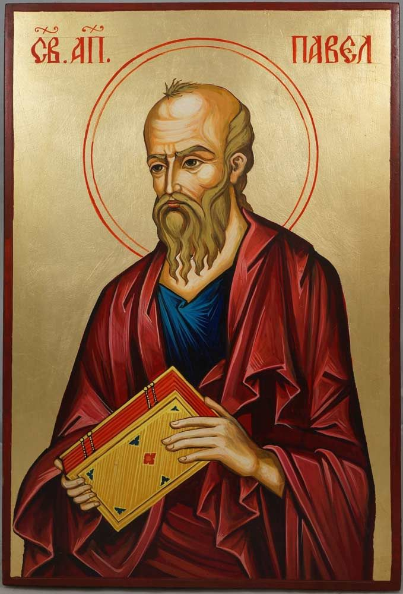

# Romans 8:28 Who Define Us in the Midst of Sin Around Us?

## The Text

>Romans 8:28 (CSB)
> 28  We know that all things work together for the good of those who love God, who are called according to his purpose.

## Our God

Herein lies love: all things work together for good for those who love God. Within our world, one might dare to ask, “What about those who don’t love God? What about my friend or neighbor or co-worker who is basically a good guy or gal? What about them?”

But what is goodness? Is it good/better/best or a quality that is wholesome and pure and without sin or evilness?

While we cannot assume the opposite is true in some cases, we can actually make that statement here: all things do not work together for good for those who do not love God. Or if things do work together for good, then it is for good/better/best and not at all for goodness according to the God.

Paul is saying nothing new. There is a distinction between those who love God and do not love God. We just got done reading at the beginning of Romans 8: “For those who live according to the flesh, set their minds on things of the flesh… Those who are in the flesh cannot please God.”[^1]

Perhaps you might think Paul is too harsh. Let's think through things for just a moment:

There are always talks about harmonizing the Gospels of the New Testament but when you study the teachings of Christ and the writings of Paul, what I think is happening that Paul is simply giving a theological explanation to the words and deeds of Christ.

I dare to say that Paul is not giving anything new outside of what Jesus Christ has already said and done.

So when Paul talks “mind set on the flesh and spirit” or in our case “for those who love God”, how is that different than when Christ spoke of those on his left hand and his right, goats, and sheep, child of hell versus sons of God?

Or here:

>John 3:36 (CSB) The one who believes in the Son has eternal life, but the one who rejects the Son will not see life; instead, the wrath of God remains on him.

Paul is simply going into a more detailed explanation of what Christ said.

## The Gospel

Why is this so important? All the promises of God are both yes and amen, but the promises for you, if you are a child of God, go many more AND deeper, more meaningful, more lovely and beautiful than anything we could have imagined.

>Romans 8:9-11 (CSB) You, however, are not in the flesh, but in the Spirit, if indeed the Spirit of God lives in you. If anyone does not have the Spirit of Christ, he does not belong to him. Now if Christ is in you, the body is dead because of sin, but the Spirit gives life because of righteousness. And if the Spirit of him who raised Jesus from the dead lives in you, then he who raised Christ from the dead will also bring your mortal bodies to life through his Spirit who lives in you.

>Romans 8:14-17 (CSB) For all those led by God’s Spirit are God’s sons. For you did not receive a spirit of slavery to fall back into fear. Instead, you received the Spirit of adoption, by whom we cry out, “Abba, Father!” The Spirit himself testifies together with our spirit that we are God’s children, and if children, also heirs—heirs of God and coheirs with Christ—if indeed we suffer with him so that we may also be glorified with him.

So who loves God? We just read that:

>Romans 8:27 (CSB) And he who searches our hearts knows the mind of the Spirit, because he intercedes for the saints according to the will of God.

That God knows the heart and that is such good news that he looks and sees us intimately.

So, what are _all things_? That circumstances and sin and wickedness do not dictate the statuses and the faiths of the children of God. Abuse does not. Trauma does not. Being ignored does not. Being betrayed does not. Being tempted does not. Being poor does not.

Let the world take everything-my innocence, my money, my family, my job, my education-everything that I could put all of my identity in and fall into idol worship. But because I have God, I have everything.

## Our Response

How’s that you say? Again, let us use the words of Paul:

Let me live and I will live to Christ.

Kill me and Christ is my gain!

>Philippians 1:21-26 (CSB) For me, to live is Christ and to die is gain. Now if I live on in the flesh, this means fruitful work for me; and I don’t know which one I should choose. I am torn between the two. I long to depart and be with Christ—which is far better— but to remain in the flesh is more necessary for your sake. Since I am persuaded of this, I know that I will remain and continue with all of you for your progress and joy in the faith, so that, because of my coming to you again, your boasting in Christ Jesus may abound.

Take my job and force me into poverty and I will be content.

>Philippians 4:10-14 (CSB) I rejoiced in the Lord greatly because once again you renewed your care for me. You were, in fact, concerned about me but lacked the opportunity to show it. I don’t say this out of need, for I have learned to be content in whatever circumstances I find myself. I know how to make do with little, and I know how to make do with a lot. In any and all circumstances I have learned the secret of being content—whether well fed or hungry, whether in abundance or in need. I am able to do all things through him who strengthens me. Still, you did well by partnering with me in my hardship.

Throw me in prison and I will preach the gospel and see that the guard’s and their households are saved.

>Philippians 4:21-23 (CSB) Greet every saint in Christ Jesus. The brothers who are with me send you greetings. All the saints send you greetings, especially those who belong to Caesar’s household. The grace of the Lord Jesus Christ be with your spirit.

Let all things come my way and try to destroy me.

>Romans 8:36-37 (CSB) As it is written:
Because of you
we are being put to death all day long;
we are counted as sheep to be slaughtered.
No, in all these things we are more than conquerors through him who loved us.

All the bad. All the good. Everything in between that has happened in your life--God will absolutely use to draw closer to Him.

[^1]: Romans 8:5-8
