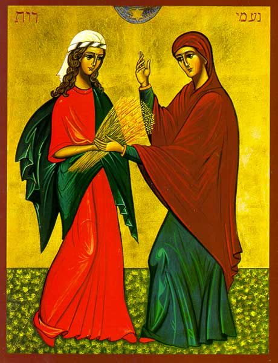

# Ruth

## The Introduction

There is no doubt in anybody's mind that Jesus Christ, the Son of God, who is God, was born Jewish and is very much Jewish. He was born to Mary and Joseph--which we can tell by the Christ genealogies in both Matthew 1 & Luke 3 that Jesus is double the son of King David. That is, one lineage through Solomon to Joseph and one lineage through Nathan to Mary.

But then take look close at the Matthew's genealogy of Christ in Matthew 1. In the only places where it was significant that Matthew should recall the mother, twice it was out of gross and vile sin (Tamar and Bathsheba) and twice more by Gentile women, Rahab and Ruth.

Why is this so distinctive?

In the mercies and providence of God, he had decided to bring about the salvation of his people through the Jewish people--starting with the father of our faith, Abraham.

>Deuteronomy 7:7 “The LORD had his heart set on you and chose you, not because you were more numerous than all peoples, for you were the fewest of all peoples.

He did not choose the Israelites because they were strong but because they were little and weak. Throughout history, God always chooses to display his love and might through the weak and the foolish.

His plan of redemption included the Israelites and through the Israelites but was not entirely exclusive to the Israelites.

In other words, God's plan of salvation always included the non-Jewish--the Gentiles--that is, you and me, if you are not of Jewish descent.

>Romans 11:13a;17a Now I am speaking to you Gentiles... you, though a wild olive branch, were grafted in among them and have come to share in the rich root of the cultivated olive tree.

Just to show that this was God's plan all along, we have the story of Ruth. Ruth is young Moabite widow, whose people originated with incest and continued into the demonic worship of the Moabite god, Chemosh, brings her to a figurative fork in the road: one leading back to her old way of life or one leading her into unfamiliar path of salvation.

Her sister, Orpah, made her choice. She went back into familarity and certainty--that is, away from the God of the Israelites. Now, Ruth must choose--what is certain and what is unknown.
