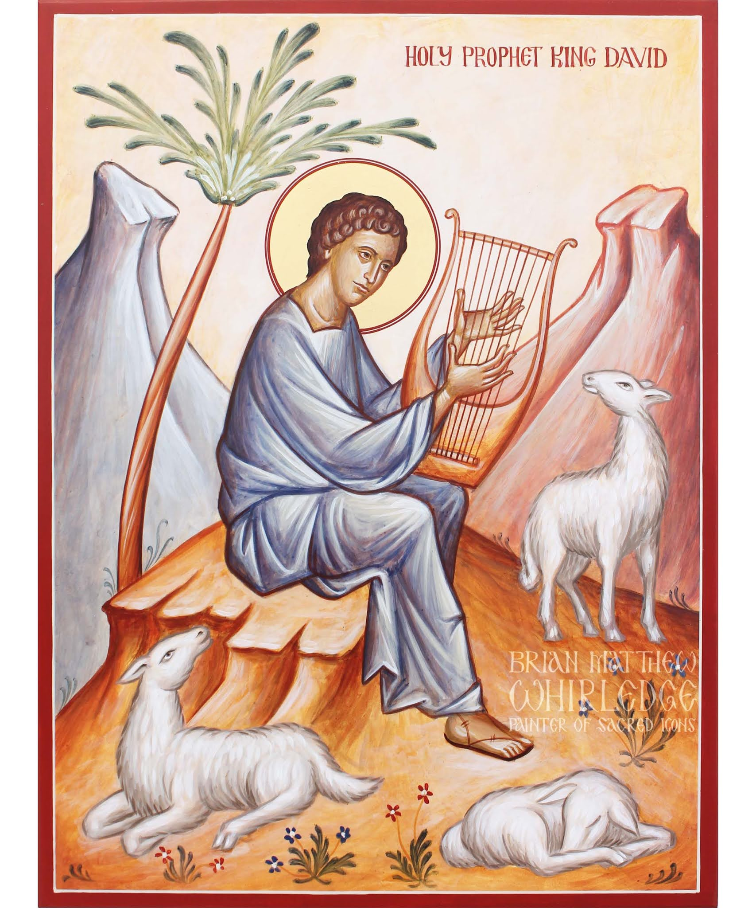

# 1 Samuel 6 You Shall Worship No Other Gods

## The Word

>Luke 4:5-8 So [Satan] took him up and showed him all the kingdoms of the world in a moment of time. The devil said to him, “I will give you their splendor and all this authority, because it has been given over to me, and I can give it to anyone I want. If you, then, will worship me, all will be yours.” And Jesus answered him, “It is written: <bgy>Worship the Lord your God, and serve him only.</bgy>”

## The Passage

>1 Samuel 6  
>1 When the ark of the LORD had been in Philistine territory for seven months, 
>
>2 the Philistines summoned the priests and the diviners and pleaded, “What should we do with the ark of the LORD? Tell us how we can send it back to its place.” 
>
>3 They replied, “If you send the ark of Israel’s God away, do not send it without an offering. Send back a guilt offering to him, and you will be healed. Then the reason his hand hasn’t been removed from you will be revealed.” 
>
>4 They asked, “What guilt offering should we send back to him?” And they answered, “Five gold tumors and five gold mice corresponding to the number of Philistine rulers, since there was one plague for both you and your rulers. 
>
>5 Make images of your tumors and of your mice that are destroying the land. Give glory to Israel’s God, and perhaps he will stop oppressing you, your gods, and your land. 
>
>6 Why harden your hearts as the Egyptians and Pharaoh hardened theirs? When he afflicted them, didn’t they send Israel away, and Israel left? 
>
>7 “Now then, prepare one new cart and two milk cows that have never been yoked. Hitch the cows to the cart, but take their calves away and pen them up. 
>
>8 Take the ark of the LORD, place it on the cart, and put the gold objects that you’re sending him as a guilt offering in a box beside the ark. Send it off and let it go its way. 
>
>9 Then watch: If it goes up the road to its homeland toward Beth-shemesh, it is the LORD who has made this terrible trouble for us. However, if it doesn’t, we will know that it was not his hand that punished us—it was just something that happened to us by chance.” 
>
>10 The men did this: They took two milk cows, hitched them to the cart, and confined their calves in the pen. 
>
>11 Then they put the ark of the LORD on the cart, along with the box containing the gold mice and the images of their tumors. 
>
>12 The cows went straight up the road to Beth-shemesh. They stayed on that one highway, lowing as they went; they never strayed to the right or to the left. The Philistine rulers were walking behind them to the territory of Beth-shemesh. 
>
>13 The people of Beth-shemesh were harvesting wheat in the valley, and when they looked up and saw the ark, they were overjoyed to see it. 
>
>14 The cart came to the field of Joshua of Beth-shemesh and stopped there near a large rock. The people of the city chopped up the cart and offered the cows as a burnt offering to the LORD. 
>
>15 The Levites removed the ark of the LORD, along with the box containing the gold objects, and placed them on the large rock. That day the people of Beth-shemesh offered burnt offerings and made sacrifices to the LORD. 
>
>16 When the five Philistine rulers observed this, they returned to Ekron that same day. 
>
>17 As a guilt offering to the LORD, the Philistines had sent back one gold tumor for each city: Ashdod, Gaza, Ashkelon, Gath, and Ekron. 
>
>18 The number of gold mice also corresponded to the number of Philistine cities of the five rulers, the fortified cities and the outlying villages. The large rock on which the ark of the LORD was placed is still in the field of Joshua of Beth-shemesh today. 
>
>19 God struck down the people of Beth-shemesh because they looked inside the ark of the LORD. He struck down seventy persons. The people mourned because the LORD struck them with a great slaughter. 
>
>20 The people of Beth-shemesh asked, “Who is able to stand in the presence of the LORD this holy God? To whom should the ark go from here?” 
>
>21 They sent messengers to the residents of Kiriath-jearim, saying, “The Philistines have returned the ark of the LORD. Come down and get it.”

---

## The Study

>1 When the ark of the LORD had been in Philistine territory for seven months, 
>
>2 the Philistines summoned the priests and the diviners and pleaded, “What should we do with the ark of the LORD? Tell us how we can send it back to its place.” 

### No Other Gods: We Cannot Worship Other Gods and the God of Gods

---

>3 They replied, “If you send the ark of Israel’s God away, do not send it without an offering. Send back a guilt offering to him, and you will be healed. Then the reason his hand hasn’t been removed from you will be revealed.” 
>
>4 They asked, “What guilt offering should we send back to him?” And they answered, “Five gold tumors and five gold mice corresponding to the number of Philistine rulers, since there was one plague for both you and your rulers. 
>
>5 Make images of your tumors and of your mice that are destroying the land. Give glory to Israel’s God, and perhaps he will stop oppressing you, your gods, and your land. 

### No Other Gods: We Have All Exchanged God For Other Gods

>Romans 1:21-25 For though they knew God, they did not glorify him as God or show gratitude. Instead, their thinking became worthless, and their senseless hearts were darkened. Claiming to be wise, they became fools and exchanged the glory of the immortal God for images resembling mortal man, birds, four-footed animals, and reptiles. Therefore God delivered them over in the desires of their hearts to sexual impurity, so that their bodies were degraded among themselves. They exchanged the truth of God for a lie, and worshiped and served what has been created instead of the Creator, who is praised forever. Amen.

---

>6 Why harden your hearts as the Egyptians and Pharaoh hardened theirs? When he afflicted them, didn’t they send Israel away, and Israel left? 

### No Other Gods: 

---

>7 “Now then, prepare one new cart and two milk cows that have never been yoked. Hitch the cows to the cart, but take their calves away and pen them up. 
>
>8 Take the ark of the LORD, place it on the cart, and put the gold objects that you’re sending him as a guilt offering in a box beside the ark. Send it off and let it go its way. 
>
>9 Then watch: If it goes up the road to its homeland toward Beth-shemesh, it is the LORD who has made this terrible trouble for us. However, if it doesn’t, we will know that it was not his hand that punished us—it was just something that happened to us by chance.” 
>
>10 The men did this: They took two milk cows, hitched them to the cart, and confined their calves in the pen. 
>
>11 Then they put the ark of the LORD on the cart, along with the box containing the gold mice and the images of their tumors. 
>
>12 The cows went straight up the road to Beth-shemesh. They stayed on that one highway, lowing as they went; they never strayed to the right or to the left. The Philistine rulers were walking behind them to the territory of Beth-shemesh. 
>
>13 The people of Beth-shemesh were harvesting wheat in the valley, and when they looked up and saw the ark, they were overjoyed to see it. 
>
>14 The cart came to the field of Joshua of Beth-shemesh and stopped there near a large rock. The people of the city chopped up the cart and offered the cows as a burnt offering to the LORD. 
>
>15 The Levites removed the ark of the LORD, along with the box containing the gold objects, and placed them on the large rock. That day the people of Beth-shemesh offered burnt offerings and made sacrifices to the LORD. 

### No Other Gods: God is the Only God That Gives to Us

>Matthew 1:21–23 She will give birth to a son, and you are to name him Jesus, because he will save his people from their sins.” Now all this took place to fulfill what was spoken by the Lord through the prophet: See, the virgin will become pregnant and give birth to a son, and they will name him Immanuel, which is translated “God is with us.”

---

>16 When the five Philistine rulers observed this, they returned to Ekron that same day. 
>
>17 As a guilt offering to the LORD, the Philistines had sent back one gold tumor for each city: Ashdod, Gaza, Ashkelon, Gath, and Ekron. 
>
>18 The number of gold mice also corresponded to the number of Philistine cities of the five rulers, the fortified cities and the outlying villages. The large rock on which the ark of the LORD was placed is still in the field of Joshua of Beth-shemesh today. 

### No Other Gods: Worshiping God at Our Convenience Will Not Save Us

>Matthew 7:21–23 “Not everyone who says to me, ‘Lord, Lord,’ will enter the kingdom of heaven, but only the one who does the will of my Father in heaven. On that day many will say to me, ‘Lord, Lord, didn’t we prophesy in your name, drive out demons in your name, and do many miracles in your name?’ Then I will announce to them, ‘I never knew you. Depart from me, you lawbreakers!’

For the moment vs. for all of eternity

---

>19 God struck down the people of Beth-shemesh because they looked inside the ark of the LORD. He struck down seventy persons. The people mourned because the LORD struck them with a great slaughter.

### No Other Gods: God is Holy

>Isaiah 6:1–5 In the year that King Uzziah died, I saw the Lord seated on a high and lofty throne, and the hem of his robe filled the temple. Seraphim were standing above him; they each had six wings: with two they covered their faces, with two they covered their feet, and with two they flew. And one called to another: Holy, holy, holy is the LORD of Armies; his glory fills the whole earth. The foundations of the doorways shook at the sound of their voices, and the temple was filled with smoke. Then I said: Woe is me for I am ruined because I am a man of unclean lips and live among a people of unclean lips, and because my eyes have seen the King, the LORD of Armies.

---

>20 The people of Beth-shemesh asked, “Who is able to stand in the presence of the LORD this holy God? To whom should the ark go from here?” 
>
>21 They sent messengers to the residents of Kiriath-jearim, saying, “The Philistines have returned the ark of the LORD. Come down and get it.”

### No Other Gods: God is the Only One Who Can Save Us from His Wrath

>John 3:36 The one who believes in the Son has eternal life, but the one who rejects the Son will not see life; instead, the wrath of God remains on him.

---

## The Psalm

>Psalm 97:9–12  
>9 For you, LORD, are the Most High over the whole earth; you are exalted above all the gods. 
>
>10 You who love the LORD, hate evil! He protects the lives of his faithful ones; he rescues them from the power of the wicked. 
>
>11 Light dawns for the righteous, gladness for the upright in heart. 
>
>12 Be glad in the LORD, you righteous ones, and give thanks to his holy name.
