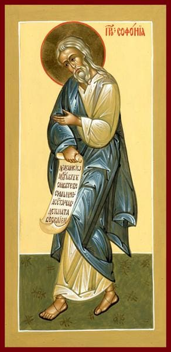

# Sermon: Zephaniah 3

## The Text

Zephaniah 3

**1** Woe to the city that is rebellious and defiled, the oppressive city!

**2** She has not obeyed; she has not accepted discipline. She has not trusted in the Lord; she has not drawn near to her God.

**3** The princes within her are roaring lions; her judges are wolves of the night, which leave nothing for the morning.

**4** Her prophets are reckless— treacherous men. Her priests profane the sanctuary; they do violence to instruction.

**5** The righteous Lord is in her; he does no wrong. He applies his justice morning by morning; he does not fail at dawn, yet the one who does wrong knows no shame.

**6** I have cut off nations; their corner towers are destroyed. I have laid waste their streets, with no one to pass through. Their cities lie devastated, without a person, without an inhabitant.

**7** I said: You will certainly fear me and accept correction. Then her dwelling place would not be cut off based on all that I had allocated to her. However, they became more corrupt in all their actions.

**8** Therefore, wait for me— this is the Lord's declaration— until the day I rise up for plunder. For my decision is to gather nations, to assemble kingdoms, in order to pour out my indignation on them, all my burning anger; for the whole earth will be consumed by the fire of my jealousy.

**9** For I will then restore pure speech to the peoples so that all of them may call on the name of the Lord and serve him with a single purpose.

**10** From beyond the rivers of Cush my supplicants, my dispersed people, will bring an offering to me.

**11** On that day you will not be put to shame because of everything you have done in rebelling against me. For then I will remove from among you your jubilant, arrogant people, and you will never again be haughty on my holy mountain.

**12** I will leave a meek and humble people among you, and they will take refuge in the name of the Lord.

**13** The remnant of Israel will no longer do wrong or tell lies; a deceitful tongue will not be found in their mouths. They will pasture and lie down, with nothing to make them afraid.

**14** Sing for joy, Daughter Zion; shout loudly, Israel! Be glad and celebrate with all your heart, Daughter Jerusalem!

**15** The Lord has removed your punishment; he has turned back your enemy. The King of Israel, the Lord, is among you; you need no longer fear harm.

**16** On that day it will be said to Jerusalem: "Do not fear; Zion, do not let your hands grow weak.

**17** The Lord your God is among you, a warrior who saves. He will rejoice over you with gladness. He will be quiet in his love. He will delight in you with singing."

**18** I will gather those who have been driven from the appointed festivals; they will be a tribute from you and a reproach on her.

**19** Yes, at that time I will deal with all who oppress you. I will save the lame and gather the outcasts; I will make those who were disgraced throughout the earth receive praise and fame.

**20** At that time I will bring you back, yes, at the time I will gather you. I will give you fame and praise among all the peoples of the earth, when I restore your fortunes before your eyes. The Lord has spoken.

## Prayer

## The Context

(Zeph. 1:2-3) I will completely sweep away everything from the face of the earth —this is the LORD's declaration. I will sweep away people and animals; I will sweep away the birds of the sky and the fish of the sea,and the ruins along with the wicked. I will cut off mankind from the face of the earth. This is the LORD's declaration.

*Why is God so quick to judge sin?*

(2 Pet. 3:9-10) (ESV) The Lord is not slow to fulfill his promise as some count slowness, but is patient toward you, not wishing that any should perish, but that all should reach repentance. But the day of the Lord will come like a thief, and then the heavens will pass away with a roar, and the heavenly bodies will be burned up and dissolved, and the earth and the works that are done on it will be exposed.

Both the prophet Jonah and we know that God is, "[. . .] a gracious and compassionate God, slow to anger, abounding in faithful love, and one who relents from sending disaster." (Jon. 4:2)

God is not slow

He gives ample time for any of us to repent

*Selah*

*Calvin*: (Ezek. 18:4) Behold, all souls are mine; the soul of the father as well as the soul of the son is mine: the soul who sins shall die.

(Zeph. 2) *much like Ezek. chapters 17 thru 35* pronounces judgments against the surrounding nations

(Zeph. 1) Judgment on the whole world

(Zeph. 2) Judgment on our surrounding neighbors

(Jn. 16:8-9) When [the Holy Spirit] comes, he will convict the world about sin, righteousness, and judgment: About sin, because they do not believe in me;

*But do you think God is preaching his righteousness to you and me in order to hear how the world is going to hell and our neighbors are heathens?*

## Our God

### Let us get to the heart of the matter - this is our great sin

(Zeph. 3:1-5)
Woe to the city that is rebellious and defiled,
the oppressive city!
She has not obeyed;
she has not accepted discipline.
She has not trusted in the LORD;
she has not drawn near to her God.
The princes within her are roaring lions;
her judges are wolves of the night,
which leave nothing for the morning.
Her prophets are reckless —
treacherous men.
Her priests profane the sanctuary;
they do violence to instruction.
The righteous LORD is in her;
he does no wrong.
He applies his justice morning by morning;
he does not fail at dawn,
yet the one who does wrong knows no shame.

### The Comparison of God and Man - God [. . .]

How can God pronounce the 'quick' judgment?

How can he call sin sin?

Who is he? Who is like our God?

He is holy, righteous, perfect, good, and pure

**Warn:** we hear those terms, those characteristics

Let us not think so little of them -- we do not dwell on God as we ought

^ but it is prideful and sinful tendency of man

to either raise man up to God

or make God in our own image but lowering him closer to us

"God understands"

"God is chill"

"God is slow"

Those unrighteous thoughts descend and devolve into the atheistic:

"There must not be a God."

But God is real and he is holy --

Refer to John Stott's *The Cross of Christ* referred to the 5 ways of how God in stark, infinite contrast to us because of his holiness and our sinfulness

**most high**

God Most High

the earth and his enemies are his footstool

(Ps. 97:9) For you, LORD,
are the Most High over the whole earth;
you are exalted above all the gods.

**far and distant**

think of the burning bush

the Holy of Holies in the tabernacle

when the people crossed the Jordan -- what was the distance between the people and the ark of the Covenant -- 10x football fields!

**unapproachable light**

Moses: "show me your glory" (Exod. 33:12-23)

God: you can only see my back

**all consuming fire**

God is driving out these nations because of their wickedness (Dt. 9:4) not because of your righteousness

How? (Dt. 9:3) "[. . .] the Lord your God will cross over ahead of you as a consuming fire; he will devastate and subdue them before you"

**rejecting vomit**

**The judgment of the Canaanites** - (Lev. 18:24-25) "Do not defile yourselves by any of these practices, for the nations I am driving out before you have defiled themselves by all these things. The land has become defiled, so I am punishing it for its iniquity, and the land will vomit out its inhabitants.

Who does the land belong to?

That is God's land - "the whole earth is filled with his glory" (Ps. 72:19) because it belongs to him!

God is vomiting out the poison in his land on his earth because he is the most Holy, Sovereign and Almighty Triune God

### [. . .] compared to us

(Rom. 3:10-18) as it is written:

There is no one righteous, not even one.
There is no one who understands;
there is no one who seeks God.
All have turned away;
all alike have become worthless.
There is no one who does what is good,
not even one.
Their throat is an open grave;
they deceive with their tongues.
Vipers' venom is under their lips.
Their mouth is full of cursing and bitterness.
Their feet are swift to shed blood;
ruin and wretchedness are in their paths,
and the path of peace they have not known.
There is no fear of God before their eyes.

(Rom. 3:23) For all have sinned and fall short of the glory of God;

(Eph. 2:1-3) And you were dead in your trespasses and sins in which you previously walked according to the ways of this world, according to the ruler of the power of the air, the spirit now working in the disobedient. We too all previously lived among them in our fleshly desires, carrying out the inclinations of our flesh and thoughts, and we were by nature children under wrath as the others were also.

(Tit. 3:3) For we too were once foolish, disobedient, deceived, enslaved by various passions and pleasures, living in malice and envy, hateful, detesting one another.

### In response to sin, this is our great God

(Zeph. 3:6) I have cut off nations;
their corner towers are destroyed.
I have laid waste their streets,
with no one to pass through.
Their cities lie devastated,
without a person, without an inhabitant.
(Zeph. 3:7) I said: You will certainly fear me
and accept correction.
Then her dwelling place
would not be cut off
based on all that I had allocated to her.
However, they became more corrupt
in all their actions.
(Zeph. 3:8) Therefore, wait for me— this is the Lord's declaration— until the day I rise up for plunder. For my decision is to gather nations, to assemble kingdoms, in order to pour out my indignation on them, all my burning anger; for the whole earth will be consumed by the fire of my jealousy.

*See the book of Revelation*

*homework* I dare you to search Revelation for "sexual immorality" - *pornea* (*Gk.*) and see what God's response to that sin

We know Jerusalem sinned the exact same way --

(Zeph. 1:4) I will stretch out my hand against Judah
and against all the residents of Jerusalem.
I will cut off every vestige of Baal
from this place,
the names of the pagan priests
along with the priests;

### He cleanses our sin and iniquities and then causes us to obey him

(Zeph. 3:9) For I will then restore pure speech to the peoples so that all of them may call on the name of the Lord and serve him with a single purpose.

Vengeance is mine, says the Lord
Don't you know, that God will do whatever it takes, in order to conquer the our enemies of our sin, Satan, demons, hell and death -- in order to save us from our sins?

Contrast v9 with Rom. 3:13

(Rom. 3:13-18) Their throat is an open grave;
they deceive with their tongues.
Vipers' venom is under their lips.
Their mouth is full of cursing and bitterness.
Their feet are swift to shed blood;
ruin and wretchedness are in their paths,
and the path of peace they have not known.
There is no fear of God before their eyes.

*Wait for me (Zeph 3:9)... I will give you a new heart and I will place my Spirit within you and cause you to follow my statutes and carefully observe my ordinances. (Ezek 36)*

If the Lord our God has to separate you & cleanse you from your sin -- guaranteed cleaned -- gave you a new heart, his Spirit -- and we known this because he has given his only begotten Son to us in Jesus Christ -- in order for us to begin to obey him (Ezek. 36:24-28), do you not think he has unmuted and cleansed our venomous tongues so that we will call upon the name of the Lord?

(Mk. 9:25) When Jesus saw that a crowd was quickly gathering, he rebuked the unclean spirit, saying to it, "You mute and deaf spirit, I command you: Come out of him and never enter him again."

(Is. 35:4-6) Say to the cowardly:

"Be strong; do not fear!
Here is your God; vengeance is coming.
God's retribution is coming; he will save you."
Then the eyes of the blind will be opened,
and the ears of the deaf unstopped.
Then the lame will leap like a deer,
and the tongue of the mute will sing for joy,
for water will gush in the wilderness,
and streams in the desert;

*Look at what God has done so that ...*

(Rom. 10:13) For everyone who calls on the name of the Lord will be saved.

## Ours to Do

### Come to the Christ!

(Zeph. 3:10) From beyond the rivers of Cush
my supplicants, my dispersed people,
will bring an offering to me.

### What can you offer to God?

Your good works? They are but filthy rags (Is. 64:6)

and they do not come from you but it is God who has prepared your good works ahead of time (Eph. 2:10)

And our God is not served by human hands for he needs nothing

They only thing you and I can give to the Lord is the one thing that he has asked for: your sin

### What did Christ say?

(Matt. 11:28-30) "Come to me, all of you who are weary and burdened, and I will give you rest. Take my yoke upon you and learn from me, because I am lowly and humble in heart, and you will find rest for your souls. For my yoke is easy and my burden is light."

### Repent of your sin!

(Zeph. 3:11) On that day you will not be put to shame
because of everything you have done
in rebelling against me.
For then I will remove
from among you your jubilant, arrogant people,
and you will never again be haughty
on my holy mountain.

Remember what Adam Waddle preached yesterday?

You don't get cleansing and forgiveness because your repentance is good enough

Our repentance is not good enough

That is why God gave his only begotten Son

In pure grace upon grace --

(1 Jn. 1:9) If we confess our sins, he is faithful and righteous to forgive us our sins and to cleanse us from all unrighteousness.

If you have the Christ, guess what, God has given you the gift of repentance

(Acts 11:18) When they heard this they became silent. And they glorified God, saying, "So then, God has given repentance resulting in life even to the Gentiles."

(2 Tm. 2:25) instructing his opponents with gentleness. Perhaps God will grant them repentance leading them to the knowledge of the truth.

(Heb. 12:17) *On Esau* For you know that later, when he wanted to inherit the blessing, he was rejected because he didn't find any opportunity for repentance, though he sought it with tears.

### Gather with his people

(Zeph. 3:12-13) I will leave
a meek and humble people among you,
and they will take refuge in the name of the LORD.
The remnant of Israel will no longer
do wrong or tell lies;
a deceitful tongue will not be found
in their mouths.
They will pasture and lie down,
with nothing to make them afraid.

(1689.26.8) A particular church, gathered and completely organized according to the mind of Christ, consists of officers and members; and the officers appointed by Christ to be chosen and set apart by the church (so called and gathered), for the peculiar administration of ordinances, and execution of power or duty, which he intrusts them with, or calls them to, to be continued to the end of the world, are bishops or elders, and deacons.

(Jer. 23:3-4) "I will gather the remnant of my flock from all the lands where I have banished them, and I will return them to their grazing land. They will become fruitful and numerous. I will raise up shepherds over them who will tend them. They will no longer be afraid or discouraged, nor will any be missing." This is the LORD's declaration.

### Sing for Joy

*(Is. 35:4-6) and the tongue of the mute will sing for joy,*

(Zeph. 3:14-17) Sing for joy, Daughter Zion;
shout loudly, Israel!
Be glad and celebrate with all your heart,
Daughter Jerusalem!
The LORD has removed your punishment;
he has turned back your enemy.
The King of Israel, the LORD, is among you;
you need no longer fear harm.
On that day it will be said to Jerusalem:
"Do not fear;
Zion, do not let your hands grow weak.
The LORD your God is among you,
a warrior who saves.
He will rejoice over you with gladness.
He will be quiet in his love *(Hosea 2:14)*
He will delight in you with singing."

### Christ has saved his people from their sin and therefore gathered throughout the whole world

(Zeph. 3:18-19) I will gather those who have been driven
from the appointed festivals;
they will be a tribute from you
and a reproach on her.
Yes, at that time
I will deal with all who oppress you.
I will save the lame and gather the outcasts;
I will make those who were disgraced
throughout the earth

(Josh. 1:9) Haven't I commanded you: be strong and courageous? Do not be afraid or discouraged, for the LORD your God is with you wherever you go.

(Eph. 2:11-13) So, then, remember that at one time you were Gentiles in the flesh — called "the uncircumcised" by those called "the circumcised," which is done in the flesh by human hands. At that time you were without Christ, excluded from the citizenship of Israel, and foreigners to the covenants of promise, without hope and without God in the world. But now in Christ Jesus, you who were far away have been brought near by the blood of Christ.

(Gal. 3:25-29) But since that faith has come, we are no longer under a guardian, for through faith you are all sons of God in Christ Jesus. For those of you who were baptized into Christ have been clothed with Christ. There is no Jew or Greek, slave or free, male and female; since you are all one in Christ Jesus. And if you belong to Christ, then you are Abraham's seed, heirs according to the promise.

### The power of the gospel of Christ will bring us all the way home

(Zeph. 3:20) At that time I will bring you back,
yes, at the time I will gather you.
I will give you fame and praise
among all the peoples of the earth,
when I restore your fortunes before your eyes.
The LORD has spoken.

(Rom. 08:38-39 NO SEPARATION!) Nothing ever created can separate us from the love of God in Christ Jesus our Lord forever

## Our Song

> Let us love and sing and wonder\
> Let us praise the Savior's name\
> He has hushed the law's loud thunder\
> He has quenched Mount Sinai's flame\
> He has washed us with His blood\
> He has washed us with His blood\
> He has washed us with His blood\
> He has brought us nigh to God
